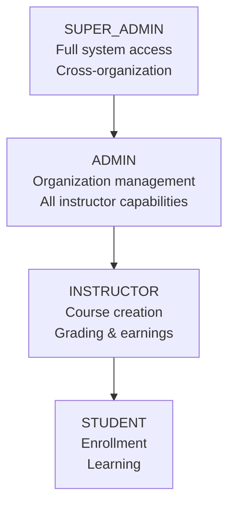
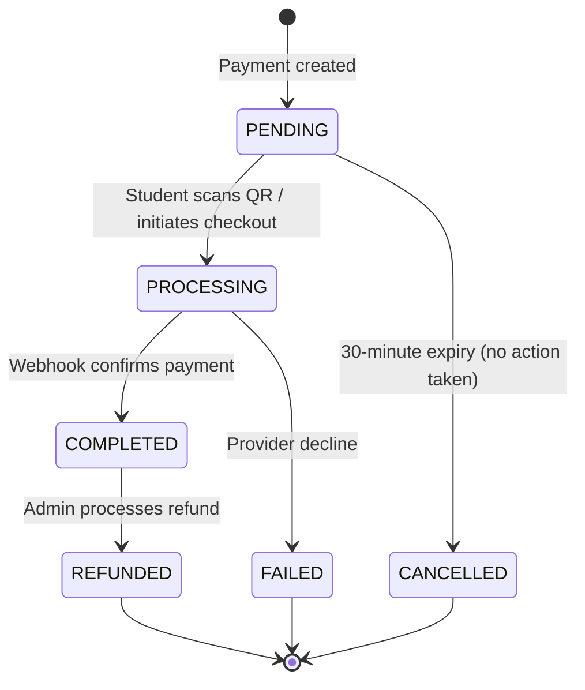
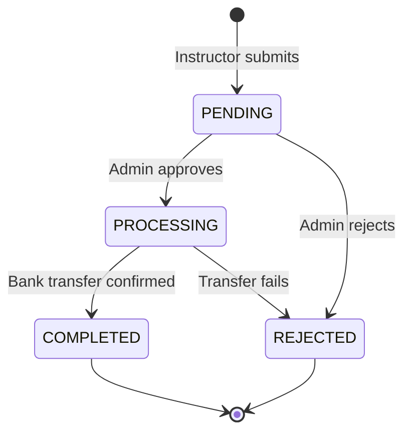

# LMS Platform — Organization Admin Guide

> **Complete reference for organization administrators: configuring the platform, managing users, monitoring analytics, and overseeing financial operations.**
> Covers every capability available to the `ADMIN` and `SUPER_ADMIN` roles.

---

## Table of Contents

1. [Admin Role Overview](#1-admin-role-overview)
2. [Dashboard & Navigation](#2-dashboard--navigation)
3. [Organization Setup](#3-organization-setup)
4. [Tenant Settings](#4-tenant-settings)
5. [User Management](#5-user-management)
6. [Role Management](#6-role-management)
7. [Course Oversight](#7-course-oversight)
8. [Analytics Dashboard](#8-analytics-dashboard)
9. [Financial Overview](#9-financial-overview)
10. [Payout Management](#10-payout-management)
11. [Certificate Management](#11-certificate-management)
12. [Notification & Communication Settings](#12-notification--communication-settings)
13. [Security Settings](#13-security-settings)
14. [Audit Logs](#14-audit-logs)
15. [Troubleshooting](#15-troubleshooting)

---

## 1. Admin Role Overview

### Two Admin Tiers

The platform has two elevated roles above Instructor:

| Role | Scope | Key Distinction |
|---|---|---|
| `ADMIN` | Organization-level | Manages users, courses, and analytics within the organization |
| `SUPER_ADMIN` | Platform-wide (all organizations) | Full infrastructure and cross-organization access; can modify any user on the system |

Unless stated otherwise, everything in this guide applies to both roles. Sections marked **[SUPER_ADMIN only]** require the higher privilege.

### What Admins Can Do

| Domain | Capability |
|---|---|
| **Users** | List all users; activate and deactivate accounts; view any user's profile |
| **Roles** | Assign roles at registration; change a user's role post-registration |
| **Courses** | View, publish, archive, and delete any course regardless of instructor ownership |
| **Enrollments** | Manually enroll or unenroll students; reset lesson progress |
| **Analytics** | Access the full KPI dashboard and raw event log |
| **Payments** | View all payment records; process refunds |
| **Payouts** | Approve or reject instructor payout requests |
| **Certificates** | Issue certificates manually; revoke certificates |
| **Notifications** | Send system-wide announcements; configure SMTP and SMS |
| **Security** | Enforce MFA; expire sessions; configure password policy |
| **Audit Logs** | Query the immutable `AnalyticsEvent` log |

---

## 2. Dashboard & Navigation

The Admin dashboard shows a platform-wide summary rather than a personal view:

| Panel | What It Contains |
|---|---|
| **KPI Summary** | Today's new users, enrollments, payments, and revenue |
| **Pending Payouts** | Instructor payout requests awaiting approval |
| **Recent Events** | Last 20 events from the analytics event log |
| **Active Users** | Users who logged in within the past 7 days |
| **Course Health** | Count of `DRAFT`, `PUBLISHED`, `ARCHIVED` courses |

### Admin Navigation Structure

```
Top Nav
├── Users          → User list, role management, account status
├── Courses        → All courses (not filtered to owner)
├── Analytics      → KPI dashboard · Event log · Custom queries
├── Payments       → Payment records · Refunds · Webhook logs
├── Payouts        → Instructor payout queue
├── Certificates   → Issue · Revoke · Verify
├── Notifications  → Send announcements · SMTP config
├── Settings       → Tenant config · Security · Integrations
└── Audit Log      → Immutable event stream query
```

---

## 3. Organization Setup

### 3.1 Initial Configuration Checklist

Before inviting users, complete the following:

```
☐ 1. Configure SMTP for outgoing email (Settings → Notifications → SMTP)
☐ 2. Set the platform name and logo (Settings → Branding)
☐ 3. Configure payment providers (Settings → Payments)
☐ 4. Set the default language and time zone (Settings → Locale)
☐ 5. Review and confirm the password policy (Settings → Security)
☐ 6. Create the first Instructor accounts (Users → New User)
☐ 7. Verify the RabbitMQ event bus is healthy (Settings → System Health)
☐ 8. Test end-to-end with a mock payment (Payments → Mock Test)
```

### 3.2 Service Health Check

Verify all microservices are running before going live:

| Service | Port | Health Endpoint |
|---|---|---|
| Gateway | 3000 | `GET /health` |
| Auth Service | 3001 | `GET /api/v1/health` |
| User Service | 3002 | `GET /api/v1/health` |
| Course Service | 3003 | `GET /api/v1/health` |
| Enrollment Service | 3004 | `GET /api/v1/health` |
| Quiz Service | 3005 | `GET /api/v1/health` |
| Assignment Service | 3006 | `GET /api/v1/health` |
| Payment Service | 3008 | `GET /api/v1/health` |
| Wallet Service | 3007 | `GET /api/v1/health` |
| AI Service | 3009 | `GET /api/v1/health` |
| Notification Service | 3010 | `GET /api/v1/health` |
| Media Service | 3011 | `GET /api/v1/health` |
| Certificate Service | 3012 | `GET /api/v1/health` |
| Analytics Service | 3013 | `GET /api/v1/health` |

All services expose `/api/v1/health` and integrate with the API Gateway at `http://localhost:3000`.

### 3.3 Creating the First Admin Account

The first `SUPER_ADMIN` account is created by bootstrapping the database directly:

```bash
# Run from the project root
docker compose exec auth-service sh -c "cd /app/services/auth-service && node dist/scripts/seed-admin.js"
```

Subsequent admin accounts are created via the User Management UI (see [Section 5](#5-user-management)).

---

## 4. Tenant Settings

### 4.1 Branding

**Settings → Branding**

| Setting | Description |
|---|---|
| **Platform Name** | Displayed in email subjects, certificate issuer name, and page titles |
| **Logo URL** | Shown in the top navigation and email templates |
| **Primary Color** | Hex color used in UI accents and buttons |
| **Support Email** | Shown to users on error pages and in notification footers |

> The `issuerName` on certificates defaults to `"LMS Platform"`. Update **Platform Name** to replace this with your organization's name on all newly issued certificates. Existing certificates are not retroactively updated.

### 4.2 Locale

**Settings → Locale**

| Setting | Default | Options |
|---|---|---|
| **Default Language** | `mn` | Any ISO 639-1 code: `mn`, `en`, `zh`, etc. |
| **Time Zone** | `Asia/Ulaanbaatar` | IANA time zone identifier |
| **Currency** | `MNT` | Used for all price displays and wallet balances |
| **Date Format** | `YYYY-MM-DD` | Displayed in reports and UI |

### 4.3 Payment Provider Configuration

**Settings → Payments**

Each provider requires credentials from the payment gateway. Configure before any student makes a purchase.

#### QPay

| Field | Description |
|---|---|
| `QPAY_USERNAME` | QPay merchant username |
| `QPAY_PASSWORD` | QPay merchant password |
| `QPAY_INVOICE_CODE` | QPay invoice template code |
| `QPAY_CALLBACK_URL` | Webhook URL: `https://your-domain.com/api/v1/webhooks/qpay` |

#### SocialPay (Golomt Bank)

| Field | Description |
|---|---|
| `SOCIALPAY_TERMINAL` | Terminal ID from Golomt Bank |
| `SOCIALPAY_SECRET` | HMAC signing secret |
| `SOCIALPAY_CALLBACK_URL` | Webhook URL: `https://your-domain.com/api/v1/webhooks/socialpay` |

#### Mock Provider

The `MOCK` provider requires no credentials. It is always available for testing. Disable in production by setting `ALLOW_MOCK_PAYMENTS=false` in the payment-service environment.

### 4.4 Email (SMTP) Configuration

**Settings → Notifications → SMTP**

| Field | Example | Notes |
|---|---|---|
| `SMTP_HOST` | `smtp.gmail.com` | |
| `SMTP_PORT` | `587` | Use `465` for SSL, `587` for STARTTLS |
| `SMTP_SECURE` | `false` | `true` for port 465 |
| `SMTP_USER` | `noreply@yourorg.com` | |
| `SMTP_PASS` | `app-specific-password` | Use app passwords for Gmail |
| `SMTP_FROM` | `"LMS Platform" <noreply@yourorg.com>` | Display name + address |

After saving, click **Send Test Email** to verify delivery. Test emails go to your admin account's registered email.

### 4.5 MinIO / Storage Configuration

**Settings → Storage**

MinIO is used for all media uploads (videos, PDFs, images, subtitles).

| Field | Default | Notes |
|---|---|---|
| `MINIO_ENDPOINT` | `minio` | Hostname within Docker network |
| `MINIO_PORT` | `9000` | |
| `MINIO_ACCESS_KEY` | — | Set in `.env` |
| `MINIO_SECRET_KEY` | — | Set in `.env` |
| `MINIO_BUCKET` | `lms-media` | Created automatically on first run |
| `MINIO_USE_SSL` | `false` | Enable for production with a valid cert |

> **Storage quotas** are not enforced at the application layer. Monitor MinIO disk usage separately via the MinIO console at `http://your-host:9001`.

---

## 5. User Management

### 5.1 User List

**Users** in the navigation displays all registered users across the platform.

Available filters:

| Filter | Values |
|---|---|
| **Role** | `SUPER_ADMIN` · `ADMIN` · `INSTRUCTOR` · `STUDENT` |
| **Status** | Active · Inactive |
| **Search** | Email address (partial match) |

Pagination: default 20 per page, up to 100 per page.

Each row shows: email, role, status (`isActive`), MFA enabled flag, account creation date.

### 5.2 Creating a User

**Users → New User**

All user creation goes through the same registration endpoint used by self-service signup. The difference is that admins can specify any role at creation time.

| Field | Validation |
|---|---|
| **Email** | Unique, valid email format |
| **Password** | Min 8 characters · uppercase · lowercase · number · special character (`!@#$%^&*(),.?":{}|<>`) |
| **Role** | `SUPER_ADMIN` · `ADMIN` · `INSTRUCTOR` · `STUDENT` (defaults to `STUDENT`) |

> Password policy is enforced by the server via regex:
> `^(?=.*[a-z])(?=.*[A-Z])(?=.*\d)(?=.*[!@#$%^&*(),.?":{}|<>])`
> Non-compliant passwords are rejected with a `400 Bad Request`.

### 5.3 Bulk User Creation (Invitation Flow)

For onboarding large cohorts:

1. Prepare a CSV with columns: `email`, `role`
2. **Users → Import → Upload CSV**
3. The system creates accounts with auto-generated temporary passwords
4. Each user receives a **Welcome Email** containing their temporary password and a forced-change prompt on first login
5. Review the import report for any rows that failed validation

> Ensure SMTP is configured (Section 4.4) before running a bulk import — without it, temporary passwords will not be delivered.

### 5.4 Activating and Deactivating Accounts

**Users → [User Row] → Edit → Status**

| Action | Effect |
|---|---|
| **Deactivate** (`isActive = false`) | User cannot log in. All existing sessions are immediately revoked. In-progress quiz attempts are abandoned. |
| **Activate** (`isActive = true`) | User can log in again. Previous sessions remain revoked — the user must log in fresh. |

Deactivation does **not** delete any data. Enrollments, progress records, submissions, and wallet balances are preserved.

**API behaviour:** The auth service checks `user.isActive` on every login attempt. An inactive user receives `401 Unauthorized` with the message "Account is inactive."

### 5.5 Resetting a User's Password

Admins cannot view passwords (stored as bcrypt hashes). To reset:

**Option A — Self-service (preferred):** Direct the user to the **Forgot Password** link on the login page.

**Option B — Admin force-reset:**
1. **Users → [User] → Reset Password**
2. Enter a new temporary password
3. The user's all sessions are revoked
4. The user must change the password on next login

### 5.6 Deleting a User [SUPER_ADMIN only]

User deletion is permanent and cascades across services. Before deleting:

- All `RefreshToken` records are removed (auth_db)
- No automatic data deletion occurs in other services — orphaned records (enrollments, submissions, wallet balance) remain with the deleted `userId`

> **Best practice:** Deactivate instead of delete. Deletion is appropriate only for test accounts or GDPR erasure requests. For compliance erasure, use the GDPR export + delete workflow in Settings → Privacy.

---

## 6. Role Management

### 6.1 Role Hierarchy



Roles are cumulative downward — an `ADMIN` can do everything an `INSTRUCTOR` can.

### 6.2 Permissions Matrix

| Action | STUDENT | INSTRUCTOR | ADMIN | SUPER_ADMIN |
|---|:---:|:---:|:---:|:---:|
| Enroll in courses | ✅ | ✅ | ✅ | ✅ |
| Take quizzes & submit assignments | ✅ | ✅ | ✅ | ✅ |
| Use AI tutor | ✅ | ✅ | ✅ | ✅ |
| Create & manage own courses | — | ✅ | ✅ | ✅ |
| Grade submissions | — | ✅ | ✅ | ✅ |
| Request wallet payout | — | ✅ | ✅ | ✅ |
| Manage **any** course (all instructors) | — | — | ✅ | ✅ |
| List all users | — | — | ✅ | ✅ |
| Activate / deactivate users | — | — | ✅ | ✅ |
| Approve / reject payouts | — | — | ✅ | ✅ |
| Revoke certificates | — | — | ✅ | ✅ |
| Access full analytics & KPI dashboard | — | — | ✅ | ✅ |
| Send system-wide notifications | — | — | ✅ | ✅ |
| Configure platform settings | — | — | ✅ | ✅ |
| Delete users permanently | — | — | — | ✅ |
| Access all organizations | — | — | — | ✅ |
| Manage infrastructure settings | — | — | — | ✅ |

### 6.3 Changing a User's Role

**Users → [User] → Edit → Role → Save**

Role changes take effect on the user's **next login** — the current access token retains the old role until it expires (15-minute TTL). For an immediate effect, also deactivate and reactivate the account to force session expiry.

> **Security note:** Upgrading a `STUDENT` to `INSTRUCTOR` grants access to the curriculum editor and wallet. Upgrading to `ADMIN` grants access to all user management and financial controls. Only perform role upgrades on verified, trusted accounts.

### 6.4 Role Assignment Best Practices

- **Principle of least privilege:** Assign the lowest role that fulfils the user's needs
- **Instructor onboarding:** Create accounts as `STUDENT` first, verify identity, then promote to `INSTRUCTOR`
- **Temporary admin access:** If granting temporary `ADMIN` for a specific task, schedule a review to downgrade back
- **SUPER_ADMIN accounts:** Limit to 2–3 trusted individuals; enable MFA before granting this role

---

## 7. Course Oversight

### 7.1 Viewing All Courses

**Courses** (admin view) shows the full catalog including `DRAFT` courses from all instructors — not just published ones. Use the **Instructor** filter to narrow by owner.

Available filters:

| Filter | Values |
|---|---|
| **Status** | `DRAFT` · `PUBLISHED` · `ARCHIVED` |
| **Level** | `BEGINNER` · `INTERMEDIATE` · `ADVANCED` |
| **Instructor** | Filter by instructor user ID or name |
| **Language** | ISO language code |

### 7.2 Admin Course Actions

As an admin, you can perform any action on any course:

| Action | When to Use |
|---|---|
| **Publish** | Approve a course created by an instructor |
| **Archive** | Take a course offline without deleting it |
| **Delete** | Permanent removal (cascades to all enrollments and progress records) |
| **Edit** | Correct metadata (title, description, price, tags) |
| **Manage Content** | Review and edit curriculum (modules, lessons, quizzes) |

### 7.3 Course Approval Workflow

For organizations requiring admin sign-off before a course goes live:

```
Instructor creates course (DRAFT)
        ↓
Instructor clicks "Request Publish" (sends notification to admin)
        ↓
Admin reviews: Courses → Pending Approval queue
        ↓
Admin clicks Publish → course becomes PUBLISHED
     (or)
Admin returns with feedback → instructor revises
```

> The "Request Publish" flow requires a custom notification rule to be configured in Settings → Workflows. Out of the box, instructors can self-publish — enable admin approval in Settings → Course Policy if you need gating.

### 7.4 Manual Enrollment

To enroll a student in a course without payment (e.g., scholarship, internal access):

**Courses → [Course] → Enrollments → Add Enrollment**

1. Search for the student by email
2. Click **Enroll**
3. An `enrollment.created` event is published, triggering:
   - Lesson progress records initialised for all lessons
   - Welcome notification sent to the student
   - Revenue distribution is **skipped** (no payment associated)

### 7.5 Unenrolling a Student

**Courses → [Course] → Enrollments → [Student Row] → Remove**

This permanently deletes the `Enrollment` record and all associated `LessonProgress` records. The student is notified. No refund is processed automatically — handle refunds separately in Payments.

---

## 8. Analytics Dashboard

### 8.1 KPI Dashboard Overview

**Analytics → Dashboard**

The KPI dashboard displays daily snapshot metrics stored in the `DailyKpi` model. Each metric is computed from events in the `AnalyticsEvent` log and stored as an immutable daily record.

### 8.2 Daily KPI Metrics

| Metric | Field | What It Measures |
|---|---|---|
| **New Users** | `newUsers` | User accounts registered that day (`auth.user.registered` events) |
| **New Enrollments** | `newEnrollments` | Enrollments created that day (free + paid) |
| **Completed Courses** | `completedCourses` | Students who reached 100% progress that day |
| **Confirmed Payments** | `confirmedPayments` | Payments that reached `COMPLETED` status |
| **Revenue** | `revenueAmount` | Gross MNT collected from confirmed payments |
| **Quiz Attempts** | `quizAttempts` | Total quiz attempts started |
| **Avg Quiz Score** | `avgQuizScore` | Mean score across all graded quiz attempts (nullable) |
| **Assignment Submissions** | `assignmentSubmissions` | Submissions moved from `DRAFT` to `SUBMITTED` |
| **Certificates Issued** | `certificatesIssued` | Auto-generated certificates |

### 8.3 Date Range Selection

The dashboard supports:
- **Today** — live rolling counts updated every 15 minutes
- **Last 7 days** — daily bar chart per metric
- **Last 30 days** — trend lines with percentage change vs. prior 30 days
- **Custom range** — select any start and end date

### 8.4 Reading the Trend Charts

Each metric shows:
- **Current period total** (bold number)
- **Delta vs. previous period** (green ↑ or red ↓ with percentage)
- **Day-by-day bar chart** for the selected range

**Example interpretation:**

```
New Enrollments — Last 7 days

Mon  Tue  Wed  Thu  Fri  Sat  Sun
 12   18   24   31   19   8    5

Total: 117    ↑ 34% vs. previous 7 days

Analysis: Peak on Thursday (course launch day), weekend drop is normal.
```

### 8.5 Revenue Chart

The Revenue section shows:

| Sub-metric | Calculation |
|---|---|
| **Gross Revenue** | Sum of `Payment.amount` where `status = COMPLETED` |
| **Platform Fees** | 20% of Gross Revenue |
| **Net to Instructors** | 80% of Gross Revenue |
| **Avg Revenue per Enrollment** | Gross Revenue / `confirmedPayments` count |

> Revenue is recorded at the time the `payment.confirmed` event fires. Refunds are tracked separately and reduce the net figure when processed.

### 8.6 Course Performance Table

**Analytics → Courses**

| Column | Source |
|---|---|
| Course Title | course-service |
| Instructor | course-service `instructorId` |
| Status | `CourseStatus` |
| Total Enrollments | count of `CourseEnrollment` records |
| Completion Rate | % of enrollments with `completed = true` |
| Avg Progress | mean `progressPercent` across active enrollments |
| Revenue | sum of gross amounts from `RevenueShare` records for this course |

Sort by **Revenue** descending to identify top-earning courses. Sort by **Completion Rate** ascending to find courses with high dropout.

### 8.7 User Activity Report

**Analytics → Users**

Shows:
- Total registered users by role
- Daily active users (DAU) — users with at least one event in the day
- Weekly active users (WAU)
- User retention cohort (week 1, week 2, week 4 return rates)

### 8.8 Custom Event Queries

**Analytics → Event Log**

The `AnalyticsEvent` table stores every event published to the RabbitMQ bus as an immutable fact. Admins can query it with filters:

| Filter | Field | Example |
|---|---|---|
| Event type | `eventType` | `payment.confirmed` |
| User | `userId` | UUID |
| Course | `courseId` | UUID |
| Date range | `occurredAt` | From/To datetime |

**All event types tracked:**

| Event | Fired When |
|---|---|
| `auth.user.registered` | New user account created |
| `auth.user.logged_in` | Successful login |
| `auth.user.logged_out` | Explicit logout |
| `auth.user.password_changed` | Password updated |
| `auth.user.token_refreshed` | Access token refreshed |
| `payment.confirmed` | Payment status reaches `COMPLETED` |
| `enrollment.created` | Student enrolled in a course |
| `assignment.submission.submitted` | Student submits an assignment |
| `assignment.submission.graded` | Instructor grades a submission |
| `wallet.revenue.distributed` | Revenue split credited to instructor wallet |

Each event record includes the raw `payload` JSON for full inspection.

---

## 9. Financial Overview

### 9.1 Revenue Model Summary

```
Student pays gross amount
        │
        ├── 20% Platform Fee  → credited to platform wallet
        │
        └── 80% Instructor Net → credited to instructor wallet (REVENUE_SHARE transaction)
```

- Split is computed using `Decimal(18,2)` precision — no rounding errors
- Credited atomically in a single PostgreSQL transaction
- `RevenueShare` record created per enrollment with: `grossAmount`, `platformFee`, `netAmount`, `feePercent`, `courseId`, `enrollmentId`

### 9.2 Payment Records

**Payments → All Payments**

| Column | Field | Notes |
|---|---|---|
| Payment ID | `Payment.id` | UUID |
| User | `userId` | Student who initiated |
| Course | `courseId` | |
| Amount | `amount` | Decimal MNT |
| Provider | `provider` | `QPAY` · `SOCIAL_PAY` · `MOCK` |
| Status | `status` | See lifecycle below |
| Created | `createdAt` | |
| Completed | `completedAt` | Null until payment confirmed |

**Payment Status Lifecycle:**



### 9.3 Processing a Refund

**Payments → [Payment Record] → Refund**

1. Locate the payment by user email or payment ID
2. Verify the payment is in `COMPLETED` status
3. Click **Refund**
4. Confirm the refund amount (full refund only — partial refunds require manual adjustment)
5. The payment status changes to `REFUNDED`

> **Important:** The refund action changes the `Payment` record status and notifies the student. The actual monetary reversal to the student's bank must be processed manually through your payment provider's dashboard (QPay / SocialPay admin panel). The platform does not automatically initiate bank-side reversals.

**After a refund:**
- The associated enrollment is **not automatically removed** — manually unenroll the student if appropriate
- The instructor's wallet balance is **not automatically reversed** — create a `DEBIT` transaction against the instructor wallet if required

### 9.4 Wallet Management

**Payments → Wallets**

Every instructor and the platform itself has a `Wallet` record:

| Field | Type | Notes |
|---|---|---|
| `ownerId` | UUID | User ID of the instructor |
| `ownerType` | String | `"USER"` for instructors |
| `balance` | Decimal(18,2) | Current spendable MNT |
| `currency` | String | `"MNT"` |
| `status` | Enum | `ACTIVE` · `SUSPENDED` · `CLOSED` |

**Wallet Status:**

| Status | Effect |
|---|---|
| `ACTIVE` | Normal — credits and debits operate |
| `SUSPENDED` | No new credits or debits; payout requests blocked |
| `CLOSED` | Wallet permanently closed; balance must be zero first |

### 9.5 Manual Wallet Adjustments

Admins can create `CREDIT` or `DEBIT` transactions directly:

**Payments → Wallets → [Instructor] → Add Transaction**

| Field | Notes |
|---|---|
| **Type** | `CREDIT` (add funds) or `DEBIT` (remove funds) |
| **Amount** | Positive decimal; direction set by type |
| **Description** | Required — appears in instructor's transaction history |
| **Reference** | Optional — link to an external reference number |

Use cases:
- Credit for a manually processed sale
- Debit to reverse an erroneous revenue share
- Credit for a bonus or promotional grant

---

## 10. Payout Management

### 10.1 Payout Queue

**Payouts** lists all pending instructor payout requests in chronological order.

| Column | Notes |
|---|---|
| Instructor | Email of requesting instructor |
| Amount | Requested MNT amount |
| Bank Name | As entered by instructor |
| Account Number | Masked for security in list view |
| Status | `PENDING` · `PROCESSING` · `COMPLETED` · `REJECTED` |
| Submitted | Request creation date |

Filter by **Status = PENDING** to see actionable items.

### 10.2 Reviewing a Payout Request

Click any request to view full details:

- Full bank name, account number, and account holder name
- Instructor's current wallet balance
- Transaction history for the past 30 days (to verify the balance is legitimate)
- All previous payout requests from this instructor

**Verification checklist:**
1. Bank account name matches the user's registered name (or company name on file)
2. Requested amount ≤ wallet balance
3. No recent chargebacks or suspicious payment activity
4. Wallet status is `ACTIVE`

### 10.3 Approving a Payout

1. Open the payout request
2. Verify the bank details
3. Click **Approve**
4. Status changes to `PROCESSING`
5. Execute the bank transfer manually through your bank's corporate portal
6. Once the transfer completes, return to the request and click **Mark Complete**
7. Status changes to `COMPLETED`
8. `Payout` transaction recorded as `DEBIT` against the instructor's wallet
9. Instructor receives an in-app and email notification

**Payout lifecycle:**



### 10.4 Rejecting a Payout

1. Open the payout request
2. Click **Reject**
3. Enter the rejection reason in the `rejectedReason` field — **this is required and is shown to the instructor**
4. Status changes to `REJECTED`
5. The instructor's wallet balance is not affected — they can resubmit a corrected request

**Common rejection reasons:**
- Bank account details do not match registered identity
- Regulatory compliance review required — please contact support
- Insufficient verification documents
- Technical issue with bank transfer — please resubmit

### 10.5 Payout Turnaround SLA

Recommended internal SLA:

| Priority | Target |
|---|---|
| New instructor (first payout) | Review within 2 business days |
| Verified instructor | Approve within 1 business day |
| Large amount (> ₮1,000,000) | Enhanced review — 3 business days |

---

## 11. Certificate Management

### 11.1 Auto-Issued Certificates

Certificates are generated automatically by the Certificate Service when the Enrollment Service publishes an `enrollment.completed` event (triggered when `progressPercent` reaches 100%).

Each certificate contains:

| Field | Source | Notes |
|---|---|---|
| `recipientName` | User profile full name | Must be set in user profile before completion |
| `title` | Course title | At time of certificate generation |
| `issuerName` | Platform name setting | Default: `"LMS Platform"` |
| `completedAt` | Enrollment `completedAt` timestamp | |
| `issuedAt` | Certificate creation time | |
| `expiresAt` | Null unless set by admin | |
| `verifyCode` | Auto-generated UUID | Unique per certificate |
| `status` | `ISSUED` | Changed to `REVOKED` only by admin |

### 11.2 Manually Issuing a Certificate

**Certificates → Issue Certificate**

Use for:
- Prior learning recognition
- Special achievement awards
- Compensating a student whose progress was lost due to a technical issue

| Field | Required | Notes |
|---|---|---|
| **User** | ✅ | Search by email |
| **Course** | ✅ | Select from catalog |
| **Title** | ✅ | Certificate title (defaults to course title) |
| **Recipient Name** | ✅ | Name as it should appear on the certificate |
| **Completed At** | ✅ | Date of course completion |
| **Expires At** | ❌ | Leave blank for permanent certificate |
| **Description** | ❌ | Additional context |

Click **Issue** — the certificate is created with `status = ISSUED` and a unique `verifyCode`. The student receives an in-app and email notification.

### 11.3 Revoking a Certificate

**Certificates → [Certificate] → Revoke**

1. Locate the certificate by student email, course, or `verifyCode`
2. Click **Revoke**
3. Enter a reason (internal record — not shown publicly)
4. `status` changes to `REVOKED`

**Effect of revocation:**
- The public verification page at `https://your-domain.com/certificates/verify/{verifyCode}` shows the certificate as **invalid**
- The certificate still appears in the student's certificate list, marked `REVOKED`
- The student receives a notification that their certificate has been revoked

**Valid reasons for revocation:**
- Fraudulent enrollment (payment reversal after course completion)
- Academic integrity violation (plagiarism confirmed)
- Impersonation (course completed by a different person)

Revocation cannot be undone through the UI. To re-issue, use the manual issue flow.

### 11.4 Public Verification

Every certificate generates a public URL:

```
https://your-domain.com/certificates/verify/{verifyCode}
```

This endpoint is publicly accessible (no authentication required) and returns:
- Certificate status: `valid` or `invalid (revoked)`
- Recipient name
- Course title
- Issue date
- Expiry date (if set)

The QR code on the certificate links to this URL. Employers and institutions can scan the QR to verify authenticity without contacting your organization.

---

## 12. Notification & Communication Settings

### 12.1 Notification Channels

The platform supports four delivery channels:

| Channel | Model Field | Default | Provider |
|---|---|---|---|
| **In-App** | `inApp` | ✅ Enabled | Built-in (stored in `notification_db`) |
| **Email** | `email` | ✅ Enabled | SMTP (configurable) |
| **Push** | `push` | ✅ Enabled | Browser Web Push API |
| **SMS** | `sms` | ❌ Disabled | Requires SMS gateway config |

### 12.2 Notification Types and Their Triggers

| Type | Event | Default Channels |
|---|---|---|
| `ASSIGNMENT_GRADED` | `assignment.submission.graded` | In-App + Email |
| `COURSE_ENROLLED` | `enrollment.created` | In-App + Email |
| `QUIZ_RESULT` | Quiz attempt submitted | In-App |
| `PAYMENT_CONFIRMED` | `payment.confirmed` | In-App + Email |
| `PAYMENT_FAILED` | Payment failed | In-App + Email |
| `SYSTEM` | Admin broadcast | All enabled channels |

### 12.3 User Notification Preferences

Each user has a `NotificationPreference` record. Per-user overrides are respected:

| Preference Field | Controls |
|---|---|
| `assignmentGraded` | Assignment graded events |
| `courseEnrolled` | Enrollment confirmation |
| `quizResult` | Quiz result events |
| `paymentConfirmed` | Payment confirmation |
| `marketing` | Platform announcements (default **off**) |

Admins cannot force notifications to users who have disabled them, except for `SYSTEM` type announcements which bypass preference filters.

### 12.4 Sending a System Announcement

**Notifications → Broadcast**

1. Write the announcement title and body (Markdown supported)
2. Select the target audience:
   - All users
   - By role (`STUDENT` / `INSTRUCTOR` / `ADMIN`)
   - By course enrollment
3. Select channels (In-App · Email · Push)
4. Click **Send**

Broadcast notifications are stored in `notification_db` as `type = SYSTEM` records for each recipient.

> Broadcasts to large audiences (> 1,000 users) are queued and processed asynchronously by the Notification Service via RabbitMQ. Delivery may take several minutes for very large lists.

### 12.5 Notification Delivery Status

**Notifications → Delivery Log**

Each notification record has:

| Status | Meaning |
|---|---|
| `PENDING` | Queued, not yet sent |
| `SENT` | Delivered to the channel |
| `FAILED` | Delivery attempt failed (e.g., SMTP error, invalid email) |
| `SKIPPED` | User preference was off for this channel |

Re-send failed notifications from the Delivery Log: **Failed → Retry**.

---

## 13. Security Settings

### 13.1 Password Policy

**Settings → Security → Password Policy**

The current enforced policy (applied server-side — UI reflects but cannot override):

| Rule | Requirement |
|---|---|
| Minimum length | 8 characters |
| Uppercase | At least 1 uppercase letter |
| Lowercase | At least 1 lowercase letter |
| Number | At least 1 digit |
| Special character | At least 1 of: `!@#$%^&*(),.?":{}|<>` |

Passwords are hashed with **bcrypt** before storage. The plaintext password is never stored.

> Password policy changes require a code deployment to update the validation regex in `RegisterDto` and `ChangePasswordDto`. Contact your platform engineer to modify these rules.

### 13.2 Session Token Management

**Token lifetimes (not configurable via UI — require env var changes):**

| Token | Lifetime | Environment Variable |
|---|---|---|
| Access Token (JWT) | 15 minutes | `JWT_ACCESS_EXPIRY` |
| Refresh Token | 7 days | `JWT_REFRESH_EXPIRY` |

Access tokens are short-lived by design. The frontend refreshes them automatically in the background. Users who are inactive for more than 7 days must log in again.

**Force-expiring a user's sessions:**

1. **Users → [User] → Revoke All Sessions**
2. All `RefreshToken` records for that user are deleted
3. The user's current access token remains valid for up to 15 more minutes (JWT cannot be revoked before expiry without a token blacklist)

**Mass session expiry** (e.g., after a security incident):

Contact your platform engineer to run:
```bash
docker compose exec auth-service sh -c "cd /app/services/auth-service && node dist/scripts/revoke-all-tokens.js"
```

This truncates the `refresh_tokens` table, forcing all users to re-authenticate.

### 13.3 Multi-Factor Authentication (MFA)

The platform supports TOTP-based MFA (Time-based One-Time Password — compatible with Google Authenticator, Authy, etc.).

**User-level MFA:**
- Users opt-in via **Account Settings → Security → Enable MFA**
- A QR code is generated from `mfaSecret` (stored in `auth_db`)
- Once enabled: `mfaEnabled = true`; login requires both password and 6-digit TOTP code

**Admin enforcement [SUPER_ADMIN only]:**

**Settings → Security → Require MFA for Admins**

When enabled, any user with role `ADMIN` or `SUPER_ADMIN` who has not configured MFA will be redirected to the MFA setup page on their next login and cannot proceed until MFA is enrolled.

**Resetting MFA for a locked-out admin:**

1. Locate the user in the admin panel
2. **Users → [User] → Reset MFA**
3. `mfaEnabled` is set to `false`, `mfaSecret` is cleared
4. The user can log in with password only and re-enroll MFA

### 13.4 OAuth / SSO

The `OAuthAccount` model supports third-party identity providers. Each OAuth account is linked to a local user:

| Field | Example |
|---|---|
| `provider` | `"google"` · `"microsoft"` · `"github"` |
| `providerUserId` | External user ID from the provider |

**Configuring OAuth [SUPER_ADMIN only]:**

**Settings → Security → OAuth Providers**

| Provider | Required Credentials |
|---|---|
| Google | `GOOGLE_CLIENT_ID`, `GOOGLE_CLIENT_SECRET` |
| Microsoft Entra | `MS_CLIENT_ID`, `MS_CLIENT_SECRET`, `MS_TENANT_ID` |
| GitHub | `GITHUB_CLIENT_ID`, `GITHUB_CLIENT_SECRET` |

After configuring, users see "Sign in with [Provider]" on the login page. First-time OAuth login creates a new user account with role `STUDENT`; admin must then promote the role if needed.

### 13.5 IP Allowlisting [SUPER_ADMIN only]

**Settings → Security → IP Allowlist**

When an IP allowlist is configured, only requests originating from listed CIDRs are accepted by the API Gateway. All others receive `403 Forbidden`.

> Configure this in the NGINX layer (`infra/nginx/nginx.conf`) rather than the application layer for maximum efficiency. Application-layer allowlisting is not currently implemented.

---

## 14. Audit Logs

### 14.1 The Immutable Event Log

Every significant action on the platform is recorded as an `AnalyticsEvent` — an append-only record that cannot be modified or deleted through the UI. This forms the platform's audit trail.

```
AnalyticsEvent {
  id:         UUID (auto-generated)
  eventType:  String  (e.g. "auth.user.logged_in")
  userId:     UUID?   (the acting user, if known)
  courseId:   UUID?   (if event is course-related)
  payload:    JSON    (full event data)
  occurredAt: Timestamp (immutable — set at write time)
}
```

### 14.2 Querying the Audit Log

**Audit Log** in the navigation provides a filterable view:

| Filter | Example Value |
|---|---|
| Event Type | `auth.user.logged_in` |
| User ID or Email | `user@example.com` (resolved to UUID) |
| Course ID | UUID |
| Date range | From `2026-01-01` to `2026-01-31` |

Results are sorted newest-first with full `payload` JSON expandable inline.

### 14.3 Key Events to Monitor

**Authentication events:**

| Event | Security Significance |
|---|---|
| `auth.user.logged_in` with unusual `ipAddress` | Possible account compromise |
| Repeated `auth.user.logged_in` failures | Brute-force attempt |
| `auth.user.password_changed` not initiated by the user | Possible session hijack |
| `auth.user.token_refreshed` from multiple IPs simultaneously | Token theft |

**Financial events:**

| Event | What to Verify |
|---|---|
| `payment.confirmed` | Matches QPay/SocialPay webhook log |
| `wallet.revenue.distributed` | `netAmount + platformFee = grossAmount` |

**Enrollment events:**

| Event | What to Verify |
|---|---|
| `enrollment.created` without `payment.confirmed` | Free enrollment — expected; or unexpected free access |

### 14.4 Exporting Audit Data

**Audit Log → Export → CSV**

Exports all events matching the current filter to a CSV file with columns: `id`, `eventType`, `userId`, `courseId`, `payload`, `occurredAt`.

For compliance exports covering a specific user (GDPR data subject access requests):

**Settings → Privacy → Export User Data → Enter Email → Export**

This generates a ZIP containing all `AnalyticsEvent` records with `userId` matching the subject, plus notification and preference records.

### 14.5 Log Retention

Analytics events are retained indefinitely by default. To configure a retention policy:

**Settings → System → Log Retention**

| Period | Recommended For |
|---|---|
| 90 days | Development / test environments |
| 1 year | Standard organizations |
| 7 years | Regulated industries (finance, education compliance) |

Retention cleanup runs as a nightly batch job that deletes `AnalyticsEvent` records older than the configured period. `DailyKpi` snapshots are always retained regardless of this setting.

---

## 15. Troubleshooting

### 15.1 User Cannot Log In

**Symptom:** User reports "Invalid credentials" on every attempt

**Diagnosis checklist:**

| Check | How |
|---|---|
| Account is active | Users → [User] → verify `isActive = true` |
| Email is correct | Users → search by exact email |
| Password meets policy | Have user reset via Forgot Password |
| MFA is blocking | Users → [User] → check `mfaEnabled`; reset if user lost authenticator |

---

**Symptom:** User is immediately logged out after login

**Cause:** Session token mismatch — refresh token was revoked or JWT secret was rotated

**Solution:**
1. Check if `JWT_SECRET` was changed recently — all existing tokens are immediately invalidated on secret rotation
2. Verify the user's `RefreshToken` records exist in auth_db
3. Have the user clear browser cookies and log in fresh

---

### 15.2 Payment Issues

**Symptom:** Student paid but shows as not enrolled

**Diagnosis:**
1. **Payments → [Payment]** — verify `status = COMPLETED`
2. Check Enrollment Service logs: `docker compose logs enrollment-service | grep {paymentId}`
3. Check the `enrollment.events` RabbitMQ queue for unprocessed messages

**Manual fix:**
If the `payment.confirmed` event was lost, manually enroll the student:
**Courses → [Course] → Enrollments → Add Enrollment → select student**

---

**Symptom:** Webhook from QPay/SocialPay not received

**Diagnosis:**
1. **Payments → Webhook Logs** — check if the webhook arrived (`processed = false` means it arrived but failed)
2. Verify the `QPAY_CALLBACK_URL` / `SOCIALPAY_CALLBACK_URL` is publicly accessible (not `localhost`)
3. Check NGINX access logs for the webhook path: `docker compose logs nginx | grep webhooks`

---

### 15.3 Analytics Not Updating

**Symptom:** `DailyKpi` shows 0 for all metrics despite activity

**Cause:** The analytics service may have missed events, or the KPI computation job did not run

**Solution:**
1. Check the analytics service is running: `docker compose ps analytics-service`
2. Check RabbitMQ management UI (`http://localhost:15672`) — verify the `analytics` queue is not empty and has active consumers
3. Manually trigger KPI recomputation: `docker compose exec analytics-service sh -c "node dist/scripts/recompute-kpi.js"`

---

### 15.4 Payout Stuck in PROCESSING

**Symptom:** An instructor's payout has been `PROCESSING` for more than 5 business days

**Cause:** Bank transfer was completed but admin forgot to mark it as complete in the system

**Solution:**
1. **Payouts → [Payout]** → verify the bank transfer is confirmed with your bank
2. If confirmed: click **Mark Complete** → status changes to `COMPLETED`
3. If the transfer actually failed: click **Reject** with reason → instructor is notified and can resubmit

---

### 15.5 Certificate Not Auto-Issued

**Symptom:** Student reports 100% progress but no certificate

**Diagnosis checklist:**

| Check | Where |
|---|---|
| Enrollment `completed = true` | Enrollment Service logs |
| `enrollment.completed` event fired | Audit Log → search by studentId + eventType |
| Certificate Service running | `docker compose ps certificate-service` |
| Student profile has a `recipientName` | User profile → Full Name field |

**Manual fix:** Issue the certificate manually via **Certificates → Issue Certificate**.

---

### 15.6 Notification Delivery Failures

**Symptom:** Students report not receiving email notifications

**Diagnosis:**
1. **Notifications → Delivery Log** → filter by `status = FAILED`
2. Check the `error` field on failed records — common causes:
   - `ECONNREFUSED` → SMTP server unreachable (check `SMTP_HOST` and `SMTP_PORT`)
   - `Invalid login` → Wrong SMTP credentials
   - `Recipient address rejected` → Invalid email format in student profile
3. Test SMTP: **Settings → Notifications → Send Test Email**

**Immediate workaround:** If SMTP is broken, send announcements via a manual email blast to affected students while the SMTP issue is resolved.

---

### 15.7 Service Down / RabbitMQ Issues

**Symptom:** Events not propagating between services (enrollments not triggering revenue, etc.)

**Diagnosis:**
1. Check RabbitMQ management console: `http://localhost:15672` (default credentials: `guest` / `guest`)
2. Verify the `lms.events` topic exchange exists
3. Verify queues are bound:
   - `enrollment.events` bound to `payment.#`
   - `wallet.events` bound to `enrollment.#`
4. Check for unacknowledged messages piling up in any queue (indicates consumer is crashing)

**Recovery:**
```bash
# Restart all services that consume events
docker compose restart enrollment-service wallet-service analytics-service notification-service

# Check logs for startup errors
docker compose logs enrollment-service --tail=50
docker compose logs wallet-service --tail=50
```

If a queue has a large backlog of unprocessed messages, they will be processed in order once the consumer restarts. No manual intervention is required unless messages have been sitting for more than 24 hours with a dead-letter queue accumulation.

---

*Last updated: May 2026 · LMS Platform Documentation · Administrator Edition*
