# LMS Platform — Architecture Reference

> **Version:** 1.0 · **Stack:** NestJS · TypeScript · Prisma · PostgreSQL · RabbitMQ · Redis · Next.js · Docker Compose

---

## Table of Contents

1. [System Overview](#1-system-overview)
2. [Microservice Architecture](#2-microservice-architecture)
3. [API Gateway](#3-api-gateway)
4. [Database Architecture](#4-database-architecture)
5. [RabbitMQ Event Flow](#5-rabbitmq-event-flow)
6. [Redis Architecture](#6-redis-architecture)
7. [AI Architecture](#7-ai-architecture)
8. [Interactive Lesson Engine](#8-interactive-lesson-engine)
9. [Quiz Engine](#9-quiz-engine)
10. [Wallet & Financial Architecture](#10-wallet--financial-architecture)

---

## 1. System Overview

The platform is a **multi-tenant, AI-native LMS** built on an event-driven microservice architecture. Every bounded context lives in an isolated service with its own database, communicates asynchronously via RabbitMQ, and is independently deployable.

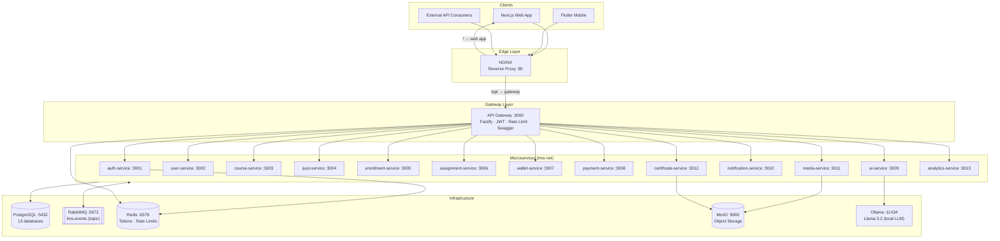

### Design Principles

| Principle | Implementation |
|-----------|---------------|
| **Service Isolation** | Each service owns its database; no cross-DB reads |
| **Stateless Services** | All runtime state in PostgreSQL or Redis |
| **Event-Driven** | Async state changes flow through `lms.events` topic exchange |
| **Clean Architecture** | Domain layer has zero framework imports |
| **Kubernetes-Ready** | 12-factor app, env-var config, health endpoints |

---

## 2. Microservice Architecture

### Service Map

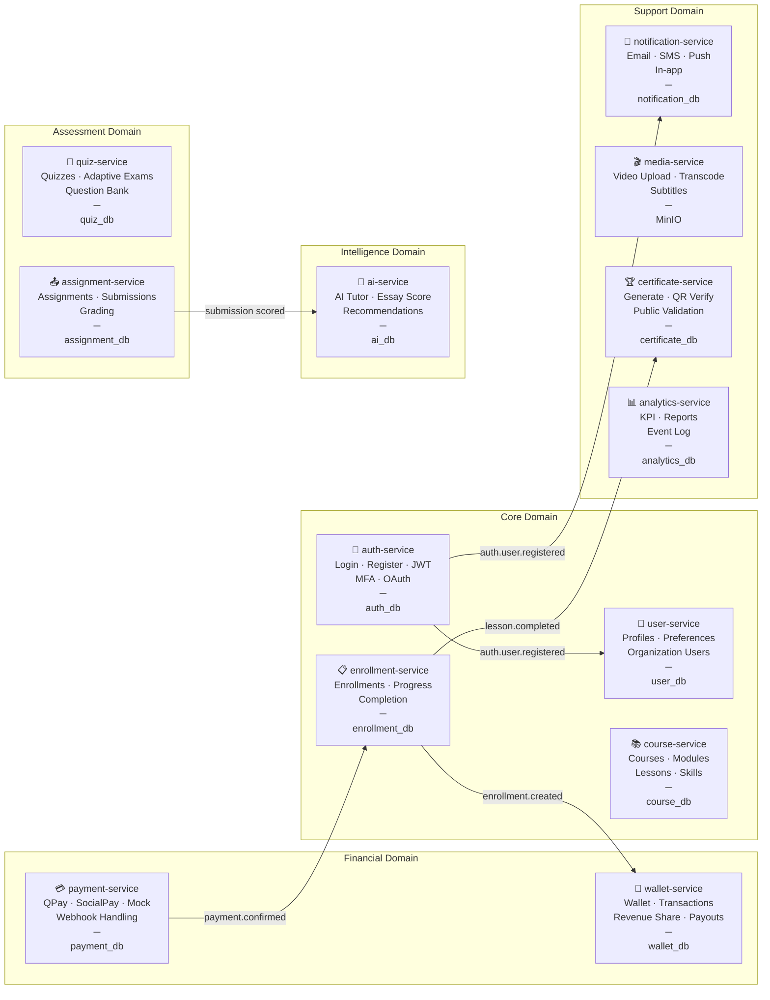

### Service Internal Structure

Every service follows the same internal layout:

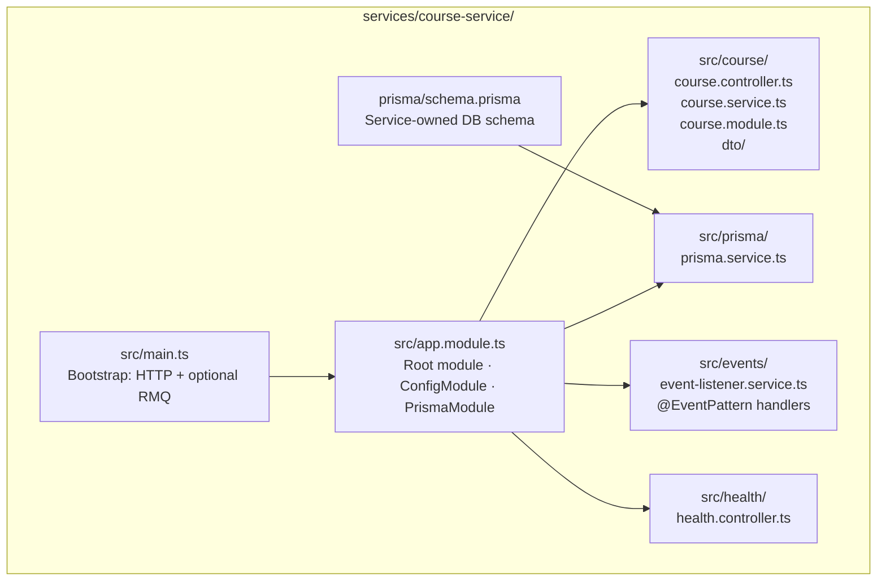

---

## 3. API Gateway

The gateway is the **single ingress point** — all client traffic passes through it. It validates JWT tokens, enforces rate limits, and forwards requests to upstream services without containing any business logic.

### Request Pipeline

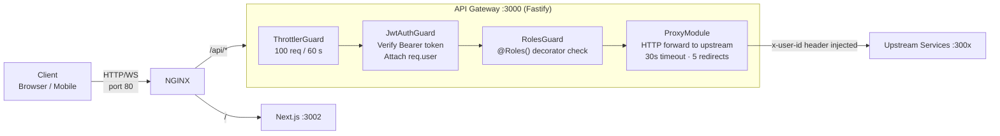

### Gateway Module Structure

```mermaid
graph TD
    APPMOD["AppModule"]
    APPMOD --> THRMOD["ThrottlerModule\nttl=60000ms\nlimit=100"]
    APPMOD --> HTTPMOD["HttpModule\ntimeout=30s\nmaxRedirects=5"]
    APPMOD --> AUTHMOD["GatewayAuthModule\nJWT strategy"]
    APPMOD --> PROXYMOD["ProxyModule\nRoute forwarding"]
    APPMOD --> MEDMOD["MediaModule\nDirect upload handling\n500MB multipart"]
    APPMOD --> HLTMOD["HealthModule\nGET /api/health"]

    PROXYMOD --> AUTH_R["/api/v1/auth/* → auth-service:3001"]
    PROXYMOD --> USER_R["/api/v1/users/* → user-service:3002"]
    PROXYMOD --> COURSE_R["/api/v1/courses/* → course-service:3003"]
    PROXYMOD --> QUIZ_R["/api/v1/quizzes/* → quiz-service:3004"]
    PROXYMOD --> ENROLL_R["/api/v1/enrollments/* → enrollment-service:3005"]
    PROXYMOD --> ASSIGN_R["/api/v1/assignments/* → assignment-service:3006"]
    PROXYMOD --> WALLET_R["/api/v1/wallet/* → wallet-service:3007"]
    PROXYMOD --> PAYMENT_R["/api/v1/payments/* → payment-service:3008"]
    PROXYMOD --> AI_R["/api/v1/ai/* → ai-service:3009"]
    PROXYMOD --> CERT_R["/api/v1/certificates/* → certificate-service:3012"]
    PROXYMOD --> ANALYTICS_R["/api/v1/analytics/* → analytics-service:3013"]
```

### JWT Token Lifecycle

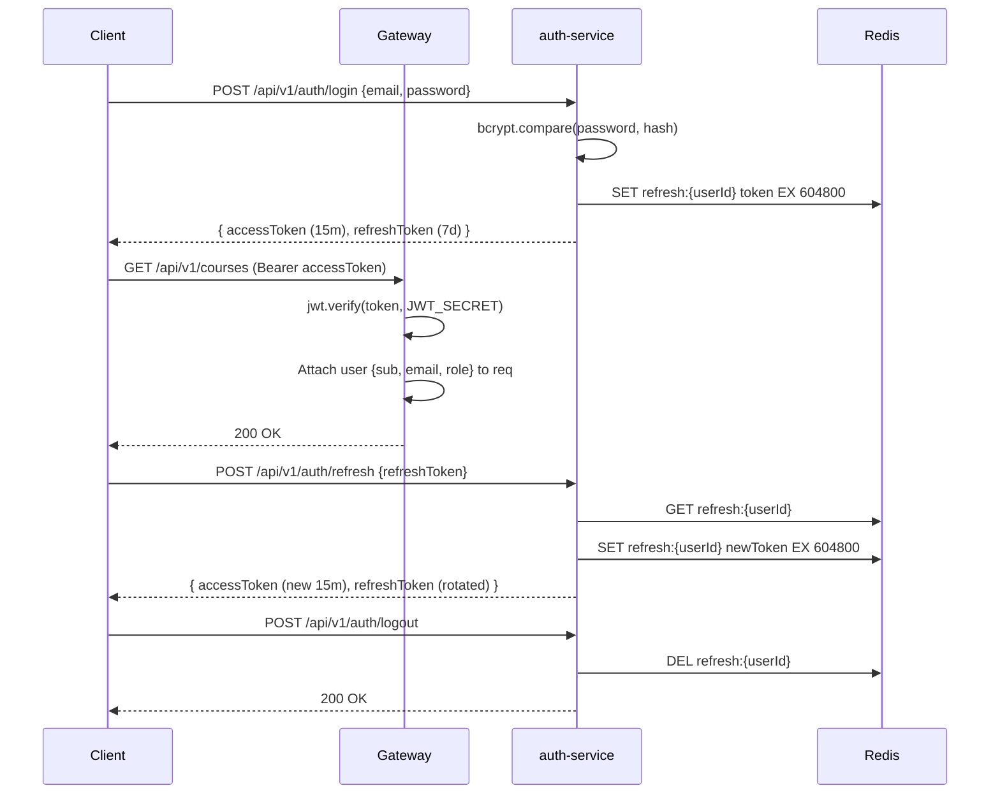

### NGINX Configuration Summary

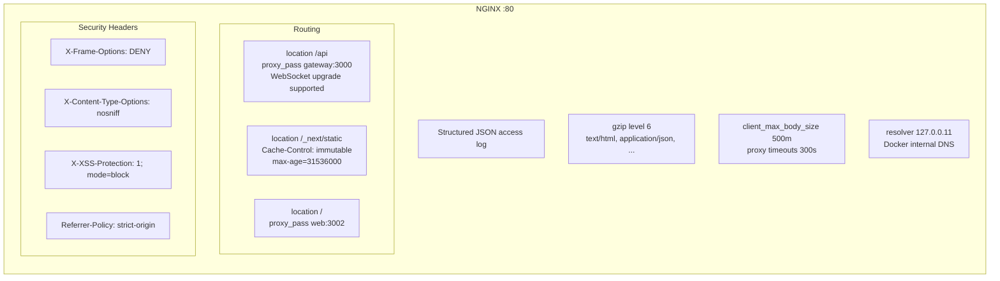

---

## 4. Database Architecture

Each service owns exactly one PostgreSQL database. No service ever reads another service's tables. Cross-domain data is accessed via HTTP or events.

### Database Isolation Map

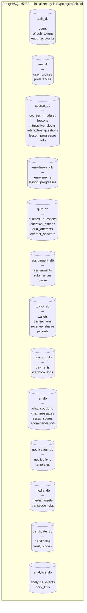

### Core Domain Entity Relationships

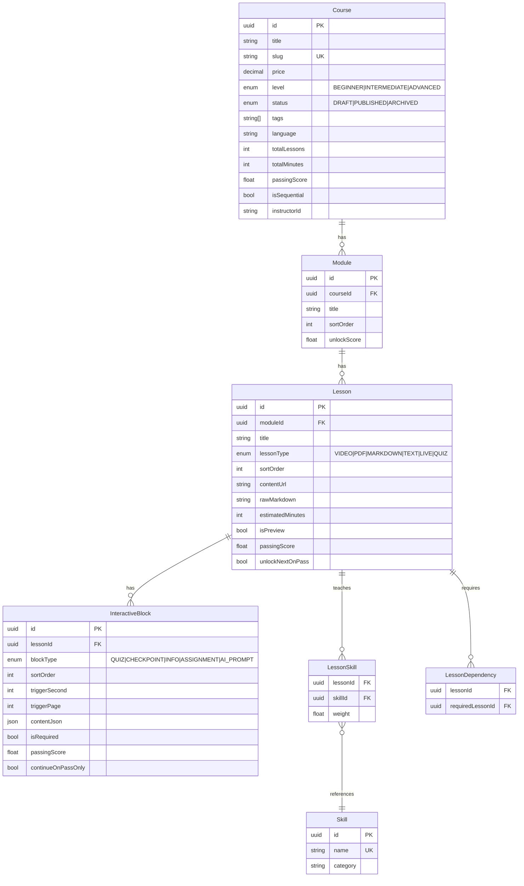

### Auth Domain Schema

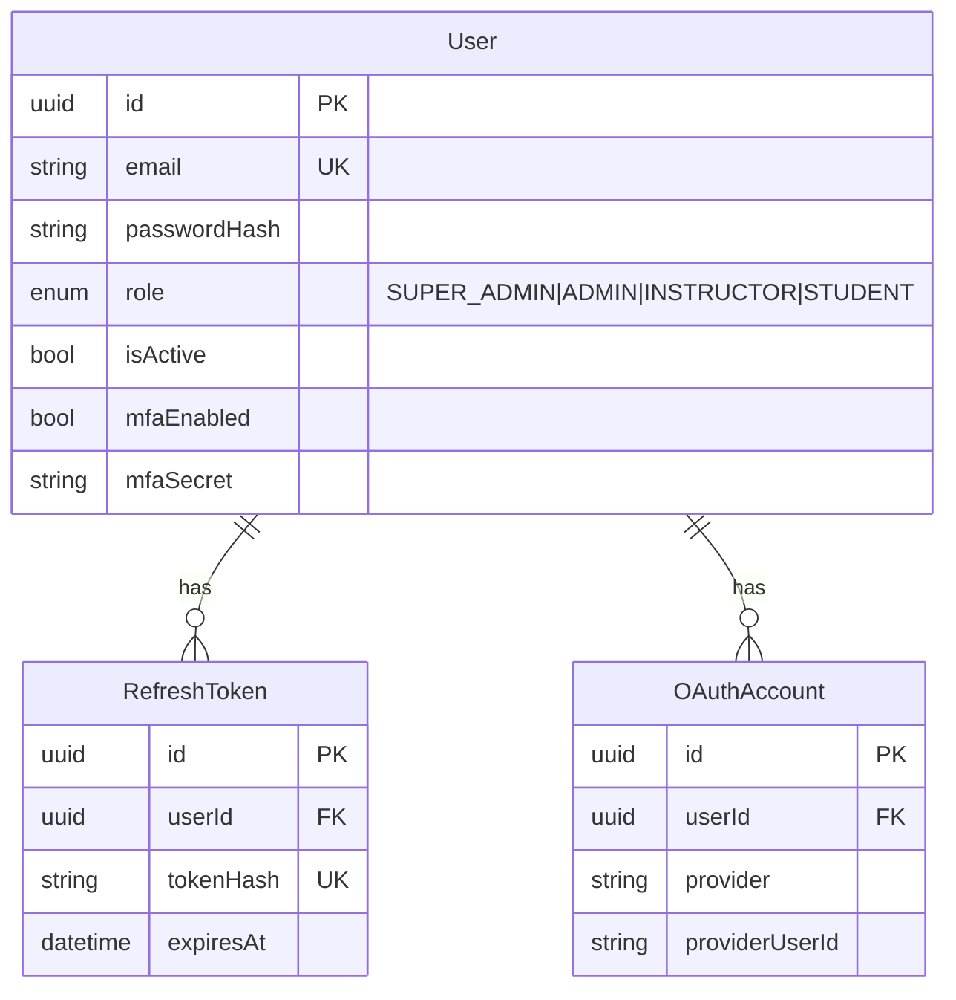

### Financial Domain Schema

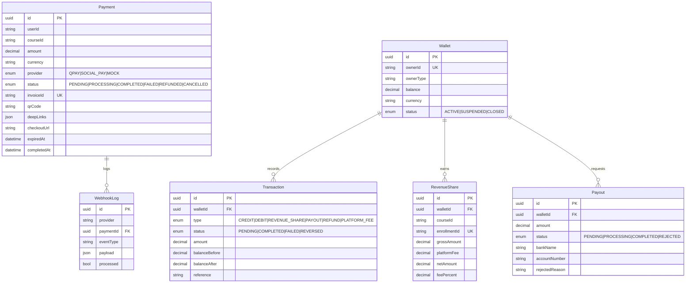

---

## 5. RabbitMQ Event Flow

### Exchange Topology

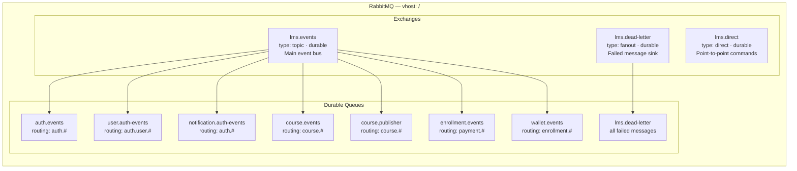

### Full Event Chain

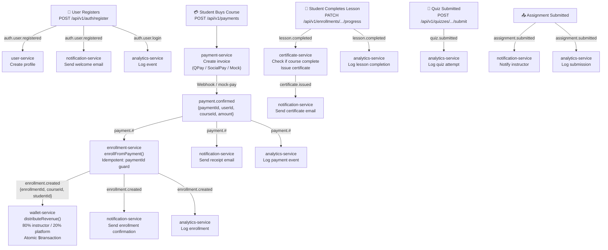

### Payment → Enrollment Sequence (Critical Path)

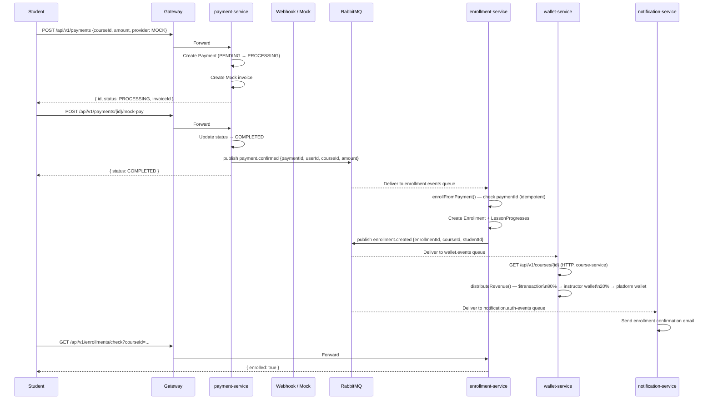

---

## 6. Redis Architecture

Redis runs with `maxmemory 256mb` and `allkeys-lru` eviction policy — meaning the least-recently-used keys are automatically evicted when memory pressure occurs.

### Usage Map

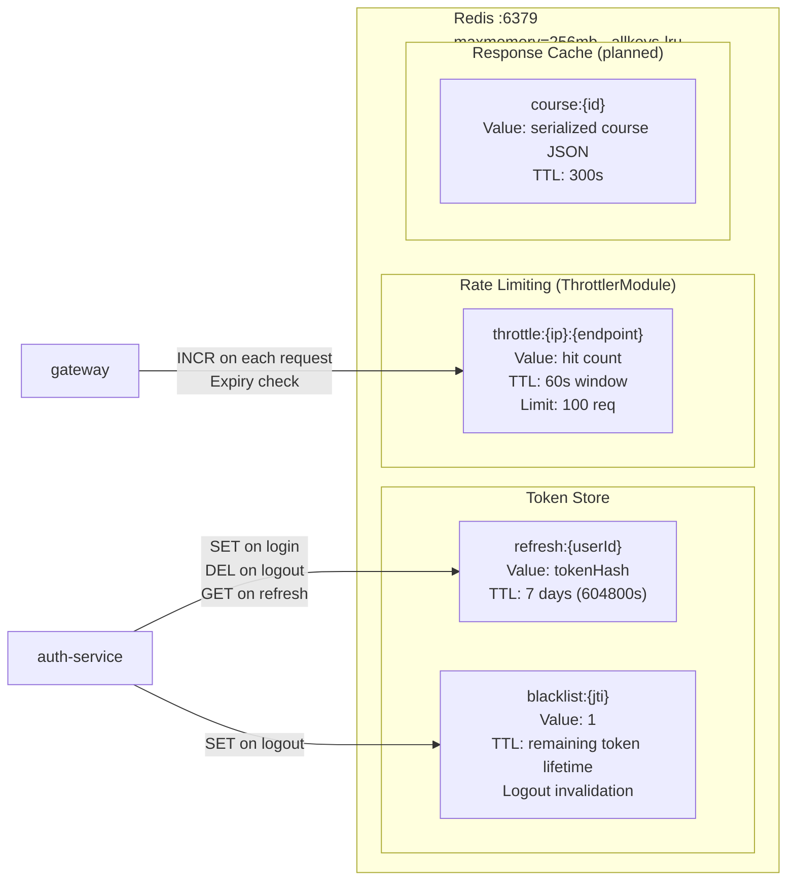

### Token Rotation Flow

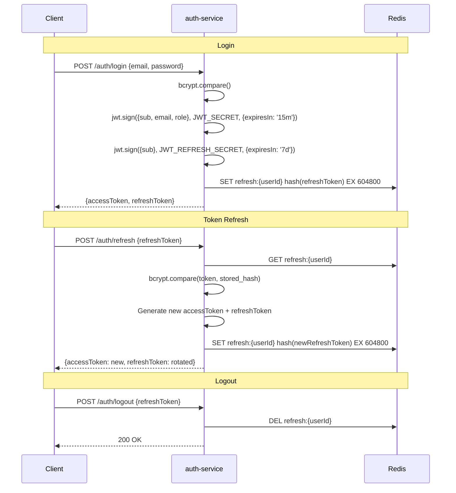

---

## 7. AI Architecture

The platform's AI capabilities are powered by **Ollama** running **Llama 3.2** locally — no external LLM API calls. This ensures data privacy and eliminates per-token costs.

### AI System Overview

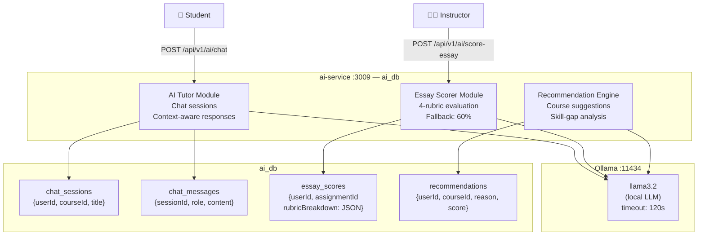

### AI Tutor Chat Flow

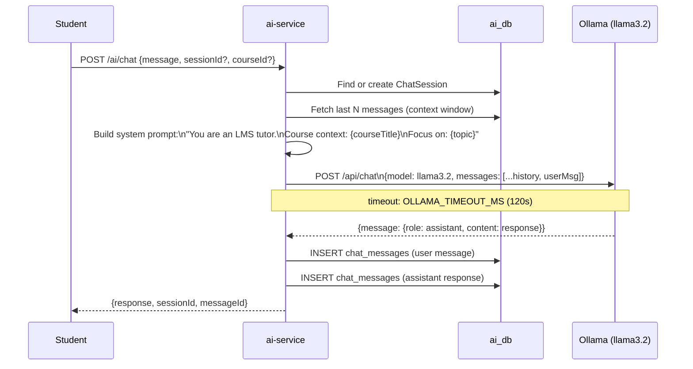

### Essay Scoring Rubric

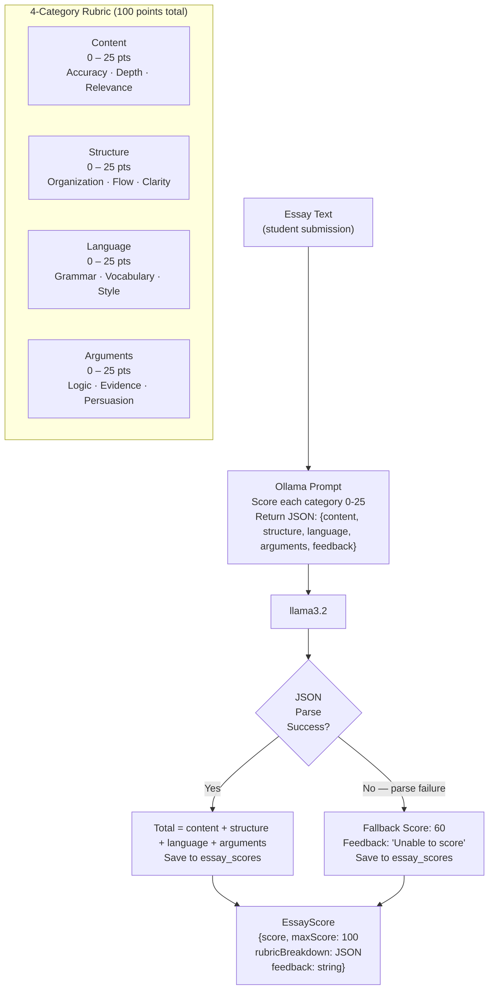

### Recommendation Engine

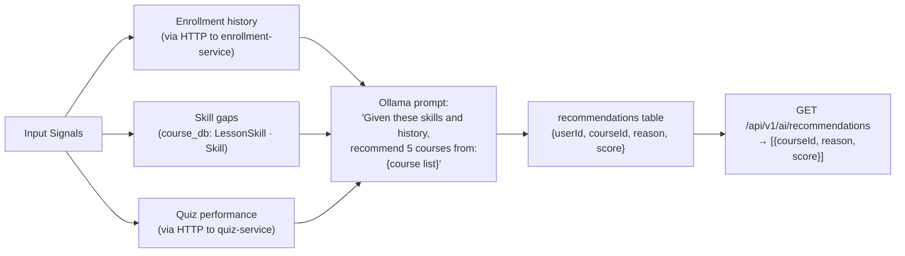

---

## 8. Interactive Lesson Engine

The interactive lesson engine embeds assessments, checkpoints, and AI prompts **inside** lesson content. A trigger fires the block at a specific moment (video second, PDF page, markdown paragraph) and can gate further progress until the student passes.

### Block Types and Triggers

```mermaid
graph LR
    subgraph LESSON["Lesson (any type)"]
        VIDEO["VIDEO\nTrigger: triggerSecond"]
        PDF["PDF\nTrigger: triggerPage"]
        MARKDOWN["MARKDOWN\nTrigger: triggerParagraph"]
        TEXT["TEXT\nTrigger: triggerParagraph"]
    end

    subgraph BLOCKS["InteractiveBlock (blockType)"]
        QUIZ_B["QUIZ\nEmbedded questions\nScore threshold → unlock"]
        CHECK["CHECKPOINT\nConfirmation prompt\nNo scoring"]
        INFO["INFO\nInformational callout\nNon-blocking"]
        ASSIGN_B["ASSIGNMENT\nLink to assignment-service\nassignmentId in contentJson"]
        AI_B["AI_PROMPT\nChat with tutor\nContext: current lesson"]
    end

    VIDEO -->|"at second N"| QUIZ_B & CHECK & INFO & AI_B
    PDF -->|"at page N"| QUIZ_B & CHECK & INFO & ASSIGN_B
    MARKDOWN -->|"at paragraph N"| QUIZ_B & INFO & AI_B
```

### Interactive Block Schema Detail

```mermaid
erDiagram
    Lesson {
        uuid id PK
        uuid moduleId FK
        enum lessonType
        bool unlockNextOnPass
        float passingScore
    }

    InteractiveBlock {
        uuid id PK
        uuid lessonId FK
        enum blockType "QUIZ|CHECKPOINT|INFO|ASSIGNMENT|AI_PROMPT"
        int sortOrder
        int triggerSecond
        int triggerPage
        int triggerParagraph
        json contentJson
        bool isRequired
        float passingScore
        bool continueOnPassOnly
    }

    InteractiveQuestion {
        uuid id PK
        uuid interactiveBlockId FK
        enum questionType "SINGLE_CHOICE|MULTIPLE_CHOICE|TRUE_FALSE|ORDERING|MATCHING|SHORT_TEXT"
        string questionText
        string explanation
        float score
        int sortOrder
    }

    InteractiveQuestionOption {
        uuid id PK
        uuid questionId FK
        string optionText
        bool isCorrect
        int sortOrder
    }

    InteractiveBlockProgress {
        uuid id PK
        uuid lessonProgressId FK
        uuid interactiveBlockId FK
        float score
        bool passed
        bool completed
        int attempts
    }

    InteractiveAnswer {
        uuid id PK
        uuid interactiveBlockProgressId FK
        uuid questionId FK
        string answerText
        json selectedOptionIds
        bool isCorrect
        float scoreAwarded
    }

    Lesson ||--o{ InteractiveBlock : "contains"
    InteractiveBlock ||--o{ InteractiveQuestion : "has"
    InteractiveQuestion ||--o{ InteractiveQuestionOption : "has"
    InteractiveBlock ||--o{ InteractiveBlockProgress : "tracks"
    InteractiveBlockProgress ||--o{ InteractiveAnswer : "records"
```

### Student Progress Flow

```mermaid
flowchart TD
    START["Student opens lesson"] --> UNLOCK{"Lesson\nstatus?"}
    UNLOCK -->|"LOCKED"| LOCKED_MSG["Show locked message\nDisplay required prerequisite"]
    UNLOCK -->|"IN_PROGRESS / COMPLETED"| CONTENT["Render lesson content"]

    CONTENT --> TRIGGER{"Interactive\nblock trigger\nreached?"}
    TRIGGER -->|"No"| CONSUME["Student continues consuming"]
    CONSUME --> TRIGGER

    TRIGGER -->|"Yes — blockType: QUIZ"| QUIZ_MODAL["Show quiz modal\nQuestions from InteractiveQuestion"]
    QUIZ_MODAL --> SUBMIT["Student submits answers"]
    SUBMIT --> SCORE["Calculate score\nSave InteractiveBlockProgress\nSave InteractiveAnswer[]"]

    SCORE --> PASS{"score ≥\npassingScore?"}
    PASS -->|"Yes"| UNLOCK_NEXT["Mark block: passed=true\nUnlock next content segment\nContinue lesson"]
    PASS -->|"No & continueOnPassOnly"| RETRY{"attempts <\nmaxAttempts?"}
    RETRY -->|"Yes"| QUIZ_MODAL
    RETRY -->|"No"| BLOCKED["Block progress\nContact instructor"]

    UNLOCK_NEXT --> ALL_DONE{"All required\nblocks passed?"}
    ALL_DONE -->|"No"| CONTENT
    ALL_DONE -->|"Yes"| COMPLETE_LESSON["Mark LessonProgress: completed\nUpdate progressPercent\nCheck unlockNextOnPass"]

    COMPLETE_LESSON --> NEXT_UNLOCK{"unlockNextOnPass\n= true?"}
    NEXT_UNLOCK -->|"Yes"| UNLOCK_LESSON["Set next LessonProgress: IN_PROGRESS"]
    NEXT_UNLOCK -->|"No"| MANUAL["Instructor must unlock"]

    COMPLETE_LESSON -->|"event"| EMIT["Publish lesson.completed\n→ analytics-service\n→ certificate-service"]
```

### Sequential vs Free-Navigation Mode

```mermaid
graph LR
    subgraph SEQ["isSequential = true (default)"]
        L1_S["Lesson 1\n✅ COMPLETED"] --> L2_S["Lesson 2\n🔓 IN_PROGRESS"] --> L3_S["Lesson 3\n🔒 LOCKED"]
    end

    subgraph FREE["isSequential = false"]
        L1_F["Lesson 1\n🔓 Available"] --- L2_F["Lesson 2\n🔓 Available"] --- L3_F["Lesson 3\n🔓 Available"]
    end

    subgraph DEP["LessonDependency — custom graph"]
        A["Lesson A\n✅"] --> C["Lesson C\n🔓"]
        B["Lesson B\n✅"] --> C
        C --> D["Lesson D\n🔒"]
    end
```

---

## 9. Quiz Engine

The quiz engine supports **standard quizzes** and **adaptive quizzes** (difficulty-branching). Quizzes can be standalone (course-level) or attached to a lesson.

### Quiz Schema

```mermaid
erDiagram
    Quiz {
        uuid id PK
        string courseId
        string lessonId
        string title
        float passingScore "default: 70"
        int timeLimit
        int maxAttempts "default: 3"
        bool isAdaptive "default: false"
        bool isPublished
    }

    Question {
        uuid id PK
        uuid quizId FK
        enum questionType "SINGLE_CHOICE|MULTIPLE_CHOICE|TRUE_FALSE|SHORT_TEXT"
        string questionText
        string explanation
        float score "default: 1"
        int sortOrder "proxy for difficulty in adaptive"
    }

    QuestionOption {
        uuid id PK
        uuid questionId FK
        string optionText
        bool isCorrect
        int sortOrder
    }

    QuizAttempt {
        uuid id PK
        uuid quizId FK
        string studentId
        enum status "IN_PROGRESS|SUBMITTED|GRADED|EXPIRED"
        float score
        bool passed
        datetime startedAt
        datetime submittedAt
        datetime expiresAt
    }

    AttemptAnswer {
        uuid id PK
        uuid attemptId FK
        uuid questionId FK
        string[] selectedOptionIds
        string textAnswer
        bool isCorrect
        float score
    }

    Quiz ||--o{ Question : "contains"
    Question ||--o{ QuestionOption : "has"
    Quiz ||--o{ QuizAttempt : "has"
    QuizAttempt ||--o{ AttemptAnswer : "records"
```

### Standard Quiz Flow

```mermaid
sequenceDiagram
    participant S as Student
    participant QS as quiz-service
    participant DB as quiz_db

    S->>QS: POST /quizzes/{id}/attempts
    QS->>DB: Check attempt count ≤ maxAttempts
    QS->>DB: Create QuizAttempt (IN_PROGRESS)\nexpiresAt = now + timeLimit
    QS->>DB: Fetch all questions (shuffled if configured)
    QS-->>S: {attemptId, questions[], expiresAt}

    S->>QS: POST /quizzes/attempts/{attemptId}/submit\n{answers: [{questionId, selectedOptionIds}]}
    QS->>DB: Fetch correct options for each question
    QS->>QS: Calculate score per question\nTotal = Σ(question.score * isCorrect)
    QS->>DB: Save AttemptAnswers
    QS->>DB: Update QuizAttempt:\nstatus=GRADED\nscore=total\npassed=(total≥passingScore)
    QS->>QS: Publish quiz.submitted event
    QS-->>S: {score, passed, passingScore, answers[]}
```

### Adaptive Quiz Engine

The adaptive engine uses `sortOrder` as a **difficulty proxy**: correct answer → serve a harder question (higher sortOrder); wrong answer → serve an easier question (lower sortOrder).

```mermaid
flowchart TD
    START["Start Adaptive Quiz\nPOST /quizzes/{id}/attempts\nisAdaptive: true"]
    START --> INIT["Select initial question\nmid-difficulty (median sortOrder)"]
    INIT --> SHOW["Show question to student"]
    SHOW --> ANS["Student answers"]
    ANS --> EVAL{"Correct?"}

    EVAL -->|"✅ Correct"| HARDER["Fetch next unanswered question\nwith sortOrder > current\n(harder)"]
    EVAL -->|"❌ Wrong"| EASIER["Fetch next unanswered question\nwith sortOrder < current\n(easier)"]

    HARDER --> MORE1{"More\nquestions?"}
    EASIER --> MORE2{"More\nquestions?"}

    MORE1 -->|"Yes"| SHOW
    MORE2 -->|"Yes"| SHOW
    MORE1 -->|"No"| GRADE
    MORE2 -->|"No"| GRADE

    GRADE["Calculate final score\nMark attempt GRADED\nPublish quiz.submitted"]
    GRADE --> RESULT["Return {score, passed, adaptivePath}"]
```

### Question Types and Answer Validation

```mermaid
graph LR
    subgraph TYPES["QuestionType"]
        SC["SINGLE_CHOICE\nExactly 1 selectedOptionId\n✅ isCorrect: 1 option"]
        MC["MULTIPLE_CHOICE\n1..N selectedOptionIds\n✅ All correct options selected\n❌ No incorrect options selected"]
        TF["TRUE_FALSE\n2 options (True/False)\nSame as SINGLE_CHOICE"]
        ST["SHORT_TEXT\ntextAnswer: string\nManual grading or AI scoring"]
    end

    subgraph SCORING["Scoring"]
        SC --> SC_SCORE["score = question.score if correct else 0"]
        MC --> MC_SCORE["score = question.score if exact match else 0"]
        TF --> TF_SCORE["score = question.score if correct else 0"]
        ST --> ST_SCORE["score = 0 (pending)\nAI service or instructor grades"]
    end
```

---

## 10. Wallet & Financial Architecture

All financial logic is isolated inside **wallet-service**. No other service touches wallet balances. Revenue is distributed atomically via Prisma `$transaction`.

### Revenue Distribution Flow

```mermaid
flowchart TD
    PAYMENT_DONE["payment.confirmed event\n{paymentId, userId, courseId, amount}"]
    PAYMENT_DONE --> ENROLL_SVC["enrollment-service\nCreate Enrollment"]
    ENROLL_SVC -->|"enrollment.created\n{enrollmentId, courseId, studentId}"| WALLET_SVC

    subgraph WALLET_SVC["wallet-service — distributeRevenue()"]
        FETCH["HTTP GET course-service\n/api/v1/courses/{courseId}\n→ {price, instructorId}"]
        FETCH --> CALC["Calculate split\ngross = course.price\nplatformFee = gross × 20%\nnetAmount = gross × 80%"]
        CALC --> TXN["Prisma $transaction ─────────────────────\n1. UPDATE wallets SET balance += netAmount\n   WHERE ownerId = instructorId\n2. INSERT revenue_shares\n   {walletId, courseId, enrollmentId\n    grossAmount, platformFee, netAmount, feePercent=20}\n───────────────────────────────────────────\nAtomic: either both succeed or neither"]
        TXN --> EMIT["Publish wallet.revenue.distributed"]
    end

    EMIT --> ANALYTICS["analytics-service\nLog revenue event"]
```

### Wallet Schema & Transaction Ledger

```mermaid
erDiagram
    Wallet {
        uuid id PK
        string ownerId UK
        string ownerType "USER or PLATFORM"
        decimal balance "18,2 precision"
        string currency "default: MNT"
        enum status "ACTIVE|SUSPENDED|CLOSED"
    }

    Transaction {
        uuid id PK
        uuid walletId FK
        enum type "CREDIT|DEBIT|REVENUE_SHARE|PAYOUT|REFUND|PLATFORM_FEE"
        enum status "PENDING|COMPLETED|FAILED|REVERSED"
        decimal amount
        decimal balanceBefore
        decimal balanceAfter
        string reference "External payment ID"
        json metadata
    }

    RevenueShare {
        uuid id PK
        uuid walletId FK
        string courseId
        string enrollmentId UK
        decimal grossAmount
        decimal platformFee
        decimal netAmount
        decimal feePercent "default: 20"
    }

    Payout {
        uuid id PK
        uuid walletId FK
        decimal amount
        enum status "PENDING|PROCESSING|COMPLETED|REJECTED"
        string bankName
        string accountNumber
        string accountName
        string rejectedReason
        datetime processedAt
    }

    Wallet ||--o{ Transaction : "ledger"
    Wallet ||--o{ RevenueShare : "earnings"
    Wallet ||--o{ Payout : "withdrawals"
```

### Payout Lifecycle

```mermaid
stateDiagram-v2
    [*] --> PENDING : Instructor requests payout\nPOST /api/v1/wallet/payouts

    PENDING --> PROCESSING : Admin reviews\nPATCH /payout/{id} status=PROCESSING

    PROCESSING --> COMPLETED : Bank transfer confirmed\nPATCH /payout/{id} status=COMPLETED\nDEBIT transaction created

    PROCESSING --> REJECTED : Admin rejects\nPATCH /payout/{id} status=REJECTED\nrejectedReason saved

    COMPLETED --> [*]
    REJECTED --> PENDING : Instructor re-applies
```

### Financial Safety Rules

```mermaid
graph TB
    RULE1["Rule 1: Isolation\nOnly wallet-service reads/writes wallet_db\nNo other service may touch wallet tables"]
    RULE2["Rule 2: Atomicity\nAll balance changes use Prisma $transaction\nBalance update + ledger record = one atomic operation"]
    RULE3["Rule 3: Idempotency\nRevenueShare.enrollmentId is UNIQUE\nDuplicate enrollment.created events → no double credit"]
    RULE4["Rule 4: Precision\nAll amounts stored as Decimal(18, 2)\nNo floating-point arithmetic for money"]
    RULE5["Rule 5: Audit trail\nEvery balance change creates a Transaction record\nbalanceBefore and balanceAfter stored"]

    RULE1 & RULE2 & RULE3 & RULE4 & RULE5 --> SAFE["Financial Integrity"]
```

---

## Appendix: Service Port Reference

| Service | Port | Database | Key Endpoints |
|---------|------|----------|---------------|
| NGINX | 80 | — | `/api/*` → gateway, `/` → web |
| **gateway** | 3000 | — | `/api/health`, `/docs` |
| **auth-service** | 3001 | auth_db | `/api/v1/auth/login`, `/register`, `/refresh`, `/logout` |
| **user-service** | 3002 | user_db | `/api/v1/users/me`, `/api/v1/users/:id` |
| **course-service** | 3003 | course_db | `/api/v1/courses`, `/modules`, `/lessons` |
| **quiz-service** | 3004 | quiz_db | `/api/v1/quizzes`, `/attempts`, `/submit` |
| **enrollment-service** | 3005 | enrollment_db | `/api/v1/enrollments`, `/check`, `/progress` |
| **assignment-service** | 3006 | assignment_db | `/api/v1/assignments`, `/submissions`, `/grade` |
| **wallet-service** | 3007 | wallet_db | `/api/v1/wallet/balance`, `/transactions`, `/payouts` |
| **payment-service** | 3008 | payment_db | `/api/v1/payments`, `/mock-pay`, `/webhook/:provider` |
| **ai-service** | 3009 | ai_db | `/api/v1/ai/chat`, `/score-essay`, `/recommendations` |
| **notification-service** | 3010 | notification_db | `/api/v1/notifications` |
| **media-service** | 3011 | MinIO | `/api/v1/media/upload`, `/transcode` |
| **certificate-service** | 3012 | certificate_db | `/api/v1/certificates`, `/verify/:code` |
| **analytics-service** | 3013 | analytics_db | `/api/v1/analytics/kpi`, `/events` |
| RabbitMQ Management | 15672 | — | `http://localhost:15672` |
| MinIO Console | 9001 | — | `http://localhost:9001` |
| PostgreSQL | 5432 | 13 DBs | Direct psql only |
| Redis | 6379 | — | Direct redis-cli only |
| Ollama | 11434 | — | Internal only |

## Appendix: Technology Decision Summary

| Decision | Choice | Rationale |
|----------|--------|-----------|
| HTTP framework | Fastify (gateway) · Express (services) | Fastify: 500MB multipart, high throughput for gateway |
| ORM | Prisma | Type-safe, migration history, per-service isolation |
| Message broker | RabbitMQ topic exchange | Pattern routing (`payment.#`, `enrollment.#`), durable queues |
| LLM inference | Ollama (local) | Zero per-token cost, data privacy, offline capability |
| Object storage | MinIO | S3-compatible, self-hosted, Docker-native |
| Cache / token store | Redis allkeys-lru | Auto-eviction under pressure, fast token lookups |
| Auth | JWT + Redis refresh | Stateless access tokens, revocable refresh tokens |
| Financial precision | Prisma `Decimal(18,2)` | Avoids IEEE 754 floating-point errors in money math |
