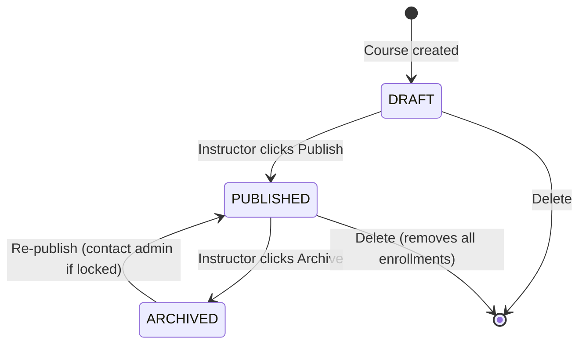
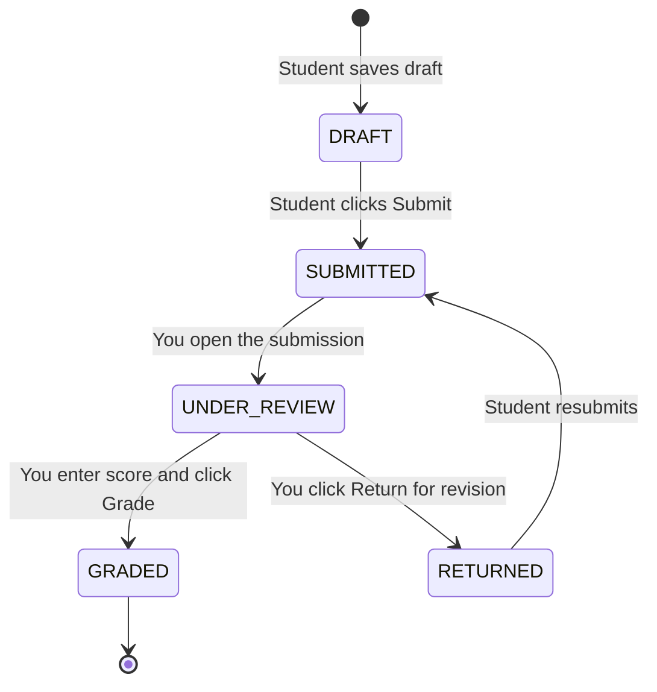
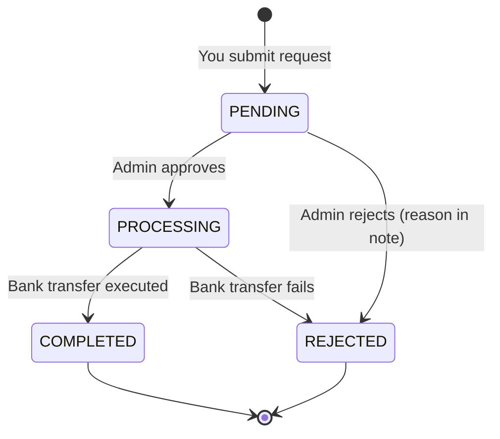

# LMS Platform — Teacher Guide

> **Complete reference for instructors: building courses, assessing students, and growing earnings.**
> Covers every feature available to the Instructor role, grounded in the platform's actual data model and business rules.

---

## Table of Contents

1. [Instructor Overview](#1-instructor-overview)
2. [Dashboard & Navigation](#2-dashboard--navigation)
3. [Course Creation](#3-course-creation)
4. [Module Management](#4-module-management)
5. [Lesson Authoring](#5-lesson-authoring)
6. [Interactive Lesson Blocks](#6-interactive-lesson-blocks)
7. [Quiz Creation](#7-quiz-creation)
8. [Adaptive Quizzes](#8-adaptive-quizzes)
9. [Assignments](#9-assignments)
10. [Grading Submissions](#10-grading-submissions)
11. [AI-Assisted Grading](#11-ai-assisted-grading)
12. [Student Progress & Analytics](#12-student-progress--analytics)
13. [Wallet & Earnings](#13-wallet--earnings)
14. [Best Practices](#14-best-practices)
15. [Troubleshooting](#15-troubleshooting)

---

## 1. Instructor Overview

As an instructor you own the full content lifecycle — from drafting a course to issuing certificates — and you earn revenue from every paid enrollment.

### What Instructors Can Do

| Area | Capability |
|---|---|
| **Courses** | Create, edit, publish, archive, and delete courses |
| **Curriculum** | Build modules and lessons in any of 6 lesson formats |
| **Interactivity** | Embed quizzes, checkpoints, info blocks, assignments, and AI prompts inside lessons |
| **Quizzes** | Create standalone quizzes (standard or adaptive) linked to lessons |
| **Assignments** | Create graded tasks; review and score student submissions |
| **AI Grading** | Use the AI Essay Scorer to pre-evaluate text submissions |
| **Certificates** | Certificates issue automatically on course completion (100% progress) |
| **Wallet** | View earnings; request bank payouts at any time |
| **Analytics** | Monitor per-course enrollment counts and submission activity |

### Instructor vs. Admin Differences

Instructors see and manage only the courses they own (`instructorId === user.id`). Admins can act on any course. If you need to transfer course ownership or change a student's enrollment manually, contact an administrator.

---

## 2. Dashboard & Navigation

After logging in as an instructor your dashboard shows four panels:

| Panel | What It Contains |
|---|---|
| **My Courses** | Every course where you are the instructor, with live enrollment counts |
| **Pending Grades** | Assignment submissions in `SUBMITTED` or `UNDER_REVIEW` status waiting for your score |
| **Wallet Balance** | Your current spendable balance in MNT |
| **Revenue Summary** | All-time gross revenue, platform fees deducted, and net earnings |

### Navigation Quick Reference

```
Top Nav
├── Courses        → Full course catalog (filter to "My Courses")
├── Assignments    → Cross-course submission inbox
├── AI             → Essay Scorer · Chat sessions
├── Wallet         → Balance · Transactions · Payouts
└── Profile Avatar → Settings · Notifications · Log Out
```

---

## 3. Course Creation

### 3.1 Creating a New Course

**Courses → New Course**

Fill in the course form:

| Field | Type | Default | Notes |
|---|---|---|---|
| **Title** | Text | — | Public-facing name; shown on course cards |
| **Description** | Textarea | — | Markdown-friendly; summarise what students learn |
| **Level** | Enum | `BEGINNER` | `BEGINNER` · `INTERMEDIATE` · `ADVANCED` |
| **Price** | Decimal | `0` | MNT; set to `0` for a free course |
| **Language** | Text | `mn` | ISO language code (e.g. `en`, `mn`, `zh`) |
| **Tags** | String array | `[]` | Comma-separated keywords for search |
| **Thumbnail** | URL | — | Cover image; shown on course cards |
| **Sequential** | Boolean | `true` | Whether students must complete lessons in order |
| **Passing Score** | Float | `60` | Minimum course-level score to issue certificate (%) |

Click **Save** — the course is created in `DRAFT` status. Students cannot see or enroll until you publish.

> **Slug is auto-generated** from the title. It must be globally unique. If you create two courses with the same title, the system appends a suffix automatically.

### 3.2 Course Status Lifecycle



| Status | Visible to Students | Enrollments Allowed | Notes |
|---|---|---|---|
| `DRAFT` | No | No | Safe editing state |
| `PUBLISHED` | Yes | Yes | Live; all changes apply immediately |
| `ARCHIVED` | No (hidden from catalog) | No | Existing enrollments preserved |

> **Best practice:** Do all content work in `DRAFT`. Publish only when the full curriculum is in place. You cannot un-publish directly to `DRAFT` — archive instead and create a new draft if needed.

### 3.3 Editing a Published Course

Navigate to the course detail page → **Засах** (Edit). All field changes save immediately and apply to all enrolled students. Structural changes (adding/removing lessons) do not remove existing `LessonProgress` records — students keep their progress on lessons that still exist.

### 3.4 Deleting a Course

Deleting a published course also deletes all enrollments and lesson progress records for every student. This action is permanent. A confirmation dialog is shown. Consider archiving instead.

---

## 4. Module Management

Modules are ordered containers of lessons. Every lesson must belong to exactly one module.

### 4.1 Accessing the Curriculum Editor

**Course Detail → Агуулга удирдах** (Manage Content)

This opens the curriculum editor showing all modules and their lessons in sort-order sequence.

### 4.2 Adding a Module

Click **Add Module** and fill in:

| Field | Type | Notes |
|---|---|---|
| **Title** | Text | Required. Example: `Introduction`, `Core Concepts`, `Final Project` |
| **Description** | Textarea | Optional context shown to students above the lesson list |
| **Sort Order** | Integer | Controls display order; lower numbers appear first |
| **Unlock Score** | Float | Optional — if set, students must reach this score in the previous module before this one unlocks |

### 4.3 Reordering Modules

Drag and drop modules in the curriculum editor, or edit the **Sort Order** field directly. Sort order values do not need to be consecutive — `10, 20, 30` is equivalent to `1, 2, 3` and leaves room to insert modules without renumbering.

### 4.4 Module Unlock Score

`unlockScore` is a module-level gate. If set to `75`, students must have an aggregate score ≥ 75% in the preceding module before the current module's first lesson becomes `IN_PROGRESS`.

Use this to enforce competency gates between major course sections (e.g., require students to pass the "Fundamentals" module before accessing "Advanced Topics").

### 4.5 Deleting a Module

Deleting a module cascades to all its lessons, interactive blocks, and lesson progress records. Students who completed those lessons lose those completion records. Confirm before deleting.

---

## 5. Lesson Authoring

### 5.1 Adding a Lesson

Inside a module, click **Add Lesson**. Configure:

| Field | Type | Default | Notes |
|---|---|---|---|
| **Title** | Text | — | Required |
| **Description** | Textarea | — | Brief summary shown in the lesson list |
| **Lesson Type** | Enum | `TEXT` | See table below |
| **Sort Order** | Integer | `0` | Position within the module |
| **Estimated Minutes** | Integer | — | Shown to students; used in `totalMinutes` rollup |
| **Is Preview** | Boolean | `false` | If true, non-enrolled users can view for free |
| **Passing Score** | Float | `60` | Score (%) required to mark lesson as `COMPLETED` |
| **Unlock Next on Pass** | Boolean | `true` | If true, the next lesson unlocks only when this one is passed |

### 5.2 Lesson Types

| Type | Content Field Used | Typical Use Case |
|---|---|---|
| `VIDEO` | `contentUrl` | Lecture recordings, demos, walkthroughs |
| `PDF` | `contentUrl` | Slide decks, reference documents, worksheets |
| `MARKDOWN` | `rawMarkdown` | Rich reading material with code, tables, images |
| `TEXT` | `rawText` | Short notes, announcements, plain instructions |
| `LIVE` | `contentUrl` | Link to Zoom/Meet session; activates at scheduled time |
| `QUIZ` | Links to a Quiz record | Standalone assessed quiz (see Section 7) |

### 5.3 Video Lessons

Set `contentUrl` to the media file path returned by the Media Service after upload. The platform serves videos from MinIO and supports the following transcoded formats:

| Format | Resolution | Recommended For |
|---|---|---|
| `MP4_480P` | 480p | Slow connections |
| `MP4_720P` | 720p | Default quality |
| `MP4_1080P` | 1080p | High-resolution screen recordings |
| `HLS` | Adaptive bitrate | Mobile students or variable connections |
| `WEBM` | Variable | Browser-native playback without plugins |

**Uploading a video:**
1. Go to **Media** in the navigation
2. Click **Upload**
3. Wait for transcoding to complete (status shown in the media library)
4. Copy the media URL and paste it into the lesson's `contentUrl` field

**Subtitle support:** Upload `.vtt` subtitle files against the same media entry. Students can toggle subtitles (CC button) while watching. Upload one `.vtt` per language — the language code in the filename is used for the toggle label.

### 5.4 Markdown Lessons

The `rawMarkdown` field accepts full CommonMark Markdown. The frontend renders:

- Headings (`#`, `##`, `###`)
- Fenced code blocks with syntax highlighting
- Tables, blockquotes, ordered and unordered lists
- Inline images: ``
- Bold, italic, inline code

**Example markdown lesson:**

````markdown
## What Is a Database Index?

An index is a separate data structure that stores a **sorted copy** of one or more columns,
with pointers back to the original rows.

### When to Use an Index

| Scenario | Add Index? |
|---|---|
| Column used in `WHERE` clause frequently | ✅ Yes |
| Column with high cardinality (many distinct values) | ✅ Yes |
| Column that is rarely queried | ❌ No |
| Small table (< 1,000 rows) | ❌ No |

### Example

```sql
-- Without index: full table scan (O(n))
SELECT * FROM orders WHERE customer_id = 42;

-- With index on customer_id: index scan (O(log n))
CREATE INDEX idx_orders_customer ON orders(customer_id);
```

> **Rule of thumb:** Index foreign keys and any column that appears in a `WHERE`, `ORDER BY`, or `JOIN` clause.
````

### 5.5 Live Lessons

Set `contentUrl` to the meeting link. The join button becomes clickable at the scheduled time. Attendance is marked manually via the student's lesson completion button, or via calendar integration if configured by your administrator.

### 5.6 Preview Lessons

Set `isPreview = true` on up to 2–3 lessons (typically the first lesson of each module) to let prospective students sample your course before enrolling. Preview lessons appear with a **Үнэгүй** (Free) badge in the course curriculum.

### 5.7 Lesson Dependencies

The platform supports explicit `LessonDependency` records in addition to the sequential-mode default. A dependency means: "this lesson cannot unlock until the required lesson is `COMPLETED`." Use the Manage Content editor to add cross-module dependencies for prerequisite relationships that span module boundaries.

---

## 6. Interactive Lesson Blocks

Interactive blocks are embedded activities placed at specific points inside a lesson. They appear inline as students scroll through (for Markdown/Text) or at specific timestamps (for Video).

### 6.1 Block Types

| Block Type | Purpose | Auto-graded? |
|---|---|---|
| `CHECKPOINT` | Require explicit acknowledgement before student can proceed | N/A (binary pass) |
| `QUIZ` | Inline mini-quiz (1–10 questions) | ✅ Yes |
| `INFO` | Highlighted callout box with supplementary content | N/A |
| `ASSIGNMENT` | Prompt to submit work before the lesson continues | ❌ No (instructor grades) |
| `AI_PROMPT` | AI-powered question or reflective activity | ✅ Partial (AI evaluates) |

### 6.2 Block Trigger Points

Each block fires at a specific position in the lesson:

| Lesson Type | Trigger Field | Example Value | Meaning |
|---|---|---|---|
| `VIDEO` | `triggerSecond` | `180` | Block appears 3 minutes into the video |
| `PDF` | `triggerPage` | `5` | Block appears after page 5 |
| `MARKDOWN` / `TEXT` | `triggerParagraph` | `3` | Block appears after the 3rd paragraph |

> If no trigger is set, the block appears at the very end of the lesson content.

### 6.3 Block Settings

| Setting | Type | Default | Effect |
|---|---|---|---|
| `isRequired` | Boolean | `true` | Student must interact with this block; cannot skip |
| `passingScore` | Float | — | Minimum score (%) to pass this block |
| `unlockNextContent` | Boolean | `true` | Passing this block unlocks the next section of the lesson |
| `continueOnPassOnly` | Boolean | `true` | If true, student cannot proceed past block until they pass it |

### 6.4 Adding a Block — Step by Step

1. Open a lesson in the curriculum editor
2. Click **Add Interactive Block**
3. Choose the block type
4. Set the trigger point (second / page / paragraph)
5. Configure content in the `contentJson` field (varies by type — see below)
6. Set `isRequired`, `passingScore`, and progression settings
7. Save

### 6.5 CHECKPOINT Block

A checkpoint is a knowledge gate. The student reads a statement and clicks to confirm they understand before the next section loads.

**`contentJson` structure:**
```json
{
  "statement": "I understand that database indexes improve read query speed at the cost of write performance.",
  "confirmLabel": "Yes, I understand"
}
```

**Workflow:**
```
[Lesson content up to triggerParagraph]
        ↓
[CHECKPOINT card appears]
        ↓
[Student clicks "Yes, I understand"]
        ↓
[Next section of lesson unlocks]
```

**Best practice:** Place checkpoints after each major concept shift — typically every 5–8 minutes of video or every 400–600 words of reading. Do not stack more than 2 checkpoints per lesson.

### 6.6 QUIZ Block (Inline)

An inline quiz tests comprehension of the material covered so far. It is shorter than a standalone quiz (1–5 questions recommended).

**`contentJson` structure:**
```json
{
  "instructions": "Quick check before we move on."
}
```

Questions are added as `InteractiveQuestion` records linked to the block. Each question supports these types:

| Type | Description |
|---|---|
| `SINGLE_CHOICE` | One correct answer from 2–6 options |
| `MULTIPLE_CHOICE` | Multiple correct answers from 2–8 options |
| `TRUE_FALSE` | Binary True / False |
| `ORDERING` | Drag items into the correct sequence |
| `MATCHING` | Match left-column items to right-column items |
| `SHORT_TEXT` | Free-text response (not auto-graded; instructor reviews) |

**Scoring:** Each question has a `score` weight (default `1`). The block's score is the sum of correctly answered question scores divided by the total possible score, expressed as a percentage.

**Retry behaviour:** If `continueOnPassOnly = true`, students who do not reach `passingScore` see a "Try Again" button and can retry immediately. Block attempt count is tracked in `InteractiveBlockProgress.attempts`.

### 6.7 INFO Block

Displays a highlighted callout with supplementary context. No interaction required.

**`contentJson` structure:**
```json
{
  "variant": "tip",
  "title": "Pro Tip",
  "body": "Always benchmark before adding an index — over-indexing slows writes."
}
```

Supported variants: `tip`, `warning`, `danger`, `info`

### 6.8 ASSIGNMENT Block

Prompts the student to submit work before the lesson continues. The block links to a published Assignment record by ID.

**`contentJson` structure:**
```json
{
  "assignmentId": "uuid-of-the-assignment",
  "message": "Submit your ERD diagram before continuing to the next section."
}
```

The block passes (allowing the lesson to continue) once the linked assignment's submission status reaches `SUBMITTED` or `GRADED`.

### 6.9 AI_PROMPT Block

An AI-powered reflective prompt. The student types a response; the AI tutor provides feedback.

**`contentJson` structure:**
```json
{
  "prompt": "Explain in your own words why you would choose a hash index over a B-tree index.",
  "minLength": 50,
  "maxLength": 500
}
```

The block is considered passed when the student submits a response meeting the length requirements. AI feedback is displayed immediately and is private to the student.

---

## 7. Quiz Creation

Quizzes are standalone assessments linked to a course and optionally to a specific lesson. A lesson of type `QUIZ` acts as the entry point to the quiz.

### 7.1 Creating a Quiz

**Courses → [Your Course] → Quizzes → New Quiz**

| Field | Type | Default | Notes |
|---|---|---|---|
| **Title** | Text | — | Required |
| **Description** | Textarea | — | Instructions shown before the quiz starts |
| **Course** | UUID | — | Which course this quiz belongs to |
| **Lesson** | UUID | — | Optional — links quiz to a specific lesson |
| **Passing Score** | Float | `70` | Minimum percentage to pass |
| **Time Limit** | Integer (seconds) | `null` | `null` = no time limit |
| **Max Attempts** | Integer | `3` | Students cannot exceed this |
| **Is Adaptive** | Boolean | `false` | See [Section 8](#8-adaptive-quizzes) |

After creating the quiz, add questions. The quiz starts in an unpublished state — students cannot take it until you click **Publish**.

### 7.2 Question Types (Standalone Quiz)

| Type | How Students Answer | Auto-graded? |
|---|---|---|
| `SINGLE_CHOICE` | Select exactly one option | ✅ |
| `MULTIPLE_CHOICE` | Select all correct options | ✅ |
| `TRUE_FALSE` | Toggle True or False | ✅ |
| `SHORT_TEXT` | Type a free-text answer (up to 500 characters) | ❌ |

### 7.3 Adding Questions

For each question:

1. Click **Add Question**
2. Select the question type
3. Enter the question text
4. Add answer options (for `SINGLE_CHOICE`, `MULTIPLE_CHOICE`, `TRUE_FALSE`)
5. Mark which options are correct (`isCorrect = true`)
6. Set the question `score` weight (default `1` — all questions worth equal points)
7. Add an optional `explanation` — shown to students after submission to explain the correct answer
8. Set `sortOrder` to control display sequence

**Example question structure:**

```
Question: "Which SQL clause filters results after aggregation?"
Type: SINGLE_CHOICE
Score: 2 (worth double)

Options:
  A. WHERE          → isCorrect: false
  B. HAVING         → isCorrect: true  ✅
  C. GROUP BY       → isCorrect: false
  D. ORDER BY       → isCorrect: false

Explanation: "WHERE filters before aggregation; HAVING filters after GROUP BY."
```

### 7.4 Scoring Formula

```
Quiz Score (%) = (sum of scores for correctly answered questions / sum of all question scores) × 100

Passed = Quiz Score >= passingScore
```

**Example:**
- 5 questions, each worth 1 point → max = 5
- Student answers 4 correctly → score = 4 / 5 × 100 = 80%
- Passing score = 70% → **Passed ✅**

### 7.5 Time Limits

`timeLimit` is stored in seconds. When the timer expires, the quiz is auto-submitted with whatever answers the student had entered — counted as one full attempt. Set time limits in seconds:

| Duration | Value |
|---|---|
| 15 minutes | `900` |
| 30 minutes | `1800` |
| 1 hour | `3600` |
| 2 hours | `7200` |

### 7.6 Attempt Limits

The default `maxAttempts` is `3`. When a student exceeds this, the server returns a `403 Forbidden` and the UI locks the quiz. If a student legitimately needs more attempts (e.g., technical issue), contact your administrator to reset their attempt count via the admin panel.

### 7.7 SHORT_TEXT Manual Grading

`SHORT_TEXT` answers are stored in `AttemptAnswer.textAnswer` and require manual review. After the quiz closes:

1. Go to **Assignments** → select the quiz's associated submission
2. Review each `SHORT_TEXT` answer
3. Assign a score for each free-text question
4. Update the total quiz score

Until you update the score, the quiz attempt remains in `SUBMITTED` status (not `GRADED`). The student's pass/fail status will be tentative.

### 7.8 Publishing a Quiz

A quiz must be published before students can take it.

1. Open the quiz
2. Click **Publish**
3. `isPublished` changes to `true`

> Unpublish is not directly supported after students have made attempts. Contact your administrator if you need to pull a quiz from students mid-course.

---

## 8. Adaptive Quizzes

### 8.1 What Adaptive Mode Does

When `isAdaptive = true`, the quiz engine adjusts the next question's difficulty based on the student's performance on the current question:

```
Student answers correctly
        ↓
Next question: higher difficulty (higher sort order)

Student answers incorrectly
        ↓
Next question: lower difficulty (reinforcement)
```

The difficulty ladder uses `sortOrder` as the proxy for difficulty — **lower `sortOrder` = easier, higher `sortOrder` = harder.** Questions must be ordered intentionally.

### 8.2 Designing an Adaptive Question Bank

**Golden rule: sort questions by difficulty, not by topic.**

```
sortOrder 1  → Recognition-level (e.g. "Which is an index type?")
sortOrder 2  → Understanding-level (e.g. "When should you NOT add an index?")
sortOrder 3  → Application-level (e.g. "Rewrite this slow query using an index.")
sortOrder 4  → Analysis-level (e.g. "Given this query plan, identify the bottleneck.")
sortOrder 5  → Synthesis-level (e.g. "Design an indexing strategy for this schema.")
```

Add at least **2× the number of questions** you want each student to answer, so the engine always has candidates to select at each difficulty level.

### 8.3 Configuring an Adaptive Quiz

1. Create the quiz with `isAdaptive: true`
2. Add questions and assign `sortOrder` strictly by difficulty (1 = easiest)
3. Set `passingScore` — the same threshold applies; the student's adaptive score is computed from the questions they actually answered
4. Do **not** set a `timeLimit` unless the course is a high-stakes exam — adaptive mode benefits from unhurried thinking

### 8.4 Adaptive vs. Standard — When to Use Each

| Scenario | Recommended Mode |
|---|---|
| End-of-module knowledge check | Standard |
| Placement test (wide skill range expected) | Adaptive |
| Certification exam | Standard (fixed, auditable) |
| Formative mid-lesson check-in | Standard (fewer questions) |
| Personalized review after poor performance | Adaptive |

---

## 9. Assignments

### 9.1 Creating an Assignment

**Courses → [Your Course] → Assignments → New Assignment**

| Field | Type | Default | Notes |
|---|---|---|---|
| **Title** | Text | — | Required |
| **Description** | Textarea | — | Instructions for the student |
| **Course** | UUID | — | Which course this belongs to |
| **Lesson** | UUID | — | Optional — ties assignment to a specific lesson |
| **Type** | Enum | `TEXT` | See table below |
| **Max Score** | Float | `100` | Maximum points the student can earn |
| **Passing Score** | Float | `60` | Minimum points to pass |
| **Due Date** | DateTime | — | Optional deadline |
| **Allow Late** | Boolean | `false` | If false, submission is blocked after due date |

### 9.2 Submission Types

| Type | What Students Submit | When to Use |
|---|---|---|
| `TEXT` | Typed response in the platform's text editor | Essays, reflections, short answers |
| `FILE_UPLOAD` | One or more files (any format, max 500 MB each) | Reports, diagrams, spreadsheets, presentations |
| `LINK` | A URL | GitHub repos, Google Docs, portfolios, deployed apps |
| `CODE` | Code pasted in the code editor block | Programming exercises, SQL queries, scripts |

> Choose the type that eliminates ambiguity. If you want a report as a PDF, use `FILE_UPLOAD`. If you want runnable code, use `CODE`. Mixing expectations causes confusion.

### 9.3 Designing a Good Assignment Description

A strong description answers:
- **What** the student must produce
- **Why** — the learning objective it maps to
- **How** — format, length, tools allowed
- **Criteria** — what distinguishes full marks from partial marks
- **When** — due date and late policy

**Example:**

```markdown
## Assignment: Design a Normalized Database Schema

**Objective:** Apply 3NF normalization to a real-world business scenario.

**Task:**
Design a PostgreSQL schema for a library management system. Your schema must include:
- At least 5 tables
- All foreign key relationships
- At least 2 indexes justified in your submission notes

**Deliverable:** Submit an ERD diagram (PNG or PDF) plus a `.sql` file with `CREATE TABLE` statements.

**Grading (100 points):**
- Correctness of relationships: 40 pts
- 3NF compliance: 30 pts
- Index justification: 20 pts
- Code quality (naming, constraints): 10 pts

**Due:** 2026-06-01 23:59 UB time. Late submissions accepted until 2026-06-03 with 10% deduction.
```

### 9.4 Due Dates and Late Submissions

| `allowLate` | Behaviour After Due Date |
|---|---|
| `false` (default) | Submit button locked; server returns `403 Forbidden` |
| `true` | Submission accepted; `isLate = true` flag set on the record |

The `isLate` flag is visible to you in the grading view. Apply late penalties manually by reducing the score — the system does not auto-deduct points.

### 9.5 Publishing an Assignment

Assignments are created in an unpublished state (`isPublished = false`). Students cannot see or interact with unpublished assignments.

Click **Publish** when the assignment is ready. Publish only after:
- The description is final
- The due date is correct
- The submission type is locked (changing type after students have saved drafts is confusing)

---

## 10. Grading Submissions

### 10.1 The Grading Inbox

**Assignments** in the navigation lists all submissions across all your courses. Filter by:

- **Status:** `SUBMITTED` (awaiting your review) · `UNDER_REVIEW` · `GRADED` · `RETURNED`
- **Assignment:** specific assignment title
- **Course:** narrow to one course

The `SUBMITTED` view is your grading queue. Work through it in chronological order (oldest first) to be fair to students who submitted early.

### 10.2 Submission Status Lifecycle



### 10.3 Opening and Reviewing a Submission

1. Click a submission in the inbox
2. Status automatically transitions to `UNDER_REVIEW`
3. Review the submitted content:
   - **TEXT:** Displayed inline
   - **FILE_UPLOAD:** Download links for each file
   - **LINK:** Clickable external link (opens in new tab)
   - **CODE:** Syntax-highlighted code block
4. Compare against your assignment rubric
5. Note issues for your feedback

### 10.4 Entering a Grade

In the grading panel:

| Field | Validation | Notes |
|---|---|---|
| **Score** | `0 ≤ score ≤ maxScore` | Server rejects scores above `maxScore` |
| **Feedback** | Optional text | Markdown supported; shown to student |

Click **Grade** to save. The system:
1. Creates or updates the `Grade` record (upsert — re-grading is safe)
2. Sets `Submission.status = GRADED`
3. Publishes an `assignment.submission.graded` event to notify the student via email and in-app notification
4. Records whether `passed = score >= assignment.passingScore`

### 10.5 Returning a Submission for Revision

If the submission is incomplete or needs correction:

1. Add feedback explaining what to fix
2. Click **Return**
3. `Submission.status` changes to `RETURNED`
4. The student receives a notification and can resubmit

After resubmission, the status returns to `SUBMITTED` and the submission re-enters your grading queue.

### 10.6 Re-grading

You can update a grade at any time (the grade is an upsert). The previous grade is overwritten — there is no grade history beyond the most recent record. Use the feedback field to explain score changes.

### 10.7 Grading Workflow — Recommended Process

```
1. Open submission inbox filtered to SUBMITTED
2. For each submission (oldest first):
   a. Open → status becomes UNDER_REVIEW
   b. Read submission fully
   c. Score against your rubric
   d. If acceptable: enter score + feedback → Grade
   e. If needs revision: enter feedback → Return
3. At the end of each session, check RETURNED queue for resubmissions
```

---

## 11. AI-Assisted Grading

### 11.1 When to Use the AI Essay Scorer

The AI Essay Scorer is most useful for:
- `TEXT`-type assignments with essay-length responses (300–5,000 words)
- Situations where you have many submissions to review in a short window
- Providing a second opinion when you are uncertain about a borderline submission

It is **not a replacement** for your judgment. Use it as a first-pass filter, then review and override as needed.

### 11.2 Accessing the Essay Scorer

**AI → Essay Scorer**

Or, directly from the grading view of a `TEXT` submission: click **Score with AI**.

### 11.3 Scorer Inputs

| Input | Required | Constraints | Notes |
|---|---|---|---|
| **Essay Text** | ✅ | 50–10,000 characters | Paste from the submission or type directly |
| **Assignment Context** | ❌ | — | Describe the prompt; improves accuracy |
| **Scoring Prompt** | ❌ | — | Custom rubric description for the AI |
| **Max Score** | ✅ | Any positive number | Default 100; match your assignment's `maxScore` |

### 11.4 Scorer Output — The Four-Dimension Rubric

The AI evaluates the essay across four equally weighted dimensions, each scored 0–25:

| Dimension | Max Points | What Is Evaluated |
|---|---|---|
| **Content** | 25 | Accuracy, depth, relevance to the prompt, factual correctness |
| **Structure** | 25 | Introduction, body paragraphs, conclusion, logical flow, transitions |
| **Language** | 25 | Grammar, spelling, vocabulary, sentence clarity, register |
| **Argumentation** | 25 | Quality of reasoning, use of evidence, strength of conclusions |

**Total score formula:**
```
total = content + structure + language + arguments   (max 100)
scaled_score = (total / 100) × maxScore
```

**Example result:**
```json
{
  "score": 78,
  "maxScore": 100,
  "percentage": 78,
  "feedback": "The essay presents a clear central argument supported by relevant examples.
               Structure is generally sound though the conclusion could be strengthened.
               Language is mostly precise; watch for passive voice overuse in paragraphs 2–3.
               The counterargument in paragraph 4 is acknowledged but not effectively rebutted.",
  "rubricBreakdown": {
    "content": 21,
    "structure": 19,
    "language": 18,
    "arguments": 20
  }
}
```

### 11.5 Fallback Behaviour

If the AI model cannot parse the essay (malformed input, model timeout, or non-text content):

- Score defaults to **60% of `maxScore`**
- Rubric breakdown defaults to **15 points per dimension**
- Feedback contains whatever raw text the model returned (truncated to 500 characters)

This is a safety net, not a meaningful grade. If you see a suspiciously round 60% score, verify the submission was parseable.

### 11.6 Workflow — AI-Assisted Grading

```
For each TEXT submission:

1. Open submission → copy text
2. Go to AI → Essay Scorer
3. Paste essay text
4. Set Assignment Context = your assignment description
5. Set Max Score = assignment's maxScore
6. Click "Score Essay"
7. Review rubric breakdown and feedback
8. Adjust the score if the AI under- or over-evaluated
9. Copy the AI feedback and add your own observations
10. Return to grading view → enter final score + feedback → Grade
```

**Time saving estimate:** AI scoring takes ~10 seconds per essay. Manual reading typically takes 3–8 minutes. For a 30-student cohort this saves approximately 90–240 minutes per assignment.

### 11.7 What the AI Cannot Do

| Limitation | Mitigation |
|---|---|
| Cannot verify external links or code in a TEXT submission | Review manually for link/code submissions |
| Cannot detect plagiarism or AI-generated text | Use external plagiarism tools before grading |
| Cannot apply assignment-specific rubric details without a scoring prompt | Write a clear `customPrompt` describing your rubric |
| May hallucinate factual claims in feedback | Always read feedback before copying to students |
| Works best with 300–5,000 words; less reliable below 100 words | Require minimum word count in assignment description |

---

## 12. Student Progress & Analytics

### 12.1 Per-Course Enrollment Overview

**Course Detail → Enrollments tab**

Displays every enrolled student with:
- `progressPercent` — overall completion (0–100%)
- `totalScore` — aggregate score across completed lessons
- `completed` — whether they have reached 100% and earned a certificate
- `enrolledAt` / `completedAt` timestamps

Sort by `progressPercent` ascending to identify students who are behind.

### 12.2 Per-Student Lesson Progress

Click any student row to see their lesson-level breakdown:

| Column | Meaning |
|---|---|
| Lesson title | — |
| Status | `LOCKED` · `IN_PROGRESS` · `COMPLETED` |
| Score | Best score achieved on this lesson |
| Completed At | Timestamp of completion (or blank if not yet complete) |

Use this to identify exactly where a student got stuck. If a student is stuck on the same interactive block after multiple attempts, it may indicate the content is unclear — consider revising.

### 12.3 Assignment Submission Analytics

For each assignment:
- **Submission rate:** How many enrolled students have submitted (or are in draft)
- **Late submissions:** Count of submissions where `isLate = true`
- **Score distribution:** Histogram of grades (visible in the assignment analytics panel)
- **Pass rate:** Percentage of graded submissions with `score >= passingScore`

### 12.4 Quiz Analytics

For each quiz:
- **Attempt count:** Total attempts across all students
- **Average score:** Mean score across all `GRADED` attempts
- **Pass rate:** Percentage of attempts that passed
- **Per-question accuracy:** Which questions most students got wrong (indicates where teaching should be reinforced)

### 12.5 Platform KPI Dashboard (Daily Snapshot)

Administrators have access to the full analytics dashboard. As an instructor, you can request reports from your administrator. The underlying data tracked daily includes:

| Metric | Description |
|---|---|
| `newEnrollments` | Enrollments created that day (including from payments) |
| `completedCourses` | Students who reached 100% on any course |
| `confirmedPayments` | Successful payments processed |
| `revenueAmount` | Gross revenue collected |
| `quizAttempts` | Total quiz attempts started |
| `avgQuizScore` | Mean quiz score across all attempts |
| `assignmentSubmissions` | Total submissions received |
| `certificatesIssued` | Certificates auto-generated |

Every event (enrollment, payment, quiz attempt, assignment submission) is stored in an immutable `AnalyticsEvent` log with the full event payload, enabling custom retrospective queries.

---

## 13. Wallet & Earnings

### 13.1 Revenue Model

When a student pays for your course, the gross amount is split atomically in a single database transaction:

```
Student pays ₮150,000
        │
        ├── Platform fee (20%)  →  ₮30,000  (credited to platform wallet)
        │
        └── Your earnings (80%) →  ₮120,000 (credited to your wallet immediately)
```

The 80/20 split is a platform-wide constant applied to every enrollment. Revenue is credited to your wallet within **seconds** of the payment being confirmed — there is no holding period.

### 13.2 Wallet Overview

**Wallet** in the navigation shows:

| Section | Contents |
|---|---|
| **Balance** | Current spendable MNT balance |
| **Transactions** | Paginated ledger of all credits and debits |
| **Revenue** | Per-enrollment revenue share records |
| **Payouts** | History of payout requests |

### 13.3 Transaction Types You Will See

| Type | When It Appears | Sign |
|---|---|---|
| `REVENUE_SHARE` | Each time a student's payment is confirmed | + Credit |
| `PAYOUT` | When a payout is completed | − Debit |
| `CREDIT` | Manual adjustment by administrator | + Credit |
| `DEBIT` | Manual deduction by administrator | − Debit |

### 13.4 Reading the Revenue Summary

The **Revenue Summary** aggregates across all your courses:

```
Total Gross:         ₮2,500,000   (sum of all enrollment payments)
Total Platform Fee:  ₮  500,000   (20% of gross)
Total Net:           ₮2,000,000   (credited to your wallet)
Enrollment Count:    50
```

Each individual `RevenueShare` record stores: `grossAmount`, `platformFee`, `netAmount`, `feePercent`, and the `enrollmentId` and `courseId` that triggered it — giving you a full audit trail per enrollment.

### 13.5 Requesting a Payout

**Wallet → Request Payout**

| Field | Requirement |
|---|---|
| **Amount** | Minimum ₮1,000; must not exceed available balance |
| **Bank Name** | Full name of your bank |
| **Account Number** | Bank account number |
| **Account Holder Name** | Must match the registered account holder |
| **Note** | Optional — reference for the transfer |

Click **Submit Request** to create a payout in `PENDING` status.

**Payout lifecycle:**



**Processing time:** Depends on your bank. Typically 1–3 business days from `PROCESSING` status. The platform does not control bank-side processing time.

### 13.6 Maximising Earnings

| Strategy | Effect |
|---|---|
| Offer 1–2 free preview lessons | Increases enrollment conversion |
| Price below ₮50,000 for introductory courses | Lower barrier; higher volume |
| Add an ADVANCED course at ₮150,000+ | Higher per-enrollment revenue |
| Keep courses updated (re-publish after edits) | Sustains repeat enrollment and recommendations |
| Respond quickly to grading queue | Improves student satisfaction and word-of-mouth |

---

## 14. Best Practices

### 14.1 Course Structure

**Do:**
- Create 4–8 modules per course, each covering a coherent topic
- Keep modules roughly equal in lesson count (3–7 lessons each)
- Put a `CHECKPOINT` or inline `QUIZ` block at the end of every major section
- Use `isPreview = true` on Lesson 1 of Module 1 to allow free sampling

**Don't:**
- Create a single module containing all 30 lessons
- Mix widely different topics in one module
- Use more than 5 interactive blocks per lesson — cognitive overload
- Publish with empty modules (no lessons)

### 14.2 Lesson Design

**Lesson length targets:**

| Lesson Type | Recommended Duration / Length |
|---|---|
| Video | 5–15 minutes per lesson |
| Markdown | 500–1,500 words |
| PDF | 5–15 pages |
| Live | 45–90 minutes |
| Quiz (standalone) | 5–20 questions |

**Estimated minutes field:** Always fill this in. It feeds the course-level `totalMinutes` rollup displayed on course cards and helps students plan their study schedule.

### 14.3 Quiz Design

- Keep passing score at the default **70%** for knowledge checks; raise to **80–85%** for certification quizzes
- Include `explanation` on every question — students learn from explanations, not just from knowing they got it wrong
- Balance question types: 60% `SINGLE_CHOICE`, 20% `MULTIPLE_CHOICE`, 20% `SHORT_TEXT` is a good default
- For a 60-minute exam: 30–40 questions, `timeLimit = 3600`, `maxAttempts = 1`
- For a module check-in: 5–10 questions, no time limit, `maxAttempts = 3`

### 14.4 Assignment Grading Consistency

- Grade all submissions for one assignment before moving to the next — avoids standards drift
- Write feedback even when the score is high — positive reinforcement matters
- Keep the rubric in the assignment description so students know in advance how they will be scored
- Use the AI Essay Scorer as a calibration tool — if your manual score consistently differs from the AI by >20 points, review your rubric clarity

### 14.5 Interactive Block Placement

| Trigger Type | Recommended Frequency |
|---|---|
| CHECKPOINT (Video) | Every 5–8 minutes |
| CHECKPOINT (Markdown) | Every 400–600 words |
| Inline QUIZ | After each major concept (1–3 questions) |
| ASSIGNMENT block | Once per lesson, near the end |
| INFO block | As needed for callouts; no more than 3 per lesson |

### 14.6 Content Release Strategy

For a course with a firm launch date:

```
Week -4: Draft all modules and lessons
Week -3: Add interactive blocks and quizzes
Week -2: Run a peer review (invite a colleague as a student-preview account)
Week -1: Fix issues; finalize pricing and thumbnail
Launch day: Click Publish
```

For a drip-release course (lessons released over time):

- Publish the first 2 modules on launch day
- Update the course weekly with new modules
- Use `ARCHIVED` status on lesson-level content not yet ready (workaround: keep the lesson `DRAFT` in the module until ready — contact your admin for per-lesson publish controls)

---

## 15. Troubleshooting

### 15.1 Course Issues

**Problem:** Publish button is disabled

**Cause:** The course has no modules, or all modules have no lessons.

**Solution:** Add at least one module with at least one lesson before publishing.

---

**Problem:** Students cannot see the course after I published it

**Causes and solutions:**

| Cause | Solution |
|---|---|
| Course status is `ARCHIVED` instead of `PUBLISHED` | Re-publish the course |
| Student's role is not `STUDENT` | Contact admin to verify the student's role |
| Student is searching by the old course title | The slug is based on the title at creation time; search by current title |

---

**Problem:** I accidentally deleted a lesson with student progress

**Cause:** Lesson delete cascades to `LessonProgress` records.

**Solution:** There is no undo. The affected students' `progressPercent` will automatically recalculate against the remaining lessons. If the course is published, students who had completed the deleted lesson will see their overall progress drop. Communicate the change to enrolled students.

---

### 15.2 Interactive Block Issues

**Problem:** A checkpoint is not appearing during the lesson

**Causes:**
- `triggerParagraph` value exceeds the actual paragraph count in the Markdown
- `triggerSecond` exceeds the video duration
- Block was created but not saved (check for unsaved changes indicator)

**Solution:** Edit the block and verify the trigger value is within the content bounds. Save and test with a student-role account.

---

**Problem:** Students report that an inline quiz lets them skip it

**Cause:** `isRequired = false` or `continueOnPassOnly = false`

**Solution:** Edit the block settings and set both to `true`. Changes apply immediately to all future attempts.

---

### 15.3 Quiz Issues

**Problem:** A student says they used all attempts but got a technical error mid-quiz

**Cause:** A quiz attempt in `IN_PROGRESS` status counts against the limit once the server creates it (to prevent abuse). A crash before submission still consumes an attempt.

**Solution:** Contact your administrator to manually delete the failed `QuizAttempt` record for that student, restoring one attempt.

---

**Problem:** SHORT_TEXT answers are all showing 0 points

**Cause:** `SHORT_TEXT` questions are not auto-graded. Manual scoring is required.

**Solution:** Go to each quiz attempt's answer view, enter a score for each `SHORT_TEXT` answer, and submit the updated grade. The student's total score will recalculate.

---

**Problem:** Students can see the correct answers before submitting

**Cause:** Some quiz configurations expose `isCorrect` in the response payload for question options. This is a configuration issue — contact your administrator to verify that the Quiz Service's student-facing endpoints do not expose `isCorrect` before submission.

---

### 15.4 Assignment Issues

**Problem:** Submit button is greyed out for a student after the due date

**Cause:** `allowLate = false` (default) and the `dueDate` has passed. This is expected behaviour.

**Solution:** If you want to grant an extension for a specific student, update `dueDate` to a future date, or set `allowLate = true` temporarily. Reset after the student submits.

---

**Problem:** I graded a submission but the student did not receive a notification

**Causes:**
1. Student has email notifications disabled for "Assignment Graded" events
2. SMTP is misconfigured at the platform level

**Solution:** Ask the student to check **Settings → Notifications** and enable the "Assignment Graded" channel. For SMTP issues, contact your administrator.

---

**Problem:** AI Essay Scorer returned a score of exactly 60

**Cause:** The AI model failed to parse the response and used the fallback (60% of `maxScore`).

**Solutions:**
1. Check that the submitted text is actual prose (not just a file link or code snippet)
2. Verify the essay length is at least 50 characters
3. Re-run the scorer with a more explicit `customPrompt`
4. Grade manually if the AI consistently fails for a specific submission

---

### 15.5 Wallet Issues

**Problem:** My wallet shows ₮0 after a student enrolled in my paid course

**Cause:** The enrollment was triggered by a free enrollment (the course price was `0`) or the payment status is not yet `COMPLETED`.

**Solutions:**
1. Check the course price — if `price = 0`, the revenue distribution is skipped (free courses earn no revenue)
2. Check the payment status in your admin panel — revenue is distributed only after `payment.confirmed` is received
3. If the payment shows `COMPLETED` but wallet still shows ₮0, check the wallet service logs with your administrator

---

**Problem:** Payout request stuck in `PENDING` for more than 3 business days

**Cause:** Payout requests require manual admin approval before moving to `PROCESSING`.

**Solution:** Contact your administrator — the request may have been missed. Provide the payout request ID from your Wallet → Payouts history.

---

**Problem:** Payout rejected without a clear reason

**Cause:** Admin is required to provide a rejection reason in the payout `note` field.

**Solution:** Check the **Payouts** history for the rejection note. Common rejection reasons: mismatched bank account details, insufficient verification, regulatory compliance review. Correct the issue and resubmit.

---

*Last updated: May 2026 · LMS Platform Documentation · Instructor Edition*
