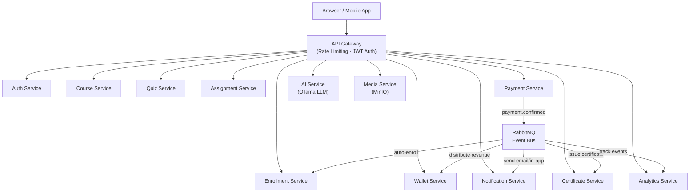
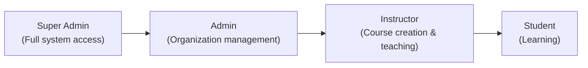
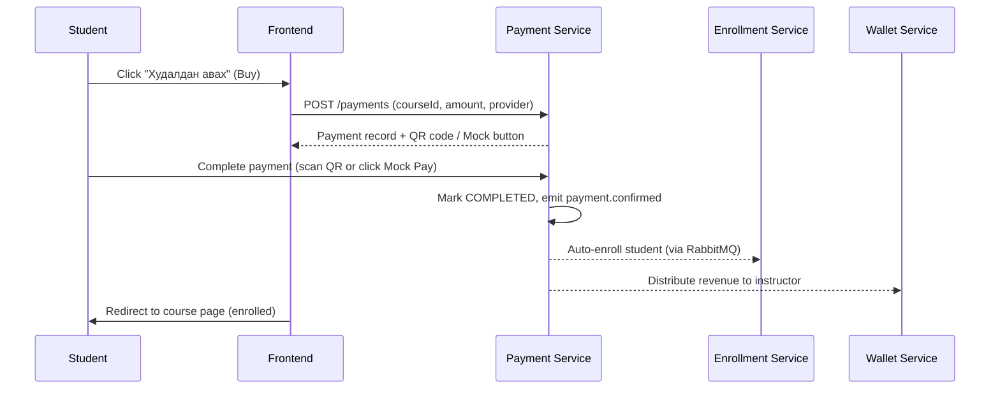
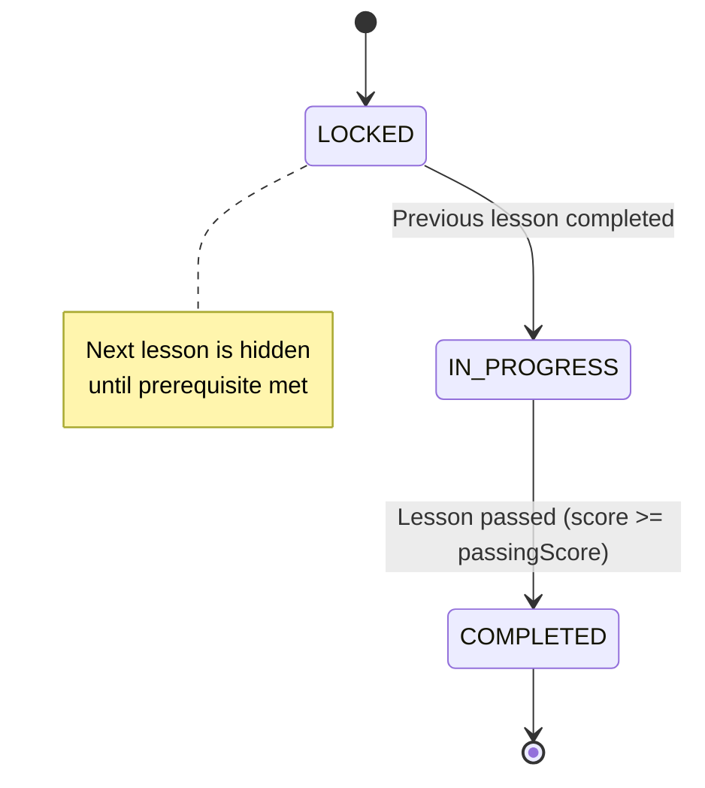
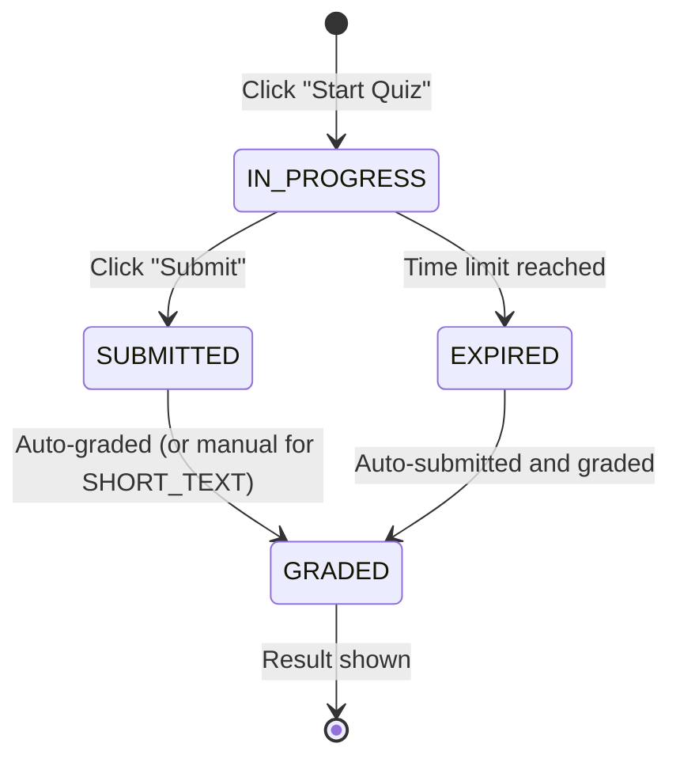

# LMS Platform — User Guide

> **Enterprise-grade AI-native Learning Management System**
> For students, instructors, and organization administrators.

---

## Table of Contents

1. [Platform Overview](#1-platform-overview)
2. [Login & Registration](#2-login--registration)
3. [User Roles & Permissions](#3-user-roles--permissions)
4. [Student Features](#4-student-features)
5. [Instructor Features](#5-instructor-features)
6. [Course Enrollment](#6-course-enrollment)
7. [Interactive Lessons](#7-interactive-lessons)
8. [Quiz System](#8-quiz-system)
9. [Assignments](#9-assignments)
10. [Wallet & Payments](#10-wallet--payments)
11. [Certificates](#11-certificates)
12. [Notifications](#12-notifications)
13. [AI Features](#13-ai-features)
14. [Troubleshooting](#14-troubleshooting)
15. [FAQ](#15-faq)

---

## 1. Platform Overview

The LMS Platform is a cloud-based learning management system built for schools, universities, corporate training programs, online academies, and certification organizations. It combines traditional course delivery with AI-powered features to personalize and accelerate learning.

### Key Capabilities

| Capability | Description |
|---|---|
| **Course Delivery** | Video, PDF, Markdown, text, and live lesson types |
| **Interactive Content** | Embedded quizzes, checkpoints, and AI prompts inside lessons |
| **Assessments** | Configurable quizzes and file/text/code/link assignments |
| **AI Tutoring** | Conversational AI tutor powered by a locally-hosted LLM |
| **Essay Scoring** | Automated essay evaluation with rubric breakdown |
| **Payments** | QPay and SocialPay integration; instant Mock payment for testing |
| **Certificates** | Auto-issued on course completion, publicly verifiable by QR code |
| **Wallet** | Instructor earnings wallet with 80/20 revenue split |
| **Analytics** | Real-time KPI dashboards for administrators |
| **Media Library** | Video transcoding, subtitle management, MinIO-backed storage |

### Platform Architecture (Overview)



---

## 2. Login & Registration

### 2.1 Creating an Account

1. Navigate to `http://your-platform.com/register`
2. Fill in the registration form:

| Field | Requirement |
|---|---|
| **Email** | Valid email address |
| **Password** | Minimum 8 characters, must include uppercase, lowercase, number, and special character (`!@#$%^&*`) |
| **Role** | Optional — defaults to **Student** |

3. Click **Register**
4. You will be redirected to the dashboard automatically upon success

> **Note:** If your organization uses invitation-based registration, your administrator will send you a link with a pre-assigned role.

### 2.2 Logging In

1. Navigate to `http://your-platform.com/login`
2. Enter your **email** and **password**
3. Click **Log In**

You will receive:
- An **access token** valid for **15 minutes** (automatically refreshed in the background)
- A **refresh token** valid for **7 days**

> If you are inactive for more than 7 days, you must log in again.

### 2.3 Changing Your Password

1. Go to **Account Settings** → **Security**
2. Enter your current password
3. Enter and confirm your new password
4. Click **Save Changes**

### 2.4 Logging Out

- **Current device:** Click your profile avatar → **Log Out**
- **All devices:** Click your profile avatar → **Log Out of All Devices**

---

## 3. User Roles & Permissions

The platform has four roles. Your role determines what you can see and do.



### Role Comparison Table

| Feature | Student | Instructor | Admin | Super Admin |
|---|:---:|:---:|:---:|:---:|
| Enroll in courses | ✅ | ✅ | ✅ | ✅ |
| Take quizzes | ✅ | ✅ | ✅ | ✅ |
| Submit assignments | ✅ | ✅ | ✅ | ✅ |
| Use AI tutor | ✅ | ✅ | ✅ | ✅ |
| Create courses | — | ✅ | ✅ | ✅ |
| Grade submissions | — | ✅ | ✅ | ✅ |
| Issue certificates | — | ✅ | ✅ | ✅ |
| Upload media | — | ✅ | ✅ | ✅ |
| View analytics | — | — | ✅ | ✅ |
| Manage all users | — | — | ✅ | ✅ |
| System configuration | — | — | — | ✅ |

### Role Descriptions

**Student**
The default role. Students browse the course catalog, enroll (free or paid), progress through lessons, take quizzes, submit assignments, and receive certificates upon completion.

**Instructor**
Creates and manages courses, modules, and lessons. Grades assignments, publishes quizzes, monitors student progress, and earns revenue from paid course enrollments.

**Admin**
Manages the organization: user accounts, course approvals, and platform-wide analytics. Can perform any action an instructor can.

**Super Admin**
Full system access including infrastructure configuration and user status management across all organizations.

---

## 4. Student Features

### 4.1 Dashboard

After logging in, your dashboard shows:

- **My Courses** — courses you are enrolled in with progress bars
- **Recent Activity** — your latest lesson, quiz, and assignment activity
- **Notifications** — unread alerts (payment confirmations, grades, etc.)

### 4.2 Browsing the Course Catalog

1. Click **Courses** in the top navigation
2. Browse by category, level, or search by title
3. Each course card shows:
   - Title and description
   - Difficulty level (`BEGINNER`, `INTERMEDIATE`, `ADVANCED`)
   - Price (or **Free**)
   - Number of lessons and estimated duration

### 4.3 Course Progress Tracking

Inside an enrolled course, you can see:

- **Progress bar** — percentage of lessons completed
- **Lesson status** — each lesson shows `Locked`, `In Progress`, or `Completed`
- **Score** — quiz and assignment scores accumulated

### 4.4 My Certificates

1. Click **Certificates** in the navigation
2. View all certificates you have earned
3. Click any certificate to see the full certificate
4. Share the public verification link or print directly from your browser

### 4.5 Wallet (Student View)

Students can view their transaction history (e.g., course purchases). Wallet credit balances may be issued by administrators for refunds or promotions.

---

## 5. Instructor Features

### 5.1 Instructor Dashboard

After logging in as an instructor, you see:

- **My Courses** — courses you created with enrollment counts
- **Pending Grades** — assignment submissions awaiting your review
- **Wallet Balance** — your current earnings balance
- **Revenue Summary** — gross revenue and platform fee breakdown

### 5.2 Creating a Course

1. Click **Courses** → **New Course**
2. Fill in the course details:

| Field | Description |
|---|---|
| **Title** | The public name of the course |
| **Description** | What students will learn |
| **Level** | `BEGINNER`, `INTERMEDIATE`, or `ADVANCED` |
| **Price** | In MNT. Set to `0` for a free course |
| **Language** | Primary language of the course |
| **Tags** | Searchable keywords |
| **Sequential** | Whether students must complete lessons in order |
| **Thumbnail** | Cover image URL |

3. Click **Save** to create the course as a **Draft**
4. Add modules and lessons before publishing

> **Important:** A course must be in `PUBLISHED` status before students can enroll.

### 5.3 Course Structure

```
Course
└── Module 1 (e.g., "Introduction")
│   ├── Lesson 1.1 (VIDEO)
│   ├── Lesson 1.2 (PDF)
│   └── Lesson 1.3 (QUIZ)
└── Module 2 (e.g., "Core Concepts")
    ├── Lesson 2.1 (MARKDOWN)
    └── Lesson 2.2 (VIDEO)
```

#### Adding a Module

1. Open your course → **Manage Content**
2. Click **Add Module**
3. Enter the module title and sort order
4. Save

#### Adding a Lesson

1. Inside a module, click **Add Lesson**
2. Choose the lesson type:

| Lesson Type | Description |
|---|---|
| `VIDEO` | Embed a video from the media library |
| `PDF` | Display a PDF document inline |
| `MARKDOWN` | Rich text with formatting, images, and code blocks |
| `TEXT` | Plain text content |
| `LIVE` | Link to a live session (Zoom, Meet, etc.) |
| `QUIZ` | Link lesson to a standalone quiz |

3. Set the lesson properties:

| Property | Description |
|---|---|
| **Is Preview** | If enabled, non-enrolled users can view this lesson for free |
| **Passing Score** | Minimum score (%) required to mark lesson as complete |
| **Estimated Minutes** | Estimated time to complete the lesson |
| **Unlock Next on Pass** | If enabled, the next lesson unlocks only when this one is passed |

### 5.4 Publishing a Course

1. Open the course detail page
2. Click **Publish**
3. Status changes from `DRAFT` → `PUBLISHED`
4. Students can now enroll

> To temporarily hide a course, click **Archive**. Existing enrollments are preserved.

### 5.5 Grading Assignments

1. Go to **Assignments** in the navigation
2. Select an assignment to see all submissions
3. Click a submission to open it
4. Review the submitted content (file, text, link, or code)
5. Enter a **score** (0 to the assignment's max score)
6. Add **feedback** (optional but recommended)
7. Click **Grade** to save

Graded students receive an in-app and email notification.

### 5.6 Revenue & Payouts

When a student purchases your paid course:
- **80%** of the course price is credited to your wallet
- **20%** is retained as the platform fee

To request a payout:
1. Go to **Wallet**
2. Click **Request Payout**
3. Enter the amount (minimum **1,000 MNT**)
4. Provide your bank details:
   - Bank Name
   - Account Number
   - Account Holder Name
5. Submit the request

Payout status flow: `PENDING` → `PROCESSING` → `COMPLETED` (or `REJECTED`)

---

## 6. Course Enrollment

### 6.1 Enrolling in a Free Course

1. Open the course detail page
2. Click **Бүртгүүлэх** (Enroll)
3. You are immediately enrolled and can begin learning

### 6.2 Purchasing a Paid Course



**Step-by-step:**

1. Open the course detail page
2. Click **Худалдан авах — ₮XX,XXX** (the price is shown on the button)
3. You are redirected to the payment page
4. Choose a payment method:
   - **QPay** — scan the QR code with any Mongolian bank app
   - **SocialPay** — redirected to Golomt Bank checkout
   - **Mock** — instant payment for testing environments
5. Complete the payment
6. You are automatically redirected to the course page — your enrollment is active

> Enrollment is automatic. You do **not** need to click anything after payment completes.

### 6.3 Checking Enrollment Status

- Open any course page — if enrolled, you see a **progress bar** and **Continue** button instead of the Buy/Enroll button
- Go to **Dashboard → My Courses** to see all active enrollments

### 6.4 Payment Status

| Status | Meaning |
|---|---|
| `PENDING` | Payment record created, awaiting user action |
| `PROCESSING` | User scanned QR / initiated payment, awaiting confirmation |
| `COMPLETED` | Payment confirmed — enrollment is active |
| `FAILED` | Payment declined by the provider |
| `CANCELLED` | Payment expired (30-minute window) |
| `REFUNDED` | Payment reversed by administrator |

Payments expire after **30 minutes** if not completed. You can create a new payment for the same course if the previous one expired.

---

## 7. Interactive Lessons

### 7.1 Lesson Progression Logic

When a course is set to **sequential** mode (the default), lessons unlock one at a time based on your progress. This prevents skipping ahead before the foundational material is understood.



### 7.2 Lesson Types in Detail

#### Video Lessons

- Video is served from the media library (MinIO storage)
- Videos may have **subtitles** in multiple languages — toggle them using the subtitles button (CC)
- Progress is tracked when you reach the end of the video

**Transcode Quality Options:**

| Format | Resolution | Best For |
|---|---|---|
| `MP4_480P` | 480p | Low bandwidth |
| `MP4_720P` | 720p | Standard viewing |
| `MP4_1080P` | 1080p | High-quality screens |
| `HLS` | Adaptive | Mobile / variable connection |
| `WEBM` | Variable | Browser-native playback |

#### PDF Lessons

- PDF is displayed inline in the browser
- Scroll through all pages — the lesson is marked complete when you reach the end
- Download button is available if enabled by the instructor

#### Markdown Lessons

- Rendered as rich text with:
  - Code blocks with syntax highlighting
  - Embedded images and tables
  - Formatted headings and lists
- Mark as complete using the **Complete** button at the bottom

#### Live Lessons

- A scheduled live session (Zoom, Google Meet, or a custom URL)
- The session link becomes active at the scheduled time
- Attendance is marked manually by the instructor or auto-detected via calendar integration

### 7.3 Interactive Blocks Inside Lessons

Instructors can embed **interactive blocks** at any point within a lesson. These are displayed inline as you scroll through the content.

| Block Type | Description |
|---|---|
| `CHECKPOINT` | A required confirmation step — you must click to acknowledge before continuing |
| `QUIZ` | An inline mini-quiz with 1 or more questions |
| `INFO` | A highlighted callout box with important information |
| `ASSIGNMENT` | A prompt to submit work before proceeding |
| `AI_PROMPT` | An AI-powered question or activity |

#### Checkpoints

Checkpoints are knowledge gates placed by instructors at critical moments in a lesson.

**Example checkpoint flow:**

```
[Video content plays]
        ↓
[CHECKPOINT]: "I understand that database indexes improve query speed."
        ↓
[Student clicks: "Yes, I understand"]
        ↓
[Next section of lesson unlocks]
```

> You cannot skip a checkpoint. You must explicitly confirm to proceed.

#### Inline Quizzes

Inline quizzes test your understanding of the material covered so far in the lesson. They are shorter than standalone quizzes (typically 1–5 questions).

- If you answer incorrectly, you can retry immediately
- Inline quiz results do not count toward your course grade unless configured by the instructor

#### Quiz Unlocking

A lesson of type `QUIZ` links to a **standalone quiz**. The quiz is only accessible after:

1. The previous lesson is `COMPLETED`
2. (If the course is sequential) All prior lessons are passed

**Unlock flow:**

```
Lesson 1 (VIDEO) — COMPLETED
        ↓
Lesson 2 (MARKDOWN) — COMPLETED
        ↓
Lesson 3 (QUIZ) — now UNLOCKED ✅
```

### 7.4 Preview Lessons

Some lessons are marked as **Free Preview** by the instructor. These lessons are visible to anyone — even before enrollment. Look for the **Үнэгүй** (Free) badge on the lesson list.

### 7.5 Tracking Your Progress

Inside an enrolled course, each lesson shows one of three states:

| Icon | State | Meaning |
|---|---|---|
| 🔒 | `LOCKED` | Complete previous lessons first |
| ▶️ | `IN_PROGRESS` | You can access this lesson now |
| ✅ | `COMPLETED` | You have passed this lesson |

Your overall course progress percentage is shown on the course card in **My Courses** and at the top of the course detail page.

---

## 8. Quiz System

### 8.1 Overview

Quizzes are assessments linked to courses or individual lessons. They test comprehension and provide instant feedback.

### 8.2 Question Types

| Type | Description | Auto-graded? |
|---|---|---|
| `SINGLE_CHOICE` | Select one correct answer from multiple options | ✅ Yes |
| `MULTIPLE_CHOICE` | Select all correct answers from multiple options | ✅ Yes |
| `TRUE_FALSE` | Select True or False | ✅ Yes |
| `SHORT_TEXT` | Type a short answer (1–500 characters) | ❌ Manual review |

> `SHORT_TEXT` answers are not automatically graded. Your instructor will review and update your score after the quiz closes.

### 8.3 Taking a Quiz

1. Navigate to the quiz from your course lesson or the **Quizzes** page
2. Click **Start Quiz**
3. Answer all questions
4. Click **Submit**
5. Your results appear immediately for auto-graded questions

**Quiz attempt rules (set per quiz by the instructor):**

| Setting | Default | Description |
|---|---|---|
| **Max Attempts** | 3 | Maximum number of times you can take the quiz |
| **Time Limit** | None | If set, the quiz auto-submits when time runs out |
| **Passing Score** | 70% | Minimum score to mark the quiz as passed |

### 8.4 Quiz Attempt Lifecycle



### 8.5 Viewing Results

After submission:
- **Score**: your points earned vs. total possible points
- **Percentage**: automatically calculated
- **Pass/Fail**: shown based on the passing threshold
- **Per-question feedback**: see which questions you got right or wrong (if enabled)

### 8.6 Retaking a Quiz

If you have attempts remaining:
1. Go back to the quiz page
2. Click **Retake Quiz**
3. A new attempt starts — previous attempt results are preserved in your history

> Only your **best score** is recorded for progress tracking purposes.

### 8.7 Adaptive Quizzes

Quizzes marked as **adaptive** adjust question difficulty based on your performance during the attempt. If you answer correctly, subsequent questions become harder. If you answer incorrectly, easier questions follow to reinforce foundational concepts.

---

## 9. Assignments

### 9.1 Overview

Assignments are instructor-graded tasks. Unlike quizzes, they require the instructor to manually review your submission and provide a score and feedback.

### 9.2 Submission Types

| Type | How to Submit |
|---|---|
| `TEXT` | Type your response directly into the text editor |
| `FILE_UPLOAD` | Upload one or more files (documents, images, spreadsheets) |
| `LINK` | Paste a URL (e.g., a GitHub repository, Google Doc, portfolio) |
| `CODE` | Paste code directly in the code submission block |

### 9.3 Submitting an Assignment

1. Navigate to the assignment from the lesson or **Assignments** page
2. Read the instructions carefully
3. Choose your submission type (as defined by the instructor)
4. Prepare your content:
   - For `TEXT`: type in the provided text area
   - For `FILE_UPLOAD`: upload your files (max 500 MB per file)
   - For `LINK`: paste your URL
   - For `CODE`: paste your code in the code editor
5. Click **Submit**

> You can save a draft before final submission. Drafts are not visible to the instructor.

### 9.4 Late Submissions

- The instructor sets a **due date** for each assignment
- If **Allow Late** is disabled (the default), the submit button is locked after the due date
- If **Allow Late** is enabled, you can submit after the due date, but your instructor may deduct points

### 9.5 Submission Status

| Status | Meaning |
|---|---|
| `DRAFT` | Saved but not submitted — only you can see it |
| `SUBMITTED` | Submitted to the instructor for review |
| `UNDER_REVIEW` | Instructor has opened your submission |
| `GRADED` | Instructor has added a score and feedback |
| `RETURNED` | Returned for revision — you can resubmit |

### 9.6 Viewing Your Grade

1. Open the assignment page
2. If graded, you will see:
   - **Score**: your points / maximum points
   - **Percentage**: automatically calculated
   - **Pass/Fail**: based on the assignment's passing threshold (default: 60%)
   - **Feedback**: the instructor's written comments

You will also receive an **in-app notification** and **email** when your assignment is graded.

### 9.7 AI-Assisted Essay Scoring

For text-based assignments, instructors may use the **AI Essay Scorer** to get an initial automated evaluation before manually reviewing. The AI provides:

- A numeric score
- Rubric breakdown across four dimensions (see [Section 13](#13-ai-features))

The instructor may use the AI score as-is or override it with their own judgment.

---

## 10. Wallet & Payments

### 10.1 For Students — Making Payments

See [Section 6.2 — Purchasing a Paid Course](#62-purchasing-a-paid-course) for the full payment flow.

**Supported payment providers:**

| Provider | Method |
|---|---|
| **QPay** | Scan QR code with any Mongolian bank mobile app |
| **SocialPay** | Golomt Bank online checkout |
| **Mock** | Instant completion (testing / development only) |

### 10.2 For Instructors — Revenue Wallet

Every instructor has a wallet that accumulates earnings from course enrollments.

**Revenue split:**

```
Student pays ₮100,000
        │
        ├─── Platform fee (20%) ─→ ₮20,000
        │
        └─── Instructor earnings (80%) ─→ ₮80,000 (credited to wallet)
```

### 10.3 Transaction Types

| Type | Who Sees It | Description |
|---|---|---|
| `CREDIT` | Instructors / Admins | Funds added manually |
| `REVENUE_SHARE` | Instructors | Earnings from a course enrollment |
| `DEBIT` | All | Funds spent |
| `PAYOUT` | Instructors | Withdrawal to bank account |
| `REFUND` | Students | Refund from a cancelled purchase |
| `PLATFORM_FEE` | Admins | Platform's share of a transaction |

### 10.4 Requesting a Payout

**Requirements:**
- Minimum withdrawal: **₮1,000**
- Your wallet must have sufficient balance

**Steps:**
1. Click **Wallet** in the navigation
2. Review your available balance
3. Click **Request Payout**
4. Enter the amount
5. Provide your bank details:
   - Bank Name
   - Account Number
   - Account Holder Name
   - Note (optional)
6. Click **Submit Request**

**Payout timeline:**

| Status | Meaning |
|---|---|
| `PENDING` | Request submitted, awaiting admin approval |
| `PROCESSING` | Admin approved — bank transfer in progress |
| `COMPLETED` | Funds transferred to your bank account |
| `REJECTED` | Request declined (reason provided in the note) |

> Payout processing times depend on your bank. Typical processing: 1–3 business days.

### 10.5 Viewing Transaction History

1. Click **Wallet** in the navigation
2. Click the **Transactions** tab
3. Filter by transaction type or date range
4. Click any transaction to view its details

---

## 11. Certificates

### 11.1 Earning a Certificate

A certificate is automatically issued when you complete a course. Completion is defined as:
- All lessons marked as `COMPLETED`
- Overall course completion reaches 100%

> Certificates can also be manually issued by an instructor or admin for special circumstances.

### 11.2 Viewing Your Certificates

1. Click **Certificates** in the navigation
2. Your certificates are listed with:
   - Course title
   - Issue date
   - Recipient name
   - Issuer name (default: "LMS Platform")
   - Status (`ISSUED` or `REVOKED`)

### 11.3 Certificate Details

Click any certificate to view the full certificate, which includes:

- Recipient's full name
- Course name
- Completion date
- Issue date
- Expiry date (if applicable)
- A unique verification code
- A QR code linking to the public verification page

### 11.4 Sharing & Verification

Every certificate has a **unique verification link** that can be shared with employers, educational institutions, or anyone who needs to verify authenticity.

**Public verification URL:**
```
https://your-platform.com/certificates/verify/{verification-code}
```

This page is **publicly accessible** — no account required. It shows:
- Whether the certificate is `valid` (issued and not revoked)
- Certificate details (name, course, issue date)

**Sharing your certificate:**
1. Open the certificate
2. Click **Copy Verification Link** to share the URL
3. Or click **Print** to save a PDF copy

### 11.5 Certificate Revocation

Certificates can be revoked by administrators if:
- The course enrollment is found to be fraudulent
- The student violates academic integrity policies

Revoked certificates still appear in your list but are marked `REVOKED`. The public verification page will show them as invalid.

---

## 12. Notifications

### 12.1 Notification Channels

The platform can reach you through four channels:

| Channel | Default | Description |
|---|:---:|---|
| **In-App** | ✅ On | Notifications shown inside the platform |
| **Email** | ✅ On | Sent to your registered email address |
| **Push** | ✅ On | Browser / mobile push notifications |
| **SMS** | ❌ Off | Text messages to your phone number |

### 12.2 Events That Trigger Notifications

| Event | Who Is Notified |
|---|---|
| **Assignment graded** | Student |
| **Course enrolled** | Student |
| **Quiz result** | Student |
| **Payment confirmed** | Student |
| **Payment failed** | Student |
| **System announcements** | All users |

### 12.3 Managing Notification Preferences

1. Click your **Profile Avatar** → **Settings** → **Notifications**
2. Toggle each channel on or off per event type:

| Preference | Description |
|---|---|
| `Assignment Graded` | Get notified when an instructor grades your work |
| `Course Enrolled` | Confirmation when enrollment succeeds |
| `Quiz Result` | Score notification after quiz submission |
| `Payment Confirmed` | Receipt when a payment is completed |
| `Marketing` | Platform announcements and new course updates |

### 12.4 Viewing Your Notifications

1. Click the **bell icon** (🔔) in the header
2. All unread notifications appear at the top
3. Click any notification to navigate directly to the relevant item
4. Click **Mark All as Read** to clear the unread count

---

## 13. AI Features

### 13.1 AI Tutor

The AI Tutor is a conversational assistant powered by a locally-hosted large language model (Ollama / Llama 3.2). It can answer questions about course material, explain concepts, and help you work through problems.

**Starting a session:**

1. Click **AI** in the navigation
2. Click **New Session**
3. Optionally link the session to a specific course for context-aware responses
4. Type your question and press **Send**

**Example interactions:**

```
You: Explain what a database index is in simple terms.

AI: A database index is like a book's index at the back — instead of reading
every page to find "PostgreSQL," you look it up in the index and jump
directly to page 142. In database terms, an index stores a sorted copy
of a column's values with pointers to the actual rows, so queries that
filter by that column can skip scanning the entire table.
```

**Tips for better AI responses:**
- Be specific about what you don't understand
- Reference the lesson or topic you are studying
- Ask for examples if the explanation is unclear
- Break complex questions into smaller parts

**Session management:**
- Sessions are saved automatically
- Return to any past session from the session list
- Delete sessions you no longer need

### 13.2 AI Essay Scorer

The essay scorer provides an automated evaluation of written work before (or instead of) instructor grading.

**Accessing the essay scorer:**
1. Click **AI** → **Essay Scorer**
2. Paste your essay text (minimum 50 characters, maximum 10,000 characters)
3. Optionally provide:
   - Assignment context (what the essay is about)
   - Custom scoring prompt (specific rubric requirements)
4. Set the maximum score (default: 100)
5. Click **Score Essay**

**Result breakdown:**

| Dimension | Max Points | What Is Evaluated |
|---|---|---|
| **Content** | 25 | Accuracy, depth, and relevance of information |
| **Structure** | 25 | Introduction, body, conclusion, logical flow |
| **Language** | 25 | Grammar, vocabulary, clarity, and style |
| **Argumentation** | 25 | Quality of reasoning, evidence, and conclusions |

**Example result:**

```json
{
  "score": 82,
  "maxScore": 100,
  "percentage": 82,
  "feedback": "Your essay presents a clear argument with well-structured
               paragraphs. The evidence provided is relevant, though more
               specific examples would strengthen your argumentation.
               Minor grammatical issues noted in paragraph 3.",
  "rubricBreakdown": {
    "content": 22,
    "structure": 21,
    "language": 20,
    "arguments": 19
  }
}
```

**Important notes:**
- AI scores are **suggestions** — your instructor may override them
- If the AI cannot parse the essay properly, it defaults to a 60% score as a safety fallback
- The scorer works best with essays between 300 and 5,000 words

### 13.3 AI Recommendations

The platform's recommendation engine analyzes your learning history, quiz scores, and progress to suggest:

- **Next courses** to enroll in based on your skill trajectory
- **Review lessons** you may need to revisit based on low quiz scores
- **Related topics** that complement what you are currently learning

Recommendations appear on your dashboard and are updated as you learn.

---

## 14. Troubleshooting

### 14.1 Login Issues

**Problem:** "Invalid credentials" error

**Solutions:**
1. Double-check your email address (ensure no typos)
2. Check Caps Lock is not on
3. Reset your password via **Forgot Password** on the login page
4. Contact your administrator if the problem persists

---

**Problem:** Automatically logged out

**Cause:** Your session expired (access tokens last 15 minutes; refresh tokens last 7 days of activity)

**Solution:** Log in again. Enable **Remember Me** if available to extend your session.

---

**Problem:** "Account suspended" message

**Cause:** An administrator has suspended your account

**Solution:** Contact your organization's administrator for reinstatement.

---

### 14.2 Payment Issues

**Problem:** Payment status is stuck on `PROCESSING`

**Solutions:**
1. Wait 2–5 minutes — payment confirmation can take time
2. Click **Check Payment Status** on the payment detail page
3. If still pending after 10 minutes, contact your bank or payment provider
4. If the issue persists, contact support — do not make a second payment

---

**Problem:** Payment `COMPLETED` but not enrolled in course

**Cause:** There may be a brief delay (a few seconds) in the automatic enrollment

**Solutions:**
1. Wait 10–15 seconds and refresh the course page
2. Check **My Courses** on the dashboard
3. If not enrolled after 5 minutes, contact support with your payment ID

---

**Problem:** Payment expired (CANCELLED)

**Cause:** The 30-minute payment window elapsed

**Solution:** Return to the course page and click **Buy** again to create a new payment

---

### 14.3 Course & Lesson Issues

**Problem:** A lesson is locked and I cannot proceed

**Causes and solutions:**

| Cause | Solution |
|---|---|
| Previous lesson not completed | Return to the previous lesson and complete it |
| Quiz not passed | Retake the quiz and achieve the passing score |
| Checkpoint not acknowledged | Scroll through the lesson and confirm all checkpoints |
| Free preview ended | Enroll in (or purchase) the course to access the full content |

---

**Problem:** Video will not play

**Solutions:**
1. Try refreshing the page
2. Check your internet connection
3. Try a different browser (Chrome, Firefox, or Edge recommended)
4. If available, select a lower video quality (480p) from the quality selector
5. Disable browser extensions (especially ad blockers) that may block video content

---

**Problem:** Quiz timer expired before I could finish

**Cause:** The quiz has a time limit set by the instructor

**What happens:** The quiz is automatically submitted with whatever answers you had at the time of expiry — it counts as one of your attempts.

**Solution:** Check the time limit before starting a quiz. If you run out of attempts, contact your instructor.

---

### 14.4 Assignment Issues

**Problem:** I cannot submit my assignment (button is greyed out)

**Causes:**
- The due date has passed and the instructor has not enabled late submissions
- You have already submitted and the instructor has not returned it for revision

**Solution:** Contact your instructor directly.

---

**Problem:** My file upload is failing

**Solutions:**
1. Check that your file is under **500 MB**
2. Ensure your internet connection is stable
3. Try a different file format if possible
4. Try uploading via a wired connection instead of Wi-Fi

---

### 14.5 Certificate Issues

**Problem:** I completed the course but no certificate was issued

**Solutions:**
1. Verify all lessons are marked `COMPLETED` in your progress view
2. Check that your overall course progress shows **100%**
3. Wait a few minutes — certificate generation is asynchronous
4. If the certificate still does not appear, contact your instructor or administrator

---

**Problem:** The certificate verification link shows "invalid"

**Cause:** The certificate may have been revoked by an administrator

**Solution:** Contact your instructor or administrator for details

---

### 14.6 Notification Issues

**Problem:** I am not receiving email notifications

**Solutions:**
1. Check your spam/junk folder
2. Add the platform's email domain to your allowlist
3. Go to **Settings → Notifications** and confirm email is enabled for the relevant event
4. Contact your administrator to verify the SMTP configuration

---

## 15. FAQ

**Q: Can I enroll in multiple courses at the same time?**

Yes. There is no limit on the number of courses you can be enrolled in simultaneously. Each course tracks your progress independently.

---

**Q: Do my quiz scores carry over if I retake?**

No. Each attempt is independent. Your **best score** across all attempts is used for progress tracking. Previous attempt history is preserved and visible.

---

**Q: What happens if I unenroll from a course?**

Your enrollment record and all progress data (lesson completions, quiz scores) are permanently deleted. If you re-enroll later, you start from the beginning. You are not refunded for paid courses upon voluntary unenrollment.

---

**Q: Can I download course videos?**

Downloads are controlled by the instructor. If a download option is not visible on the video player, the instructor has not enabled it.

---

**Q: What file types can I upload for assignments?**

The platform accepts all common file types (PDF, DOCX, XLSX, PPTX, PNG, JPG, ZIP, etc.) up to **500 MB** per file. For code submissions, use the code submission type instead of a file upload.

---

**Q: How long is my certificate valid?**

Certificates do not expire unless the instructor sets an explicit expiry date. You can check the expiry on your certificate detail page. If no expiry is shown, the certificate is valid indefinitely.

---

**Q: Can I appeal my quiz or assignment score?**

For assignments, reply to the instructor's feedback through the assignment comments section and explain your concern. For quizzes, contact your instructor directly — `SHORT_TEXT` answers require manual review and can be updated.

---

**Q: Is the AI tutor conversation private?**

Yes. Your AI tutor sessions are private and visible only to you. Administrators with system-level access can audit sessions for compliance purposes, but instructors cannot see your AI conversations.

---

**Q: What is the AI model used for the tutor?**

The platform runs **Llama 3.2** via Ollama (self-hosted). The model runs entirely on the platform's infrastructure — your data is not sent to external AI providers (e.g., OpenAI, Anthropic).

---

**Q: I am an instructor — when do I receive payment for enrollments?**

Revenue is credited to your wallet automatically within seconds of a student's payment being confirmed. You can request a payout at any time, subject to the minimum withdrawal amount of ₮1,000.

---

**Q: Can the same student enroll in a course twice?**

No. The platform enforces a unique enrollment per student per course. If a student has already enrolled (free or paid), a second enrollment attempt is rejected. This also prevents duplicate payments.

---

**Q: How do I contact support?**

Contact your **organization administrator** first for account, enrollment, or payment issues.

For platform-level technical issues, administrators can open a support request through the admin panel or by emailing the platform support team.

---

*Last updated: May 2026 · LMS Platform Documentation · Enterprise Edition*
