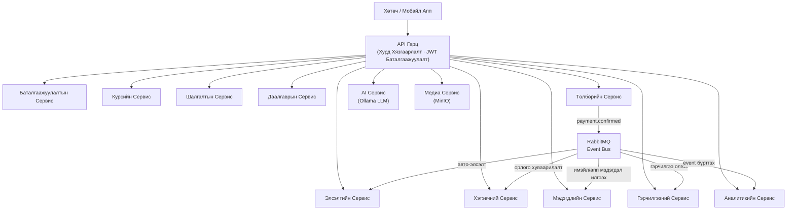
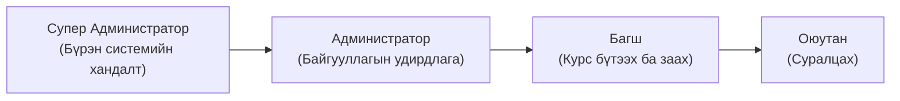
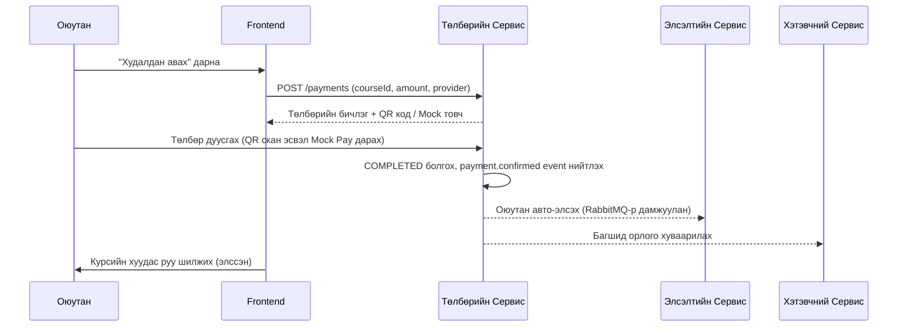
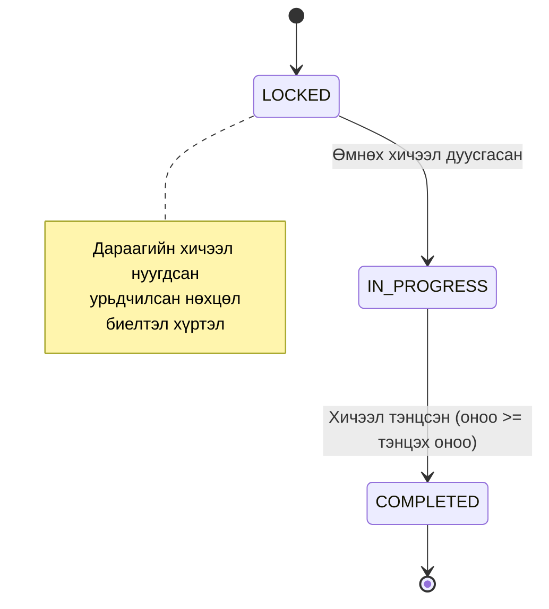
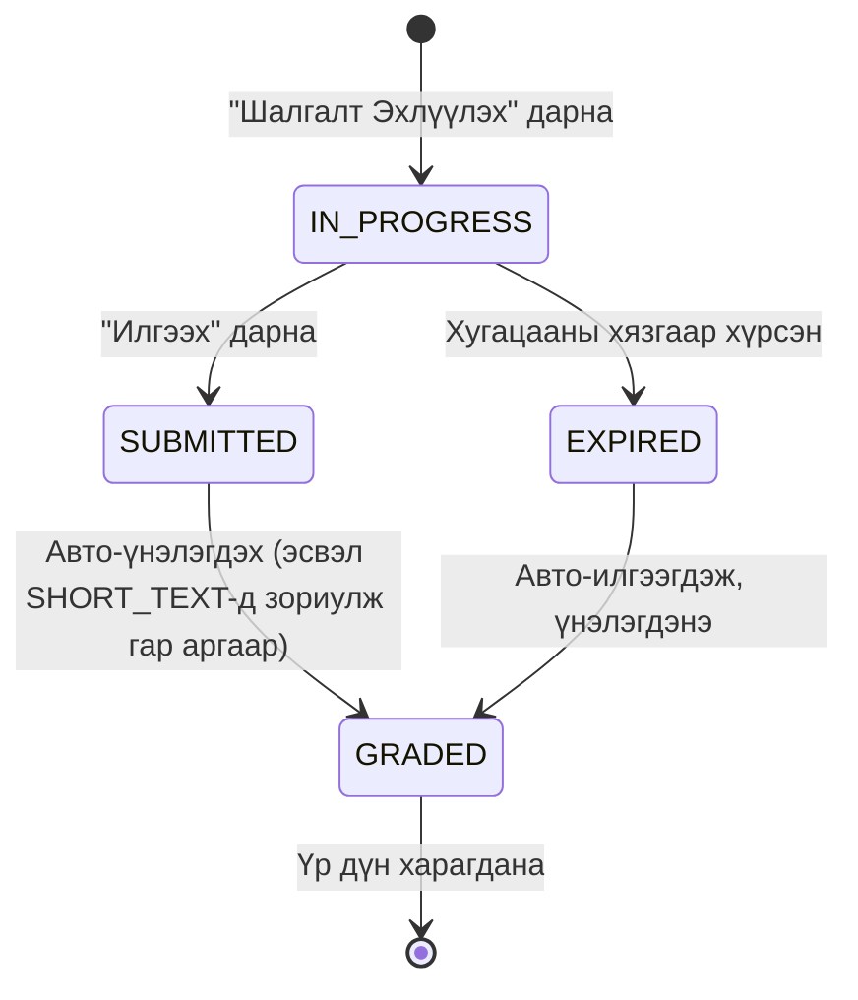

# LMS Платформ — Хэрэглэгчийн Гарын Авлага

> **Аж ахуйн нэгжийн түвшний AI-native Сургалтын Удирдлагын Систем**
> Оюутан, багш, болон байгууллагын администраторуудад зориулсан.

---

## Гарчгийн Хүснэгт

1. [Платформын Тойм](#1-платформын-тойм)
2. [Нэвтрэх ба Бүртгүүлэх](#2-нэвтрэх-ба-бүртгүүлэх)
3. [Хэрэглэгчийн Үүрэг ба Эрхүүд](#3-хэрэглэгчийн-үүрэг-ба-эрхүүд)
4. [Оюутны Боломжууд](#4-оюутны-боломжууд)
5. [Багшийн Боломжууд](#5-багшийн-боломжууд)
6. [Курст Элсэх](#6-курст-элсэх)
7. [Интерактив Хичээлүүд](#7-интерактив-хичээлүүд)
8. [Шалгалтын Систем](#8-шалгалтын-систем)
9. [Даалгаврууд](#9-даалгаврууд)
10. [Хэтэвч ба Төлбөр](#10-хэтэвч-ба-төлбөр)
11. [Гэрчилгээнүүд](#11-гэрчилгээнүүд)
12. [Мэдэгдэлүүд](#12-мэдэгдэлүүд)
13. [AI Боломжууд](#13-ai-боломжууд)
14. [Алдааг Засах](#14-алдааг-засах)
15. [Түгээмэл Асуулт Хариулт](#15-түгээмэл-асуулт-хариулт)

---

## 1. Платформын Тойм

LMS Платформ нь сургууль, их дээд сургууль, корпорацийн сургалтын хөтөлбөр, онлайн академи болон гэрчилгээ олгох байгууллагуудад зориулан бүтээсэн үүлд суурилсан сургалтын удирдлагын систем юм. Уламжлалт хичээл заалтыг AI-д суурилсан боломжуудтай хослуулж, сурах үйл явцыг хувийн болгон хурдасгадаг.

### Үндсэн Боломжууд

| Боломж | Тайлбар |
|---|---|
| **Хичээл Заалт** | Видео, PDF, Markdown, текст болон шууд хичээлийн төрлүүд |
| **Интерактив Агуулга** | Хичээлийн дотор суулгасан шалгалт, хяналтын цэг, AI асуулт |
| **Үнэлгээ** | Тохируулж болох шалгалт болон файл/текст/код/холбоос даалгаврууд |
| **AI Дасгалжуулагч** | Дотоод LLM-д суурилсан яриа хэлцлийн AI дасгалжуулагч |
| **Эссэ Үнэлгээ** | Автомат эссэ үнэлэлт, рубрик задаргаатай |
| **Төлбөр** | QPay ба SocialPay интеграци; тест хийхэд зориулсан шуурхай Mock төлбөр |
| **Гэрчилгээ** | Курс дуусмагц автомат олгогддог, QR кодоор нийтэд баталгаажуулж болно |
| **Хэтэвч** | Багшийн орлогын хэтэвч, 80/20 орлого хуваарилалттай |
| **Аналитик** | Администраторуудад зориулсан бодит цагийн KPI дашборд |
| **Медиа Сан** | Видео хөрвүүлэлт, хадмал орчуулга удирдлага, MinIO хадгалалт |

### Платформын Архитектур (Тойм)



---

## 2. Нэвтрэх ба Бүртгүүлэх

### 2.1 Бүртгэл Үүсгэх

1. `http://your-platform.com/register` хаяг руу орно уу
2. Бүртгэлийн маягтыг бөглөнө үү:

| Талбар | Шаардлага |
|---|---|
| **Имэйл** | Хүчинтэй имэйл хаяг |
| **Нууц үг** | Хамгийн багадаа 8 тэмдэгт, том үсэг, жижиг үсэг, тоо болон тусгай тэмдэгт (`!@#$%^&*`) агуулсан байх |
| **Үүрэг** | Заавал биш — анхдагч нь **Оюутан** |

3. **Бүртгүүлэх** товчийг дарна уу
4. Амжилттай болсны дараа дашборд руу автоматаар шилжинэ

> **Анхаарна уу:** Хэрэв таны байгууллага урилгад суурилсан бүртгэлийг ашигладаг бол, таны администратор урьдчилан тодорхойлсон үүрэгтэй холбоос илгээнэ.

### 2.2 Нэвтрэх

1. `http://your-platform.com/login` хаяг руу орно уу
2. **Имэйл** болон **нууц үгийг** оруулна уу
3. **Нэвтрэх** товчийг дарна уу

Та дараахийг авна:
- **15 минут** хүчинтэй **нэвтрэх токен** (далд ажиллагаагаар автоматаар сэргээгддэг)
- **7 хоног** хүчинтэй **сэргээх токен**

> Хэрэв та 7 хоногоос илүү хугацаанд идэвхгүй байвал, дахин нэвтрэх шаардлагатай.

### 2.3 Нууц Үг Солих

1. **Акаунтын Тохиргоо** → **Аюулгүй байдал** руу орно уу
2. Одоогийн нууц үгийг оруулна уу
3. Шинэ нууц үгийг оруулж, баталгаажуулна уу
4. **Өөрчлөлтийг Хадгалах** товчийг дарна уу

### 2.4 Гарах

- **Одоогийн төхөөрөмж:** Профайлын дүрсийг дарна уу → **Гарах**
- **Бүх төхөөрөмж:** Профайлын дүрсийг дарна уу → **Бүх Төхөөрөмжөөс Гарах**

---

## 3. Хэрэглэгчийн Үүрэг ба Эрхүүд

Платформ дөрвөн үүрэгтэй. Таны үүрэг нь юу харж, юу хийж болохыг тодорхойлно.



### Үүргийн Харьцуулах Хүснэгт

| Боломж | Оюутан | Багш | Администратор | Супер Администратор |
|---|:---:|:---:|:---:|:---:|
| Курст элсэх | ✅ | ✅ | ✅ | ✅ |
| Шалгалт өгөх | ✅ | ✅ | ✅ | ✅ |
| Даалгавар илгээх | ✅ | ✅ | ✅ | ✅ |
| AI дасгалжуулагч ашиглах | ✅ | ✅ | ✅ | ✅ |
| Курс бүтээх | — | ✅ | ✅ | ✅ |
| Илгээлтийг үнэлэх | — | ✅ | ✅ | ✅ |
| Гэрчилгээ олгох | — | ✅ | ✅ | ✅ |
| Медиа байршуулах | — | ✅ | ✅ | ✅ |
| Аналитик харах | — | — | ✅ | ✅ |
| Бүх хэрэглэгч удирдах | — | — | ✅ | ✅ |
| Системийн тохиргоо | — | — | — | ✅ |

### Үүргийн Тайлбар

**Оюутан**
Анхдагч үүрэг. Оюутан нар курсийн каталогийг үзэж, элсэж (үнэгүй эсвэл төлбөртэй), хичээлийг дамжин өнгөрч, шалгалт өгч, даалгавар илгээж, дуусгасны дараа гэрчилгээ авдаг.

**Багш**
Курс, модуль, хичээлийг бүтээж, удирддаг. Даалгаврыг үнэлж, шалгалт нийтэлж, оюутны ахицыг хянаж, төлбөртэй курст элссэнийхээ орлогыг авдаг.

**Администратор**
Байгууллагыг удирддаг: хэрэглэгчийн акаунт, курсийн зөвшөөрөл, болон платформ хэрээс хэтрэх аналитик. Багшийн хийх чадвартай бүх үйлдлийг хийж чадна.

**Супер Администратор**
Дэд бүтцийн тохиргоо болон бүх байгууллагын хэрэглэгчийн статусын удирдлага зэрэг бүрэн системийн хандалттай.

---

## 4. Оюутны Боломжууд

### 4.1 Дашборд

Нэвтэрсний дараа таны дашборд дараахийг харуулна:

- **Миний Курсууд** — элссэн курсүүдийн ахицын мөртэй жагсаалт
- **Сүүлийн Үйл Ажиллагаа** — сүүлийн хичээл, шалгалт, даалгаврын үйл ажиллагаа
- **Мэдэгдэлүүд** — уншаагүй анхааруулга (төлбөр баталгаажуулалт, үнэлгээ гэх мэт)

### 4.2 Курсийн Каталогийг Үзэх

1. Дээд навигацид **Курсууд** дээр дарна уу
2. Категори, түвшин, эсвэл гарчгаар хайна уу
3. Курс бүрийн карт дараахийг харуулна:
   - Гарчиг ба тайлбар
   - Хүндрэлийн түвшин (`BEGINNER`, `INTERMEDIATE`, `ADVANCED`)
   - Үнэ (эсвэл **Үнэгүй**)
   - Хичээлийн тоо болон тооцоолсон хугацаа

### 4.3 Курсийн Ахицыг Хянах

Элссэн курсийн дотор та дараахийг харж болно:

- **Ахицын мөр** — дуусгасан хичээлийн хувь
- **Хичээлийн статус** — хичээл бүр `Locked` (Хаалттай), `In Progress` (Явагдаж байна), эсвэл `Completed` (Дууссан) гэж харагдана
- **Оноо** — хуримтлагдсан шалгалт болон даалгаврын онооны дүн

### 4.4 Миний Гэрчилгээнүүд

1. Навигацид **Гэрчилгээнүүд** дээр дарна уу
2. Авсан бүх гэрчилгээгээ үзнэ үү
3. Бүтэн гэрчилгээг харахын тулд дурын гэрчилгээ дээр дарна уу
4. Нийтийн баталгаажуулалтын холбоосыг хуваалцах эсвэл хөтчөөсөө шууд хэвлэнэ үү

### 4.5 Хэтэвч (Оюутны Харагдац)

Оюутан нар гүйлгээний түүхээ харж болно (жишээ нь, курс худалдан авалт). Администраторууд буцаан олголт эсвэл урамшуулалд зориулж хэтэвчний кредитийн үлдэгдлийг олгож болно.

---

## 5. Багшийн Боломжууд

### 5.1 Багшийн Дашборд

Багшаар нэвтэрсний дараа та дараахийг харна:

- **Миний Курсууд** — элсэлтийн тоотой бүтээсэн курсүүдийн жагсаалт
- **Хүлээгдэж буй Үнэлгээнүүд** — таны хянахыг хүлээж буй даалгаврын илгээлтүүд
- **Хэтэвчний Үлдэгдэл** — одоогийн орлогын үлдэгдэл
- **Орлогын Тойм** — нийт орлого болон платформын хэмжээний задаргаа

### 5.2 Курс Бүтээх

1. **Курсууд** → **Шинэ Курс** дээр дарна уу
2. Курсийн дэлгэрэнгүй мэдээллийг бөглөнө үү:

| Талбар | Тайлбар |
|---|---|
| **Гарчиг** | Курсийн нийтийн нэр |
| **Тайлбар** | Оюутан юу сурах вэ |
| **Түвшин** | `BEGINNER`, `INTERMEDIATE`, эсвэл `ADVANCED` |
| **Үнэ** | MNT-ээр. Үнэгүй курст `0` тавина уу |
| **Хэл** | Курсийн үндсэн хэл |
| **Шошгонууд** | Хайлтын түлхүүр үгс |
| **Дараалалтай** | Оюутан хичээлийг дараалалтайгаар дуусгах ёстой эсэх |
| **Зургийн хавтас** | Нүүрний зургийн URL |

3. **Хадгалах** товчийг дарж курсийг **Ноорог** болгон үүсгэнэ
4. Нийтлэхийн өмнө модуль болон хичээл нэмнэ үү

> **Чухал:** Оюутан элсэхийн өмнө курс `PUBLISHED` статустай байх шаардлагатай.

### 5.3 Курсийн Бүтэц

```
Курс
└── Модуль 1 (жишээ нь, "Танилцуулга")
│   ├── Хичээл 1.1 (VIDEO)
│   ├── Хичээл 1.2 (PDF)
│   └── Хичээл 1.3 (QUIZ)
└── Модуль 2 (жишээ нь, "Үндсэн Ойлголтууд")
    ├── Хичээл 2.1 (MARKDOWN)
    └── Хичээл 2.2 (VIDEO)
```

#### Модуль Нэмэх

1. Курсийг нээнэ үү → **Агуулга Удирдах**
2. **Модуль Нэмэх** дээр дарна уу
3. Модулийн гарчиг болон дараалалтын дугаарыг оруулна уу
4. Хадгалана уу

#### Хичээл Нэмэх

1. Модулийн дотор **Хичээл Нэмэх** дээр дарна уу
2. Хичээлийн төрлийг сонгоно уу:

| Хичээлийн Төрөл | Тайлбар |
|---|---|
| `VIDEO` | Медиа сангаас видео суулгах |
| `PDF` | PDF баримт бичгийг дотор харуулах |
| `MARKDOWN` | Формат, зураг, код блок бүхий баялаг текст |
| `TEXT` | Энгийн текст агуулга |
| `LIVE` | Шууд сессийн холбоос (Zoom, Meet гэх мэт) |
| `QUIZ` | Хичээлийг бие даасан шалгалттай холбох |

3. Хичээлийн шинж чанарыг тохируулна уу:

| Шинж чанар | Тайлбар |
|---|---|
| **Үзэгчдэд нээлттэй** | Идэвхжүүлсэн үед элсээгүй хэрэглэгч энэ хичээлийг үнэгүй үзэж болно |
| **Тэнцэх Оноо** | Хичээлийг дуусгасанд тооцохын тулд шаардагдах доод хамгийн бага оноо (%) |
| **Тооцоолсон Минут** | Хичээлийг дуусгахад зарцуулах тооцоолсон хугацаа |
| **Тэнцсэн үед дараагийнхыг нээх** | Идэвхжүүлсэн үед дараагийн хичээл зөвхөн энэ нэг тэнцсэний дараа нээгдэнэ |

### 5.4 Курс Нийтлэх

1. Курсийн дэлгэрэнгүй хуудсыг нээнэ үү
2. **Нийтлэх** дээр дарна уу
3. Статус `DRAFT` → `PUBLISHED` болж өөрчлөгдөнө
4. Одоо оюутан элсэж болно

> Курсийг түр нуухын тулд **Архивлах** дээр дарна уу. Одоо байгаа элсэлтүүд хадгалагдана.

### 5.5 Даалгаврыг Үнэлэх

1. Навигацид **Даалгаврууд** руу орно уу
2. Бүх илгээлтийг харахын тулд даалгавраа сонгоно уу
3. Нээхийн тулд илгээлт дээр дарна уу
4. Илгээсэн агуулгыг хянана уу (файл, текст, холбоос, эсвэл код)
5. **Оноо** оруулна уу (0-ээс даалгаврын дээд онoo хүртэл)
6. **Санал хүсэлт** нэмнэ үү (заавал биш, гэхдээ зөвлөмжтэй)
7. Хадгалахын тулд **Үнэлэх** дээр дарна уу

Үнэлэгдсэн оюутнууд апп дотор болон имэйлээр мэдэгдэл авна.

### 5.6 Орлого ба Төлбөр Гаргалт

Оюутан таны төлбөртэй курсийг худалдан авах үед:
- Курсийн үнийн **80%** таны хэтэвчинд кредитлэгдэнэ
- **20%** платформын хэмжээний хураамж болгон хадгалагдана

Төлбөр гаргалт хүсэхийн тулд:
1. **Хэтэвч** руу орно уу
2. **Төлбөр Гаргалт Хүсэх** дээр дарна уу
3. Дүнг оруулна уу (хамгийн бага **1,000 ₮**)
4. Банкны мэдээллийг оруулна уу:
   - Банкны нэр
   - Дансны дугаар
   - Дансны эзэмшигчийн нэр
5. Хүсэлт илгээнэ үү

Төлбөр гаргалтын статус: `PENDING` → `PROCESSING` → `COMPLETED` (эсвэл `REJECTED`)

---

## 6. Курст Элсэх

### 6.1 Үнэгүй Курст Элсэх

1. Курсийн дэлгэрэнгүй хуудсыг нээнэ үү
2. **Бүртгүүлэх** дээр дарна уу
3. Та шууд элсэж, суралцаж эхлэх боломжтой

### 6.2 Төлбөртэй Курс Худалдан Авах



**Алхам алхмаар:**

1. Курсийн дэлгэрэнгүй хуудсыг нээнэ үү
2. **Худалдан авах — ₮XX,XXX** дээр дарна уу (товч дээр үнэ харагдана)
3. Та төлбөрийн хуудас руу шилжинэ
4. Төлбөрийн аргыг сонгоно уу:
   - **QPay** — Монголын аль ч банкны апп-аар QR кодыг скан хийнэ
   - **SocialPay** — Голомт Банкны checkout руу шилжинэ
   - **Mock** — Тест орчинд зориулсан шуурхай төлбөр
5. Төлбөрийг дуусгана уу
6. Та автоматаар курсийн хуудас руу шилжинэ — таны элсэлт идэвхтэй болсон

> Элсэлт автоматаар хийгдэнэ. Төлбөр дууссаны дараа та **юу ч** дарах шаардлагагүй.

### 6.3 Элсэлтийн Статусыг Шалгах

- Дурын курсийн хуудсыг нээнэ үү — элссэн бол Худалдан авах/Бүртгүүлэх товчийн оронд **ахицын мөр** болон **Үргэлжлүүлэх** товч харагдана
- Бүх идэвхтэй элсэлтийг харахын тулд **Дашборд → Миний Курсууд** руу орно уу

### 6.4 Төлбөрийн Статус

| Статус | Утга |
|---|---|
| `PENDING` | Төлбөрийн бичлэг үүссэн, хэрэглэгчийн үйлдлийг хүлээж байна |
| `PROCESSING` | Хэрэглэгч QR скан хийсэн / төлбөр эхлүүлсэн, баталгаажуулалт хүлээж байна |
| `COMPLETED` | Төлбөр баталгаажсан — элсэлт идэвхтэй |
| `FAILED` | Постачалагч төлбөрийг татгалзсан |
| `CANCELLED` | Төлбөрийн хугацаа дууссан (30 минутын цонх) |
| `REFUNDED` | Администратор төлбөрийг буцаасан |

Дуусгаагүй бол төлбөр **30 минут**-ын дараа хугацаа дуусна. Өмнөхөөр нь хугацаа дуусвал та ижил курст шинэ төлбөр үүсгэж болно.

---

## 7. Интерактив Хичээлүүд

### 7.1 Хичээлийн Дэвшилтийн Логик

Курс **дараалалтай** горимд тохируулагдсан үед (анхдагч), хичээлүүд таны ахицын дагуу нэг нэгээр нээгдэнэ. Энэ нь суурийн материалыг ойлгохоос өмнө урагш давхихаас сэргийлнэ.



### 7.2 Хичээлийн Төрлүүд Дэлгэрэнгүй

#### Видео Хичээлүүд

- Видео нь медиа сангаас (MinIO хадгалалт) дамжуулагдана
- Видеод олон хэл дээрх **хадмал орчуулга** байж болно — субтитр товч (CC) ашиглан тэдгээрийг асааж/унтраана уу
- Видеоны төгсгөлд хүрэхэд ахиц бүртгэгдэнэ

**Хөрвүүлэлтийн Чанарын Сонголтууд:**

| Формат | Нягтрал | Хамгийн тохиромжтой |
|---|---|---|
| `MP4_480P` | 480p | Бага зурвасын өргөн |
| `MP4_720P` | 720p | Стандарт үзэлт |
| `MP4_1080P` | 1080p | Өндөр чанарын дэлгэц |
| `HLS` | Дасан тохируулах | Мобайл / хувьсах холболт |
| `WEBM` | Хувьсах | Хөтчийн уугуул тоглуулалт |

#### PDF Хичээлүүд

- PDF нь хөтөч дотор дотоод харуулагдана
- Бүх хуудасаар гүйлгэнэ — төгсгөлд хүрэхэд хичээл дуусгасанд тооцогдоно
- Багш идэвхжүүлсэн бол татаж авах товч байна

#### Markdown Хичээлүүд

- Дараахтай баялаг текст болгон дүрслэгдэнэ:
  - Синтакс тодруулгатай код блокууд
  - Суулгасан зураг ба хүснэгтүүд
  - Форматлагдсан гарчиг ба жагсаалтууд
- Хичээлийн доод хэсэгт байгаа **Дуусгах** товчоор дуусгасанд тэмдэглэнэ

#### Шууд Хичээлүүд

- Товлолтой шууд сесс (Zoom, Google Meet, эсвэл захиалгат URL)
- Сессийн холбоос товлосон цагт идэвхтэй болно
- Ирц нь багш гараар тэмдэглэгддэг эсвэл календарийн интеграциаар авто-илрүүлэгддэг

### 7.3 Хичээлийн Дотор Интерактив Блокууд

Багш нар хичээлийн дотор дурын цэгт **интерактив блокуудыг** суулгаж болно. Агуулгыг гүйлгэх үед эдгээр нь дотор харагдана.

| Блокийн Төрөл | Тайлбар |
|---|---|
| `CHECKPOINT` | Шаардлагатай баталгаажуулалтын алхам — үргэлжлэхийн өмнө та дарж зөвшөөрөх ёстой |
| `QUIZ` | 1 ба түүнээс олон асуулт бүхий дотоод мини-шалгалт |
| `INFO` | Чухал мэдээлэл бүхий тодорхойлогдсон дуудлагын хайрцаг |
| `ASSIGNMENT` | Үргэлжлэхийн өмнө ажлаа илгээхийн уриалга |
| `AI_PROMPT` | AI-д суурилсан асуулт эсвэл үйл ажиллагаа |

#### Хяналтын Цэгүүд

Хяналтын цэгүүд нь хичээлийн чухал мөчид багш нарын тавьсан мэдлэгийн хаалга юм.

**Хяналтын цэгийн урсгалын жишээ:**

```
[Видео агуулга тоглогдоно]
        ↓
[CHECKPOINT]: "Би мэдээллийн санд индекс хайлтын хурдыг сайжруулдаг гэдгийг ойлгосон."
        ↓
[Оюутан: "Тийм, ойлгосон" дарна]
        ↓
[Хичээлийн дараагийн хэсэг нээгдэнэ]
```

> Та хяналтын цэгийг алгасах боломжгүй. Үргэлжлэхийн тулд тодорхой зөвшөөрөх ёстой.

#### Дотоод Шалгалтууд

Дотоод шалгалтууд нь хичээлд одоо хүртэл авсан материалын ойлголтыг шалгана. Тэдгээр нь бие даасан шалгалтаас богино (ерөнхийдөө 1–5 асуулт).

- Буруу хариулсан бол та шууд дахин оролдож болно
- Дотоод шалгалтын дүн нь багш тохируулаагүй бол курсийн дүнд ордоггүй

#### Шалгалт Нээлт

`QUIZ` төрлийн хичээл нь **бие даасан шалгалттай** холбоотой байдаг. Шалгалт нь дараахийн дараа л хандах боломжтой:

1. Өмнөх хичээл `COMPLETED` (Дуусгасан) болсон
2. (Хэрэв курс дараалалтай бол) Өмнөх бүх хичээл тэнцсэн

**Нээлтийн урсгал:**

```
Хичээл 1 (VIDEO) — COMPLETED
        ↓
Хичээл 2 (MARKDOWN) — COMPLETED
        ↓
Хичээл 3 (QUIZ) — одоо НЭЭЛТТЭЙ ✅
```

### 7.4 Үзэгчдэд Нээлттэй Хичээлүүд

Зарим хичээлүүд нь багш нарын **Үнэгүй Үзэгчдэд Нээлттэй** болгосон байдаг. Эдгээр хичээлүүд нь хэн бүхэнд — элсэхийн өмнө ч — харагддаг. Хичээлийн жагсаалт дахь **Үнэгүй** тэмдэглэгээг хайна уу.

### 7.5 Ахицаа Хянах

Элссэн курсийн дотор хичээл бүр гурван төлөвийн аль нэгийг харуулна:

| Дүрс | Төлөв | Утга |
|---|---|---|
| 🔒 | `LOCKED` | Эхлээд өмнөх хичээлүүдийг дуусга |
| ▶️ | `IN_PROGRESS` | Та энэ хичээлд одоо хандаж болно |
| ✅ | `COMPLETED` | Та энэ хичээлийг тэнцсэн |

Таны нийт курсийн ахицын хувь нь **Миний Курсууд** дахь курсийн картанд болон курсийн дэлгэрэнгүй хуудасны дээд хэсэгт харагдана.

---

## 8. Шалгалтын Систем

### 8.1 Тойм

Шалгалтууд нь курс эсвэл хувь хичээлтэй холбоотой үнэлгээнүүд юм. Тэдгээр нь ойлголтыг шалгаж, шуурхай санал хүсэлт өгдөг.

### 8.2 Асуулгын Төрлүүд

| Төрөл | Тайлбар | Авто-үнэлэгддэг үү? |
|---|---|---|
| `SINGLE_CHOICE` | Олон сонголтоос нэг зөв хариулт сонгох | ✅ Тийм |
| `MULTIPLE_CHOICE` | Олон сонголтоос зөв хариулт бүгдийг сонгох | ✅ Тийм |
| `TRUE_FALSE` | Үнэн эсвэл Худал сонгох | ✅ Тийм |
| `SHORT_TEXT` | Богино хариулт бичих (1–500 тэмдэгт) | ❌ Гар аргаар хянах |

> `SHORT_TEXT` хариултууд автоматаар үнэлэгддэггүй. Таны багш шалгалт хаагдсаны дараа хянаж, оноог шинэчилнэ.

### 8.3 Шалгалт Өгөх

1. Курсийн хичээл эсвэл **Шалгалтууд** хуудаснаас шалгалт руу очно уу
2. **Шалгалт Эхлүүлэх** дээр дарна уу
3. Бүх асуултад хариулна уу
4. **Илгээх** дээр дарна уу
5. Авто-үнэлэгдэх асуултын үр дүн шууд харагдана

**Шалгалтын оролдлогын дүрмүүд (шалгалт тутам багш тохируулдаг):**

| Тохиргоо | Анхдагч | Тайлбар |
|---|---|---|
| **Дээд Оролдлого** | 3 | Шалгалтыг өгч болох дээд хэмжээний тоо |
| **Хугацааны Хязгаар** | Байхгүй | Тохируулсан бол хугацаа дуусахад шалгалт автоматаар илгээгдэнэ |
| **Тэнцэх Оноо** | 70% | Шалгалтыг тэнцсэнд тооцох доод хамгийн бага оноо |

### 8.4 Шалгалтын Оролдлогын Мөчлөг



### 8.5 Үр Дүнг Харах

Илгээсний дараа:
- **Оноо**: таны авсан цэг vs. нийт боломжит цэг
- **Хувь**: автоматаар тооцогдоно
- **Тэнцсэн/Тэнцээгүй**: тэнцэх босгод үндэслэн харагдана
- **Асуулт тутмын санал хүсэлт**: аль асуулт зөв, аль нь буруу болохыг харна (идэвхжүүлсэн бол)

### 8.6 Шалгалт Давтан Өгөх

Хэрэв танд оролдлого үлдсэн бол:
1. Шалгалтын хуудас руу буцна уу
2. **Шалгалтыг Давтан Өгөх** дээр дарна уу
3. Шинэ оролдлого эхэлнэ — өмнөх оролдлогын үр дүн таны түүхэнд хадгалагдана

> Ахицын хянаалтанд зөвхөн таны **хамгийн өндөр оноо** бүртгэгдэнэ.

### 8.7 Дасан Зохицох Шалгалтууд

**Дасан зохицох** гэж тэмдэглэгдсэн шалгалтууд оролдлогын явцад таны гүйцэтгэлд үндэслэн асуулгын хүндрэлийг тохируулдаг. Зөв хариулбал дараагийн асуулт хүндэрнэ. Буруу хариулбал суурийн ойлголтыг бататгахын тулд хялбар асуулт дагана.

---

## 9. Даалгаврууд

### 9.1 Тойм

Даалгаврууд нь багш үнэлдэг даалгаврууд юм. Шалгалтаас ялгаатай нь, тэдгээр нь багш таны илгээлтийг гар аргаар хянаж, оноо болон санал хүсэлт өгөхийг шаарддаг.

### 9.2 Илгээлтийн Төрлүүд

| Төрөл | Хэрхэн Илгээх |
|---|---|
| `TEXT` | Хариултаа текст засварлагчид шууд бичнэ |
| `FILE_UPLOAD` | Нэг ба түүнээс олон файл байршуулна (баримт, зураг, хүснэгт) |
| `LINK` | URL оруулна (жишээ нь, GitHub репозитор, Google Doc, портфолио) |
| `CODE` | Кодыг код илгээлтийн блокд шууд оруулна |

### 9.3 Даалгавар Илгээх

1. Хичээл эсвэл **Даалгаврууд** хуудаснаас даалгавар руу очно уу
2. Зааврыг анхааралтай уншина уу
3. Илгээлтийн төрлийг сонгоно уу (багшийн тодорхойлсноор)
4. Агуулгаа бэлдэнэ үү:
   - `TEXT`-д зориулж: өгөгдсөн текстийн талбарт бичнэ
   - `FILE_UPLOAD`-д зориулж: файлуудаа байршуулна (нэг файл дээд тал нь 500 МБ)
   - `LINK`-д зориулж: URL оруулна
   - `CODE`-д зориулж: кодоо код засварлагчид оруулна
5. **Илгээх** дээр дарна уу

> Эцсийн илгээлтийн өмнө ноорог хадгалах боломжтой. Ноорог нь багшид харагдахгүй.

### 9.4 Хугацаа Хэтэрсэн Илгээлтүүд

- Багш нь даалгавар тутамд **дуусах огноо** тохируулдаг
- **Хугацаа Хэтрэлтийг Зөвшөөрөх** идэвхгүй бол (анхдагч), дуусах огнооны дараа илгээх товч хаагддаг
- **Хугацаа Хэтрэлтийг Зөвшөөрөх** идэвхтэй бол, та дуусах огнооны дараа илгээж болно, гэхдээ таны багш цэг хасч болно

### 9.5 Илгээлтийн Статус

| Статус | Утга |
|---|---|
| `DRAFT` | Хадгалагдсан, гэхдээ илгээгдээгүй — зөвхөн та харж болно |
| `SUBMITTED` | Хяналтанд зориулж багшид илгээгдсэн |
| `UNDER_REVIEW` | Багш таны илгээлтийг нээсэн |
| `GRADED` | Багш оноо болон санал хүсэлт нэмсэн |
| `RETURNED` | Засвар хийлгэхээр буцаагдсан — та дахин илгээж болно |

### 9.6 Дүнгээ Харах

1. Даалгаврын хуудсыг нээнэ үү
2. Үнэлэгдсэн бол та дараахийг харна:
   - **Оноо**: таны цэг / дээд хэмжээний цэг
   - **Хувь**: автоматаар тооцогдоно
   - **Тэнцсэн/Тэнцээгүй**: даалгаврын тэнцэх босгод үндэслэн (анхдагч: 60%)
   - **Санал хүсэлт**: багшийн бичсэн сэтгэгдэл

Даалгаврыг үнэлэх үед та мөн **апп дотор мэдэгдэл** болон **имэйл** авна.

### 9.7 AI-тай Туслалцсан Эссэ Үнэлгээ

Текст дээр суурилсан даалгаврын хувьд багш нар гар аргаар хянахаасаа өмнө **AI Эссэ Үнэлэгч**-ийг ашиглан анхны автомат үнэлгээ авч болно. AI нь дараахийг өгдөг:

- Тооны оноо
- Дөрвөн хэмжүүрийн рубрик задаргаа ([13-р хэсгийг](#13-ai-боломжууд) харна уу)

Багш нь AI-ийн оноог тийм нь ашиглаж эсвэл өөрийн дүгнэлтээр орлуулж болно.

---

## 10. Хэтэвч ба Төлбөр

### 10.1 Оюутнуудад — Төлбөр Хийх

Бүтэн төлбөрийн урсгалыг [6.2-р хэсгийг — Төлбөртэй Курс Худалдан Авах](#62-төлбөртэй-курс-худалдан-авах) харна уу.

**Дэмжигдэх төлбөрийн постачалагчид:**

| Постачалагч | Арга |
|---|---|
| **QPay** | Монголын аль ч банкны мобайл аппаар QR код скан хийнэ |
| **SocialPay** | Голомт Банкны онлайн checkout |
| **Mock** | Шуурхай дуусгах (зөвхөн тест / хөгжүүлэлт) |

### 10.2 Багш нарт — Орлогын Хэтэвч

Багш бүр курст элссэнийхээ орлогыг хуримтлуулдаг хэтэвчтэй байдаг.

**Орлого хуваарилалт:**

```
Оюутан ₮100,000 төлнө
        │
        ├─── Платформын хэмжээний хураамж (20%) ─→ ₮20,000
        │
        └─── Багшийн орлого (80%) ─→ ₮80,000 (хэтэвчинд кредитлэгдэнэ)
```

### 10.3 Гүйлгээний Төрлүүд

| Төрөл | Хэн Харах Вэ | Тайлбар |
|---|---|---|
| `CREDIT` | Багш / Администратор | Гар аргаар нэмэгдсэн хөрөнгө |
| `REVENUE_SHARE` | Багш | Курст элссэнийхээс авсан орлого |
| `DEBIT` | Бүгд | Зарцуулсан хөрөнгө |
| `PAYOUT` | Багш | Банкны данс руу гаргалт |
| `REFUND` | Оюутан | Цуцлагдсан худалдан авалтаас буцаан олголт |
| `PLATFORM_FEE` | Администратор | Гүйлгээний платформын хувь |

### 10.4 Төлбөр Гаргалт Хүсэх

**Шаардлагууд:**
- Хамгийн бага гаргалт: **₮1,000**
- Таны хэтэвчинд хангалттай үлдэгдэл байх ёстой

**Алхмууд:**
1. Навигацид **Хэтэвч** дээр дарна уу
2. Боломжтой үлдэгдлийг хянана уу
3. **Төлбөр Гаргалт Хүсэх** дээр дарна уу
4. Дүнг оруулна уу
5. Банкны мэдээллийг оруулна уу:
   - Банкны нэр
   - Дансны дугаар
   - Дансны эзэмшигчийн нэр
   - Тэмдэглэл (заавал биш)
6. **Хүсэлт Илгээх** дээр дарна уу

**Төлбөр гаргалтын хугацаа:**

| Статус | Утга |
|---|---|
| `PENDING` | Хүсэлт илгээгдсэн, администраторын зөвшөөрлийг хүлээж байна |
| `PROCESSING` | Администратор зөвшөөрсөн — банкны шилжүүлэг хийгдэж байна |
| `COMPLETED` | Хөрөнгө таны банкны данс руу шилжсэн |
| `REJECTED` | Хүсэлт татгалзагдсан (тэмдэглэлд шалтгааныг заасан) |

> Төлбөр гаргалтын боловсруулалтын хугацаа таны банкнаас хамаарна. Ердийн боловсруулалт: 1–3 ажлын өдөр.

### 10.5 Гүйлгээний Түүхийг Харах

1. Навигацид **Хэтэвч** дээр дарна уу
2. **Гүйлгээнүүд** табд дарна уу
3. Гүйлгээний төрөл эсвэл огнооны хүрээгээр шүүнэ үү
4. Дэлгэрэнгүйг харахын тулд дурын гүйлгээ дээр дарна уу

---

## 11. Гэрчилгээнүүд

### 11.1 Гэрчилгээ Авах

Та курсийг дуусгах үед гэрчилгээ автоматаар олгогддог. Дуусгасан гэдэг нь:
- Бүх хичээл `COMPLETED` гэж тэмдэглэгдсэн
- Нийт курсийн ахиц 100%-д хүрсэн

> Тусгай нөхцөл байдалд зориулж гэрчилгээг багш эсвэл администратор гар аргаар ч олгож болно.

### 11.2 Гэрчилгээгээ Харах

1. Навигацид **Гэрчилгээнүүд** дээр дарна уу
2. Таны гэрчилгээнүүд дараахтай жагсаагдана:
   - Курсийн гарчиг
   - Олгосон огноо
   - Хүлээн авагчийн нэр
   - Олгогчийн нэр (анхдагч: "LMS Platform")
   - Статус (`ISSUED` эсвэл `REVOKED`)

### 11.3 Гэрчилгээний Дэлгэрэнгүй

Бүтэн гэрчилгээг харахын тулд дурын гэрчилгээ дээр дарна уу, тэр нь дараахийг агуулдаг:

- Хүлээн авагчийн бүтэн нэр
- Курсийн нэр
- Дуусгасан огноо
- Олгосон огноо
- Дуусах огноо (хэрэв тохирох бол)
- Давтагдашгүй баталгаажуулалтын код
- Нийтийн баталгаажуулалтын хуудсын холбоос бүхий QR код

### 11.4 Хуваалцах ба Баталгаажуулах

Гэрчилгээ бүр нь ажил олгогч, боловсролын байгууллага, эсвэл жинхлэлийг баталгаажуулах шаардлагатай хэн бүхэнтэй хуваалцаж болох **давтагдашгүй баталгаажуулалтын холбоостой** байдаг.

**Нийтийн баталгаажуулалтын URL:**
```
https://your-platform.com/certificates/verify/{verification-code}
```

Энэ хуудас нь **нийтэд хандах боломжтой** — акаунт шаардлагагүй. Тэр дараахийг харуулна:
- Гэрчилгээ `хүчинтэй` эсэх (олгогдсон, цуцлагдаагүй)
- Гэрчилгээний дэлгэрэнгүй (нэр, курс, олгосон огноо)

**Гэрчилгээгээ хуваалцах:**
1. Гэрчилгээгээ нээнэ үү
2. URL-ийг хуваалцахын тулд **Баталгаажуулалтын Холбоосыг Хуулах** дарна уу
3. Эсвэл PDF хуулбар хадгалахын тулд **Хэвлэх** дарна уу

### 11.5 Гэрчилгээ Цуцлах

Дараах тохиолдолд администраторууд гэрчилгээг цуцалж болно:
- Курст элсэлт луйвартай гэдэг нь тогтоогдсон
- Оюутан академийн шударга байдлын бодлогыг зөрчсөн

Цуцлагдсан гэрчилгээнүүд таны жагсаалтад харагсаар байх боловч `REVOKED` гэж тэмдэглэгдэнэ. Нийтийн баталгаажуулалтын хуудас тэдгээрийг хүчингүй гэж харуулна.

---

## 12. Мэдэгдэлүүд

### 12.1 Мэдэгдлийн Суваг

Платформ дөрвөн суваггаар танд хүрэж болно:

| Суваг | Анхдагч | Тайлбар |
|---|:---:|---|
| **Апп Дотор** | ✅ Асаалттай | Платформын дотор харагдах мэдэгдэлүүд |
| **Имэйл** | ✅ Асаалттай | Бүртгэгдсэн имэйл хаяг руу илгээгддэг |
| **Push** | ✅ Асаалттай | Хөтөч / мобайл push мэдэгдэлүүд |
| **SMS** | ❌ Унтраалттай | Утасны дугаар руу текст мессеж |

### 12.2 Мэдэгдэл Өдөөдөг Үйлдэлүүд

| Үйлдэл | Хэнд Мэдэгддэг |
|---|---|
| **Даалгавар үнэлэгдсэн** | Оюутан |
| **Курст элссэн** | Оюутан |
| **Шалгалтын үр дүн** | Оюутан |
| **Төлбөр баталгаажсан** | Оюутан |
| **Төлбөр амжилтгүй болсон** | Оюутан |
| **Системийн зарлал** | Бүх хэрэглэгч |

### 12.3 Мэдэгдлийн Тохиргоог Удирдах

1. **Профайлын Дүрс** → **Тохиргоо** → **Мэдэгдэлүүд** дарна уу
2. Үйлдлийн төрөл тутамд суваг бүрийг асааж/унтраана уу:

| Тохиргоо | Тайлбар |
|---|---|
| `Даалгавар Үнэлэгдсэн` | Багш ажлыг үнэлэх үед мэдэгд |
| `Курст Элссэн` | Элсэлт амжилттай болоход баталгаажуулалт |
| `Шалгалтын Үр Дүн` | Шалгалт илгээсний дараа ононы мэдэгдэл |
| `Төлбөр Баталгаажсан` | Төлбөр дуусах үед баримт |
| `Маркетинг` | Платформын зарлал болон шинэ курсийн шинэчлэлт |

### 12.4 Мэдэгдэлүүдээ Харах

1. Толгой хэсгийн **дуут хонх (🔔)** дүрс дарна уу
2. Уншаагүй бүх мэдэгдэлүүд дээд хэсэгт харагдана
3. Холбогдох зүйл рүү шууд очихын тулд дурын мэдэгдэл дарна уу
4. Уншаагүй тоог цэвэрлэхийн тулд **Бүгдийг Уншсан гэж Тэмдэглэх** дарна уу

---

## 13. AI Боломжууд

### 13.1 AI Дасгалжуулагч

AI Дасгалжуулагч нь дотооддоо байршуулсан том хэлний загвар (Ollama / Llama 3.2)-д суурилсан яриа хэлцлийн туслагч юм. Тэр курсийн материалын талаар асуултанд хариулж, ойлголтыг тайлбарлаж, асуудлыг шийдвэрлэхэд тусалж чадна.

**Сесс эхлүүлэх:**

1. Навигацид **AI** дарна уу
2. **Шинэ Сесс** дарна уу
3. Нөхцөл харгалзасан хариултанд зориулж сессийг тодорхой курстэй холбох (заавал биш)
4. Асуултаа бичээд **Илгээх** дарна уу

**Харилцааны жишээ:**

```
Та: Мэдээллийн сангийн индексийг энгийнээр тайлбарла.

AI: Мэдээллийн сангийн индекс нь номын арын хуудасны жагсаалттай адил юм —
"PostgreSQL"-ийг олохын тулд бүх хуудас уншихын оронд жагсаалтаас хайж
142-р хуудаст шууд очно. Мэдээллийн сангийн тэмдэгт нь хайлт хийх баганын
утгуудын эрэмбэлэгдсэн хуулбарыг бодит мөрийн заалт бүхий хадгалдаг тул
тухайн баганаар шүүх хайлтууд хүснэгт бүхлийг нь уншихгүй байж болно.
```

**AI-аас илүү сайн хариулт авах зөвлөмжүүд:**
- Ойлгохгүй байгаа зүйлийнхээ талаар тодорхой байна уу
- Судалж буй хичээл эсвэл сэдвийг дурдаарай
- Тайлбар ойлгомжгүй бол жишээ хүсэнэ үү
- Цогц асуултуудыг жижиг хэсгүүдэд хуваана уу

**Сессийн удирдлага:**
- Сессүүд автоматаар хадгалагддаг
- Сессийн жагсаалтаас өмнөх дурын сесс рүү буцна уу
- Хэрэгцээгүй болсон сессүүдийг устгана уу

### 13.2 AI Эссэ Үнэлэгч

Эссэ үнэлэгч нь бичгийн ажлын автомат үнэлгээг багшийн үнэлгээний өмнө (эсвэл оронд) өгдөг.

**Эссэ үнэлэгчид хандах:**
1. **AI** → **Эссэ Үнэлэгч** дарна уу
2. Эссэийн текстийг буулгана уу (хамгийн бага 50 тэмдэгт, дээд хэмжээ 10,000 тэмдэгт)
3. Заавал биш:
   - Даалгаврын агуулга (эссэ юуны тухай)
   - Захиалгат үнэлгээний асуулт (тодорхой рубрикийн шаардлагууд)
4. Дээд оноог тохируулна уу (анхдагч: 100)
5. **Эссэ Үнэлэх** дарна уу

**Үр дүнгийн задаргаа:**

| Хэмжүүр | Дээд Цэг | Юу Үнэлэгдэх Вэ |
|---|---|---|
| **Агуулга** | 25 | Мэдээллийн нарийвчлал, гүн, хамаарал |
| **Бүтэц** | 25 | Оршил, үндэсний хэсэг, дүгнэлт, логик урсгал |
| **Хэл** | 25 | Дүрэм, үгийн санд, тодорхой байдал, хэв маяг |
| **Маргаан** | 25 | Үндэслэлийн чанар, нотлох баримт, дүгнэлтүүд |

**Жишээ үр дүн:**

```json
{
  "score": 82,
  "maxScore": 100,
  "percentage": 82,
  "feedback": "Таны эссэ сайн бүтэцтэй догол мөрүүдтэй тодорхой маргааныг илэрхийлсэн.
               Өгсөн нотлох баримтууд хамааралтай боловч илүү тодорхой жишээнүүд
               маргааныг бататгах болно. 3-р догол мөрт бага зэргийн дүрмийн
               алдаанууд байна.",
  "rubricBreakdown": {
    "content": 22,
    "structure": 21,
    "language": 20,
    "arguments": 19
  }
}
```

**Чухал тэмдэглэл:**
- AI-ийн оноо нь **санал болгосон** — таны багш тэдгээрийг орлуулж болно
- AI эссэийг зөв задлан шинжилж чадахгүй бол аюулгүй нөөц болгон 60%-ийн оноо авдаг
- Үнэлэгч 300-аас 5,000 үгийн хоорондох эссэгүүдтэй хамгийн сайн ажилладаг

### 13.3 AI Зөвлөмжүүд

Платформын зөвлөмжийн хөдөлгүүр нь таны сурах түүх, шалгалтын оноо, ахицыг шинжлэн дараахийг санал болгодог:

- Чадварын чиглэлд тань үндэслэн элсэх **дараагийн курсууд**
- Шалгалтын бага онооны дагуу дахин үзэх хэрэгтэй **хянан гэрчлэлтийн хичээлүүд**
- Одоо судалж буй зүйлийг нөхдөг **холбогдох сэдвүүд**

Зөвлөмжүүд таны дашборд дээр гарч, суралцахын хэрээр шинэчлэгддэг.

---

## 14. Алдааг Засах

### 14.1 Нэвтрэлтийн Асуудлууд

**Асуудал:** "Invalid credentials" (Буруу нэвтрэх мэдээлэл) алдаа

**Шийдэлүүд:**
1. Имэйл хаягаа давхар шалгана уу (алдаа байхгүй эсэхийг шалгана уу)
2. Caps Lock асаалттай эсэхийг шалгана уу
3. Нэвтрэх хуудасны **Нууц Үг Мартсан** хэсгээр нууц үгийг дахин тохируулна уу
4. Асуудал үргэлжилбэл администратортоо хандана уу

---

**Асуудал:** Автоматаар гарсан

**Шалтгаан:** Таны сесс дууссан (нэвтрэх токен 15 минут хүчинтэй; сэргээх токен 7 хоногийн идэвхтэй байдлын хугацаатай)

**Шийдэл:** Дахин нэвтэрнэ үү. Боломжтой бол **Намайг Санах** идэвхжүүлж сессийг уртасгана уу.

---

**Асуудал:** "Account suspended" (Акаунт түдгэлзүүлэгдсэн) мессеж

**Шалтгаан:** Администратор таны акаунтыг түдгэлзүүлсэн

**Шийдэл:** Сэргээхийн тулд байгууллагынхаа администратортай холбогдоно уу.

---

### 14.2 Төлбөрийн Асуудлууд

**Асуудал:** Төлбөрийн статус `PROCESSING`-д зогссон

**Шийдэлүүд:**
1. 2–5 минут хүлээнэ үү — төлбөрийн баталгаажуулалт хугацаа шаардаж болно
2. Төлбөрийн дэлгэрэнгүй хуудсан дахь **Төлбөрийн Статусыг Шалгах** дарна уу
3. 10 минутын дараа хүлээгдэж байвал банк эсвэл төлбөрийн постачалагчтайгаа холбогдоно уу
4. Асуудал үргэлжилбэл дэмжлэгтэй холбогдоно уу — хоёр дахь төлбөр хийж болохгүй

---

**Асуудал:** Төлбөр `COMPLETED` (Дууссан) боловч курст элсээгүй

**Шалтгаан:** Автомат элсэлтэд товчхон хугацааны хоцролт (хэдэн секунд) байж болно

**Шийдэлүүд:**
1. 10–15 секунд хүлээгаад курсийн хуудсыг сэргээнэ үү
2. Дашборд дахь **Миний Курсуудыг** шалгана уу
3. 5 минутын дараа элсэлт хийгдэхгүй байвал төлбөрийн ID-гаа дэмжлэгт өгч холбогдоно уу

---

**Асуудал:** Төлбөрийн хугацаа дууссан (CANCELLED)

**Шалтгаан:** 30 минутын төлбөрийн цонх дууссан

**Шийдэл:** Курсийн хуудас руу буцаж **Худалдан авах** дарж шинэ төлбөр үүсгэнэ үү

---

### 14.3 Курс ба Хичээлийн Асуудлууд

**Асуудал:** Хичээл хаалттай бөгөөд би үргэлжлэх боломжгүй

**Шалтгаан ба шийдэлүүд:**

| Шалтгаан | Шийдэл |
|---|---|
| Өмнөх хичээл дуусаагүй | Өмнөх хичээл рүү буцаж дуусгана уу |
| Шалгалт тэнцэхгүй байна | Шалгалтыг давтан өгч тэнцэх оноог авна уу |
| Хяналтын цэг зөвшөөрөгдөөгүй | Хичээлийг гүйлгэж бүх хяналтын цэгийг баталгаажуулна уу |
| Үнэгүй үзэгчдэд нээлттэй хичээл дууссан | Бүтэн агуулгад хандахын тулд курст элсэх (эсвэл худалдан авах) хэрэгтэй |

---

**Асуудал:** Видео тоглогдохгүй байна

**Шийдэлүүд:**
1. Хуудсыг сэргээж үзнэ үү
2. Интернэт холболтоо шалгана уу
3. Өөр хөтөч ашиглаж үзнэ үү (Chrome, Firefox, эсвэл Edge зөвлөгдсөн)
4. Боломжтой бол чанарын сонголтоос доод видео чанар (480p) сонгоно уу
5. Видео агуулгыг хааж болох хөтчийн өргөтгөлүүдийг (ялангуяа реклам хориглогч) идэвхгүй болгоно уу

---

**Асуудал:** Шалгалтын хугацаа дуусахаас өмнө цаг дуусдаг

**Шалтгаан:** Шалгалтын хугацааны хязгаарыг багш тохируулсан

**Болох зүйл:** Хугацаа дуусах үед байсан хариултуудаараа шалгалт автоматаар илгээгдэнэ — энэ нь таны оролдлогуудын нэгэнд тооцогдоно.

**Шийдэл:** Шалгалт эхлүүлэхийн өмнө хугацааны хязгаарыг шалгана уу. Оролдлого дуусвал багштайгаа холбогдоно уу.

---

### 14.4 Даалгаврын Асуудлууд

**Асуудал:** Даалгаврыг илгээх боломжгүй (товч саарал байна)

**Шалтгаанууд:**
- Дуусах огноо өнгөрсөн, багш хугацаа хэтэрсэн илгээлтийг зөвшөөрөөгүй
- Та аль хэдийн илгээсэн бөгөөд багш засварлахаар буцаагаагүй

**Шийдэл:** Багштайгаа шууд холбогдоно уу.

---

**Асуудал:** Файл байршуулалт амжилтгүй болж байна

**Шийдэлүүд:**
1. Файл **500 МБ**-аас бага эсэхийг шалгана уу
2. Интернэт холболт тогтвортой эсэхийг баталгаажуулна уу
3. Боломжтой бол өөр файл форматыг туршина уу
4. Wi-Fi-ийн оронд утастай холболтоор байршуулж үзнэ үү

---

### 14.5 Гэрчилгээний Асуудлууд

**Асуудал:** Курсийг дуусгасан боловч гэрчилгээ олгогдоогүй

**Шийдэлүүд:**
1. Ахицын харагдацад бүх хичээл `COMPLETED` гэж тэмдэглэгдсэн эсэхийг баталгаажуулна уу
2. Нийт курсийн ахиц **100%** гэж харагдаж байгааг шалгана уу
3. Хэдэн минут хүлээнэ үү — гэрчилгээ үүсгэлт асинхрон байдаг
4. Гэрчилгээ гарч ирэхгүй байвал багш эсвэл администратортайгаа холбогдоно уу

---

**Асуудал:** Гэрчилгээний баталгаажуулалтын холбоос "хүчингүй" харуулж байна

**Шалтгаан:** Гэрчилгээг администратор цуцалж болзошгүй

**Шийдэл:** Дэлгэрэнгүйг мэдэхийн тулд багш эсвэл администратортайгаа холбогдоно уу

---

### 14.6 Мэдэгдлийн Асуудлууд

**Асуудал:** Имэйл мэдэгдэл хүлээж аваагүй байна

**Шийдэлүүд:**
1. Спам/хог хайрцгийг шалгана уу
2. Платформын имэйл домайныг зөвшөөрлийн жагсаалтад нэмнэ үү
3. **Тохиргоо → Мэдэгдэлүүд** руу орж холбогдох үйлдлийн имэйл идэвхжүүлэгдсэн эсэхийг баталгаажуулна уу
4. SMTP тохиргоог баталгаажуулахын тулд администратортайгаа холбогдоно уу

---

## 15. Түгээмэл Асуулт Хариулт

**А: Би нэгэн зэрэг олон курст элсэж болох уу?**

Тийм. Нэгэн зэрэг элсэж болох курсийн тоонд хязгаарлалт байхгүй. Курс бүр ахицыг бие даасан байдлаар хянадаг.

---

**А: Дахин өгвөл шалгалтын онооны минь гүйдэг үү?**

Үгүй. Оролдлого бүр бие даасан байдаг. Ахицыг хянахад таны бүх оролдлогын дотроос **хамгийн өндөр оноо** ашиглагддаг. Өмнөх оролдлогын түүх хадгалагдаж, харагдах боломжтой.

---

**А: Курсаас гарвал яах вэ?**

Таны элсэлтийн бичлэг болон бүх ахицын мэдээлэл (хичээл дуусгалт, шалгалтын оноо) бүрмөсөн устагдана. Дараа нь дахин элсвэл та эхнээс эхэлнэ. Сайн дурын гарах тохиолдолд төлбөртэй курсийн мөнгийг буцаан олгодоггүй.

---

**А: Курсийн видеоыг татаж авч болох уу?**

Татаж авах эрхийг багш хянадаг. Хэрэв видео тоглуулагч дээр татаж авах сонголт харагдахгүй бол, багш тийм боломжийг идэвхжүүлээгүй гэсэн үг.

---

**А: Даалгаврын хувьд ямар файлын төрлүүд байршуулах боломжтой вэ?**

Платформ нийтлэг бүх файлын төрлийг (PDF, DOCX, XLSX, PPTX, PNG, JPG, ZIP гэх мэт) файл тутамд **500 МБ** хүртэл дэмждэг. Код илгээлтийн хувьд файл байршуулахын оронд код илгээлтийн төрлийг ашиглана уу.

---

**А: Гэрчилгээ хэр удаан хүчинтэй байдаг вэ?**

Багш тодорхой дуусах огноо тохируулаагүй бол гэрчилгээнүүд хугацаа дуусдаггүй. Дуусах огноог гэрчилгээний дэлгэрэнгүй хуудсан дээрээс шалгаж болно. Хэрэв дуусах огноо харагдахгүй бол гэрчилгээ тодорхойгүй хугацаагаар хүчинтэй.

---

**А: Шалгалт эсвэл даалгаврын оноог маргаалтаар авч үзүүлэх боломжтой юу?**

Даалгаврын хувьд даалгаврын сэтгэгдлийн хэсгээр дамжуулан багшийн санал хүсэлтэд хариулж, санаагаа тайлбарлана уу. Шалгалтын хувьд багштайгаа шууд холбогдоно уу — `SHORT_TEXT` хариултуудыг гар аргаар хянаж, шинэчилж болно.

---

**А: AI дасгалжуулагчтай хийсэн ярианы нууцлал хадгалагддаг уу?**

Тийм. Таны AI дасгалжуулагчийн сессүүд хувийн бөгөөд зөвхөн танд харагдана. Системийн түвшний хандалттай администраторууд нийцлийн зорилгоор сессүүдийг аудит хийж болох боловч багш нар таны AI яриаг харж чадахгүй.

---

**А: Дасгалжуулагчид ашиглагдаж буй AI загвар юу вэ?**

Платформ нь Ollama (өөрт байршуулсан)-аар дамжуулан **Llama 3.2** ажиллуулдаг. Загвар нь платформын дэд бүтцэд бүрэн ажилладаг — таны мэдээлэл гадаад AI постачалагч руу (жишээ нь, OpenAI, Anthropic) илгээгддэггүй.

---

**А: Би багш хүн — элсэлтийн төлбөрийг хэзээ авах вэ?**

Оюутны төлбөр баталгаажсанаас хэдхэн секундын дотор орлого таны хэтэвчинд автоматаар кредитлэгдэнэ. Та хамгийн бага гаргалтын дүн ₮1,000-ын шаардлагатайгаар хүссэн үедээ гаргалт хүсэж болно.

---

**А: Нэг оюутан курст хоёр удаа элсэх боломжтой юу?**

Үгүй. Платформ оюутан тутамд курс тутамд давтагдашгүй элсэлтийг хэрэгжүүлдэг. Оюутан аль хэдийн элссэн (үнэгүй эсвэл төлбөртэй) бол дахин элсэх оролдлого татгалздаг. Энэ нь давхар төлбөр хийхээс сэргийлдэг.

---

**А: Дэмжлэгтэй хэрхэн холбогдох вэ?**

Акаунт, элсэлт, эсвэл төлбөрийн асуудлын хувьд эхлээд **байгууллагын администратортай** холбогдоно уу.

Платформ түвшний техникийн асуудлын хувьд администраторууд Admin панелиар дамжуулан эсвэл платформын дэмжлэгийн багт имэйл илгээж дэмжлэгийн хүсэлт гаргаж болно.

---

*Сүүлд шинэчилсэн: 2026 оны 5-р сар · LMS Платформын Баримт Бичиг · Аж ахуйн нэгжийн хувилбар*
